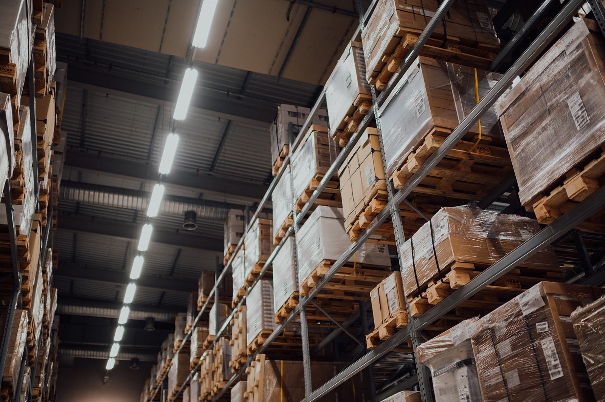
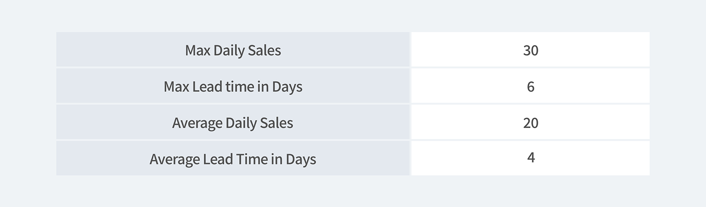
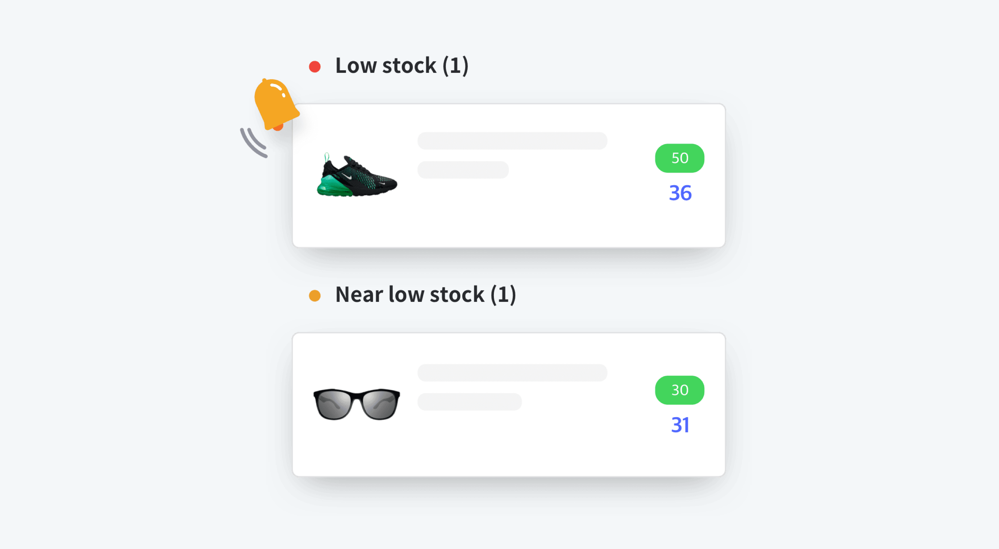

<gray-box>

**Q.** Why is inventory management important?

**A.** Because every stock in your inventory is **MONEY**.

</gray-box>

 

> “Inventory is money sitting around in another form” - Rhonda Adams, USA today

Inventory management and operations are always at risk due to unpredictable factors. So, is there any way to avoid that risk?

Don't worry! Safety stock does just that.

## What is Safety Stock?

Safety stock is the extra quantity you hold in your inventory to avoid running out of stock in unexpected situations such as sudden customer demand increase. Although it's holding more stock, this can help reduce your inventory costs and improve inventory management efficiency. Considering how having the most popular item as sold out is one of the fastest ways to lose your customers, safety stock is something you should consider.

Safety stock is a solution that keeps customers satisfied by maintaining a steady stock level. It helps you to order additional items if your company makes a demand forecast error or underestimates popular items. You don't have to rely on your suppliers to deliver quickly or turn away customers due to a low inventory level if you have enough safety stock.

Let's now check out how you can adopt safety stock to your business.

 

<gray-text>Safety stock reduces the risk of running out of stock</gray-text>

## Importance of Safety Stock

- **Protection against unforeseen supply variation** The main goal of safety stock is to keep enough inventory on hand in case of unexpected shortages. Because shortages can happen due to various reasons, it's recommended to keep extra stock in the back to be prepared. Especially if your items consist of non-perishables, keeping a safety stock is highly recommended.

- **Avoid stock-outs to maintain customer satisfaction** Most importantly, safety stock has the potential to play a significant role in meeting customers' needs. It helps to well-manage your inventories and avoid stockouts to maintain loyal customers. Therefore, keeping a surplus of quantity as safety stock can help the company to manage customer satisfaction.

- **Inaccurate demand estimation** Although predicting inventory based on customer demand is crucial for all businesses, prediction even in inventory management is difficult. Even if a company has experience or not, it's still difficult to predict the demand accurately. Therefore, it's recommended for businesses to be aware of always tracking the safety stock levels.

- **Prevention against price fluctuations** Restocking inventories in an emergency will cause additional expenses since factories, shipment, and management must be rushed. Aside from this, once market price changes, it can cause the cost of your goods to increase unexpectedly. This results in a lack of raw material prices, unexpected market demand increases, and new competitors. If you have enough safety stock during these unforeseen situations, you may avoid the higher costs of item buying price without losing sales.

## Calculating Safety Stock

The safety stock formula helps you find out the optimal number of products that you must maintain.

<tip-box>

**General equation** 
*Safety Stock = (Max Daily Sales x Max Lead Time in Days) - (Average Daily Sales x Average Lead Time in Days)*

</tip-box>

<gray-text>* *Lead Time* is a product’s manufacturing time from the beginning to the end.</gray-text>

 

Let's look at the example below to understand the calculation of safety stock.

<gray-box title="Example of safety stock formula">

Company A is running an accessory store. It takes on an average lead time of 4 days and a maximum of 6 days to make an accessory. The average daily sales of the accessories are 20 pieces and a maximum of 30 pieces.

</gray-box>

 

<gray-text>Example of safety stock formula</gray-text>

If we put the above values to the safety stock equation of the above, (30 x 7) – (20 x 4) = 130. 
As a result, company A will need a safety stock of 130 units.

## Low Stock Reminder

Low stock reminder helps you to protect your business from stock fluctuation. The feature sends a stock alert notification to help you with reordering and prevent stockouts.

 

Start your inventory management with BoxHero and set a low stock reminder to better your sales.

<gray-text>Receive a low stock reminder in BoxHero App</gray-text>

## Optimize your Safety Stock with BoxHero

BoxHero supports features that are ideal for managing inventory, such as:

- Easily control your stock with BoxHero's 'Analysis' menu.

- Identify items' low stock and view current stock status altogether on a single page.

- Insert the minimum stock quantity for each item. Check out the overall quantity and receive low stock notifications before it runs out.

- Easily create purchase orders, sales orders, and invoice statements.

- BoxHero is a cloud-based inventory management system that allows you to create and share transactions with your team anywhere, anytime.

### Have a hard time managing your inventory? Try [BoxHero](https://www.boxhero-app.com/en/) now.

BoxHero is an easy inventory management solution for everyone.

BoxHero's various smart features suit all industries and businesses.

**Start inventorying right now with BoxHero!**
