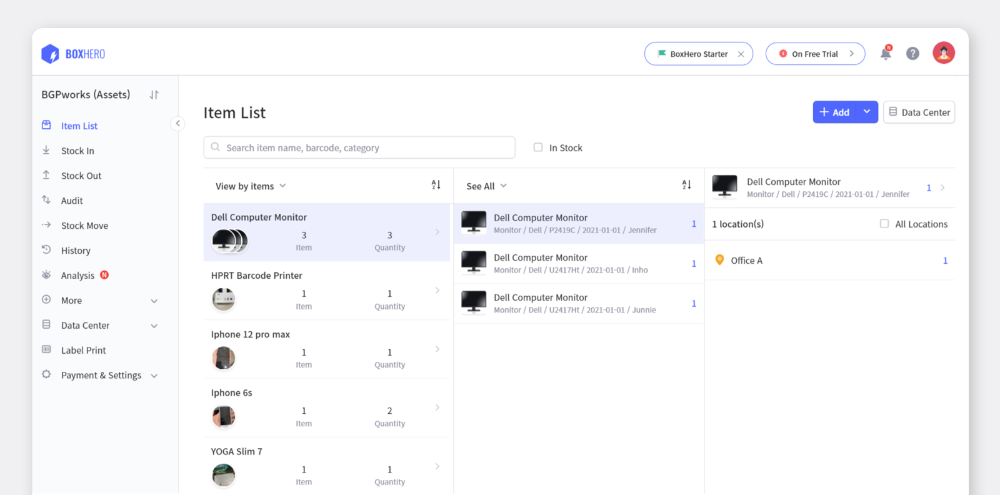

Every company needs to keep track of its tools and equipment regularly since it allows you to increase profits and reduce the risk of loss. To do this, you need to manage your assets efficiently with a proper management plan. However, if your company decides to manage and monitor assets manually, it will take lots of time and effort. In addition, it also has a high chance of making mistakes that results in prone to errors, especially when there are too many disorganized assets. Despite everything, good asset management will help you control expenses, meet business goals and production targets.

So ask yourself first if you have developed a good asset management plan. Aren't you having a hard time managing it? Don't worry. This article will help you process an effective asset management plan to better your decision-making.

## Why is Asset Management Essential?

Asset management helps all businesses save money and avoid costly problems such as repurchasing and repairing assets. You can overcome this issue by knowing where your assets are, who has them, and their condition. Those asset data will allow employees to improve accountability and efficiency in how they manage valuable business assets. Also, it ensures appropriate financial statements to increase the company's profits. The keys to achieving production targets, reducing expenditures, and fulfilling the company's goals include efficient asset management and optimizing asset effectiveness. The best way to have good asset management is to identify first the difficulties and look for ways to solve them.

## 4 Challenges of Asset Management

Many companies are discovering how much productivity they would lose if they do not update how assets are managed. To have effective asset management, you must avoid these:

 

**1. No Asset Information** 
No information about how many assets your company has or what their status is a challenge in asset management. If nobody is interested in the condition of the assets, you will have no idea when an asset needs repair or repurchase and which one needs more maintenance. Your company might need to reinvest, and this will result in additional expenses.

 

**2. Inaccurate Inventory Counts** 
You might encounter assets that are lost, damaged, or theft. In this case, it is difficult to identify and record those issues. If you don't know the number of business assets your company has, you won't be able to notice if they go missing. With this, difficulties may occur at the financial level since it is hard to know which business assets need replacement and their condition.

 

**3. Inaccurate Data** 
Information and data are the most crucial aspect of asset management. It shows every transaction and allows you to keep track of your asset. With this, it guides you on how a company should operate their business properly. However, there might be a risk when your company is one of the several industries relying on spreadsheets that are prone to errors. When data is entered wrong, decisions based on that data will also be incorrect. This kind of error occurs when there is no automated asset management system. These mistakes can result in asset loss, unmaintained assets, and poor decision-making.

 

**4. Lack of Asset Management System Optimization** 
Asset management will be a complicated process if your company is one of those managing assets manually. With this procedure, employees will be needing lots of time and effort to keep track of their business assets. Also, in the absence of an asset management system, there is a high chance of having errors or mistakes in asset data.

 

## How to Overcome Them

Some factors contribute to poor asset management. Think of a situation where you are running a small accessory shop. You have no idea where your assets are, and you even can't track who took them. If you don't give attention to your business assets, this sometimes results in lost, damaged, or theft. So how can we get rid of this issue?

 

**1. Keep an Up-to-date Record of Asset** 
Up-to-date records must contain all of the asset's information. It is much easier to track assets by using an asset management system to get notifications. Also, when assets need replacement, it alerts the person in charge of the maintenance.

 

**2. Create an Organized Database** 
All of your valuable assets and parts data must be in your database first. You can maintain proper operations simply by centralizing asset management. It will assist you in meeting many productivity and cost-cutting goals. In addition, it helps to reduce errors and disturbances. You'll be able to see all of your asset data at a glance.

 

**3. Ensure Accurate Data** 
Avoid having inaccurate data by providing the necessary information to help you create a proper plan and future goal for your company. Most significantly, it assists you in determining areas for improvement and how to enhance daily operations.

 

**4. Take a Systematic Approach** 
Overcome the challenges of asset management by taking a systematic approach. Asset management software allows you to have actionable information and accurate data. Choosing the right system will make your company's goal one step closer to success, and it betters the business's decision-making.

 

## Start An Effective Asset Management with BoxHero

<gray-box>

• Register all of your business asset's information such as item name, quantity, and category to have accurate data. You can easily track and view them in the item list at a glance. Also, you can directly identify the types of assets by categorizing them according to your needs like "category, brand, purchased date, user, and more."

• Save money and reduce the risk of loss by checking your asset status in Analysis feature. Every time an asset comes in/out, you can record it as stock in/out. After recording transactions, you can speedily check them in History menu. By having this record, you can get a notification to avoid low- or overstock.

• Avoid the risk of theft, loss, or damage by locating assets in the right area. Record its placements to manage the location of an asset to find them quickly when needed.

• Check the number of your business assets regularly and perform "Inventory Count" in BoxHero App. Scan barcodes to easily count assets and enter the total to have an updated quantity of the current assets.

• Manage all of a company's tools and equipment by designing a barcode or QR code for the asset in BoxHero. Scanning these labels allow you to keep track who is using your asset, how they are been used, and where it is located.

• Create and share transactions with your team anywhere, anytime with a cloud-based asset management system, BoxHero.

</gray-box>

### Having a hard time managing your inventory? Try BoxHero now.

BoxHero is an easy inventory management solution for everyone.

BoxHero's various smart features suit all industries and businesses.

Start inventorying right now with BoxHero!
