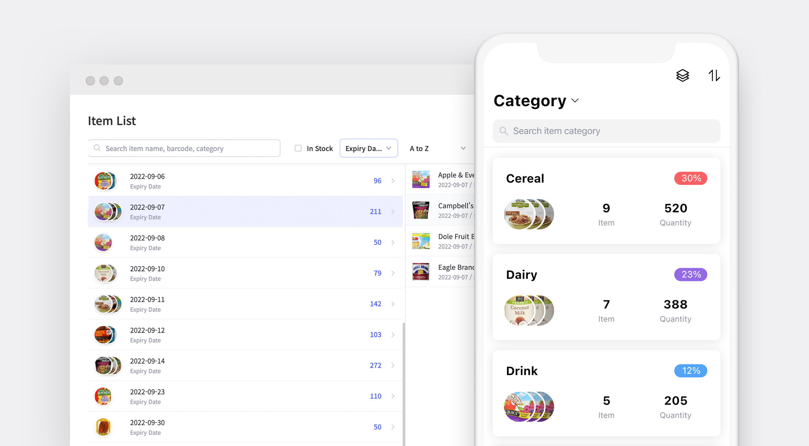

**What is dead stock? It's literally stock that's dead. It's sitting in your warehouse, nowhere to go. What's the reason for a dead stock to be created?** Considering how dead stock is a result of poor inventory management, it's important to remember that any company can end up having undesirable merchandise in its warehouse.

Dead stock can actually be caused by various factors such as the end of a season or product life cycle, a new competitor, or the loss of a loyal customer. Therefore, demand trends are difficult to predict and unexpected economic variables may have a negative impact on customer purchases. So how can we get rid of dead stock? Start by prioritizing inventory based on investment value, shelf life, and the turnover rate to identify excess inventory. Then, simply practice product forecasting to find the optimal quantity you need.

In this post, we'll discuss further on causes of dead stock and how to manage or repurpose dead stock.

[Suggested Reading: What is Dead Stock?](/en/blog/posts/what-is-head-stock)

## 3 Main Causes of Dead Stock

Here are 3 main causes of dead stock in many businesses:

- **Out of Style** 
  Unless you are selling a product that customers can find only in your shop, competition with other businesses is inevitable. So, what would happen if your competitor's product is more trendy than yours? With a high chance, your competitor's sales may turn out to be higher than yours. Although catching up with the market trend is one of the business basics, it's also important to remember that keeping up with trends relates to less dead stock also.
- **Absence of Quality Control** 
  Customers hate low-quality products. Also, they are less likely to purchase defective items, which can lead to unsold items piling in the warehouse. Therefore, quality issues can occur when Acceptable Quality Limit (AQL) standards aren't checked regularly.

  So how can we avoid this? Set high standards for raw materials and products throughout the production process as well as before they reach your warehouse. Pay attention to product specifications, packaging regulations, and AQL standards.

- **Lack of Customer Interest** 
  When your customers aren't interested or dissatisfied with your products, there might be a big chance of those products ending up as dead stock. Furthermore, as products in your store tend to dissatisfy your customers, the frequency of them coming back to your store may decrease as well. Therefore, make sure to constantly communicate with your customers and address their feedback to find where and why your customers are whether satisfied or not with your items. Always pay attention to your customer's needs as it is one of the gateways to improving your sales.

 

<tip-box>

**Product specifications:** Inspect things as soon as they arrive. If an item doesn't meet your expectations, get it replaced rather than taking the risk of selling defective goods.

**Acceptable quality limit (AQL):** Generally expressed as a percentage or ratio of the number of defective items compared to the total quantity. During random sample quality checks, the AQL informs you how many defective components are considered acceptable.

</tip-box>

 

We have learned the causes of dead stock. Now, let's look at the 5 tips below to turn your dead stock into sales:

## 5 Tips to Effectively Manage or Repurpose Dead Stock

### 1. Freebies

Increase order value by giving dead stock for free when customers purchase products from you. Offering a freebie will lead customers to have a good reason for buying products in your shop. However, this strategy may not improve your business's bottom line other than clearing up space to store popular goods in your warehouse. It might only be a great marketing technique whether you provide giveaways or promotions. Also, it will create a positive customer experience and increase the likelihood of them purchasing goods in your store.

### 2. Clearance

Discounts and clearance sales could also be the best approach to avoid dead stock. Create a sales event to sell your dead stock and make sure to advertise the event in any way. Even if you don’t get the expected profit margin by doing this, offering discounts can help you to generate a type of cash flow while also freeing up space in your warehouse.

### 3. Buy One, Get One Free

An effective way to clear dead stock is to easily bundle them with best-selling products and create an interesting combination with a good price on it. Same as the above causes, you won't be able to make a profit on this process. However, the freeloading stock items will be out from your inventory quickly. It is much better to sell dead stock rather than them to take up too much space in your warehouse.

### 4. Donation

Donating dead stock may not help you recoup lost revenue. However, there is a good opportunity when it comes to donating dead stock to a charity such as claiming tax benefits and creating a positive impression of your brand on people.

### 5. Use Inventory Management System

Once you have cleared out all of your dead stock on shelves, it's time to escape the dead stock situation by using an efficient inventory management system. This system provides real-time data on the inventory status and allows better visibility of stock movements. With this, you'll be able to detect what products aren't selling well and what products are most popular.

If you are still manually tracking inventory, upgrade your inventory management processes to make better decisions. Using an inventory management system like [BoxHero](https://www.boxhero-app.com/en/) may reduce the risk of dead stock by continuously monitoring and managing inventory levels to ensure you have just enough inventory to meet demand.

 

## Easily Manage Dead Inventory with BoxHero

[BoxHero](https://www.boxhero-app.com/en/) supports features that are ideal for managing dead inventory, such as:

- Organize products by categorizing them according to your needs, such as brand, color, and size.

- Check your inventory status and find dead stock right away with the inventory turnover ratio in the 'Analysis' feature.

- Identify items' low stock and view current stock status to maintain appropriate inventory management.

- Automatic, real-time inventory updates for every transaction.

- Creating purchase orders and invoice statements easily with an automatic sales analysis.

- BoxHero is a cloud-based inventory management system that allows you to create and share transactions with your team anywhere, anytime.

### Have a hard time managing your inventory? Try [BoxHero](https://www.boxhero-app.com/en/) now.

BoxHero is an easy inventory management solution for everyone.

BoxHero's various smart features suit all industries and businesses.

**Start inventorying right now with BoxHero!**
