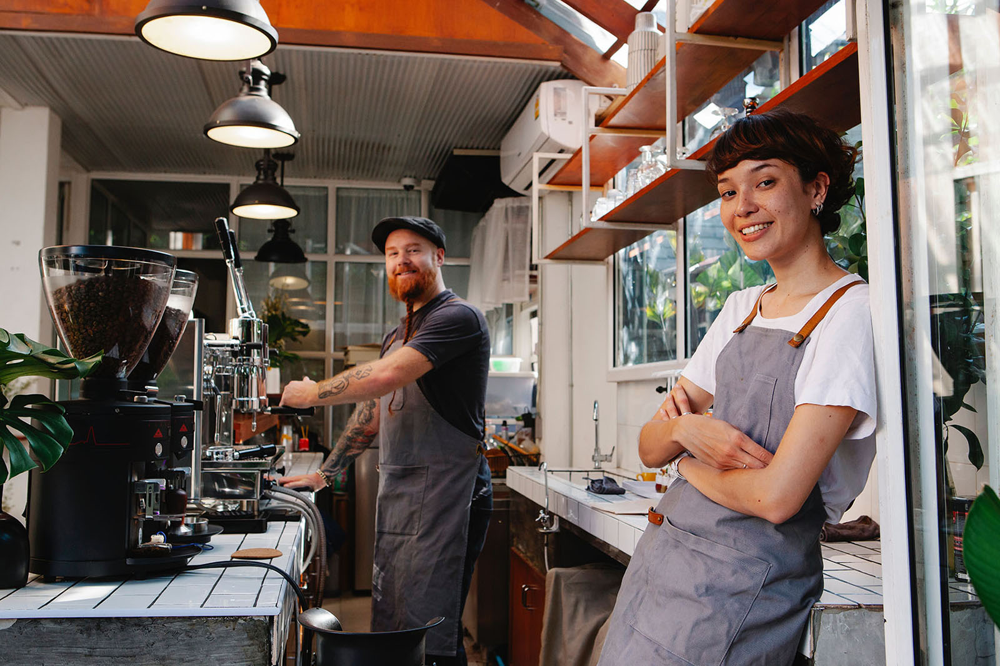
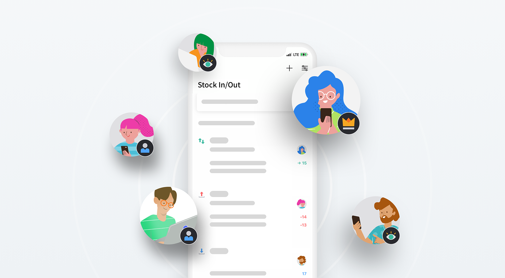

In F&B(Food and Beverage) industries like cafes, inventory management is critical. Having a customer eat something rotten would be the last thing you would want in your business. In addition, running out of consumables, like cups, forks, or napkins can actually lead to customer dissatisfaction, losing regulars, and ending up with fewer profits. However, because most cafe employees work part-time, it's difficult to maintain stable inventory management. A well-organized inventory management system in a coffee shop may be quite important than you think.

 

When it comes to inventory management at a cafe, the first thing you might think of is 'FIFO': which refers to 'First In First Out.' It's a method of shipping out the item in the order of first received. Usually, this first-in-first-out process is often applied for products with expiration dates. Considering how most cafes deal with a variety of products with expiry dates, including dairy products and desserts, FIFO is one of the recommended inventory methods for cafes. Let's not forget how coffee cups drink carriers, and paper napkins also need stock tracking before they run out.

 

So, what are other inventory management tactics cafes? let's learn about **4 effective ways** to manage your cafe's inventory.

## 1. Categorize your Inventory

Cafes require not only managing food ingredients every day but also managing various kinds of products.

Classify products with appropriate categories like 'Category,' 'Measurement,' 'Partner,' 'Expiry date,' and more. This classification not only allows you to easily view the current inventory status but also check the products by their expiry date. So, categorization is perfect when dealing with products with a relatively short lifespan, like milk and butter, which are the commonly used ingredients in a cafe.

## 2. Inventory Analysis

Inventory analysis is helpful not only for managing your current inventory management, but also to predict next month's order. By analyzing a full year's inventory, you can check which menus are most popular by season and have this information in mind for next year. This not only prevents you from stockout but also from excessive stock as well.

You can check the reorder quantity by the following formula: average daily units sold multiplied by average lead time:

<tip-box>

**Optimal Reorder Quantity for an SKU** = Avg. Daily Units Sold x Avg. Lead Time

</tip-box>

 

No time to calculate reorder quantity? Why not try using an inventory management system that will do the complication for you? BoxHero not only provides the essential data you need for better inventory management, but a dashboard to view the data easily is also supported. [Start Now- It's Free.](https://www.boxhero-app.com/en/)

## 3. Know your Safety Stock

When running a business, checking your inventory regularly is something you want to do, but somehow never have enough time for. A tactic for such a case is to learn your optimal safety stock level to prevent your items from stockout. As long as you know a certain level of products is stocked in the back, you won't have to constantly go through an inventory count.

[Read more about Safety Stock](/en/blog/posts/what-is-safety-stock).

 

## 4. Use a Cloud-Based System

It is always complicated to manage and share your inventory status on a paper or spreadsheet. Because stocks are coming in and out constantly, it's difficult to update the data with a pencil or access a desktop PC in real-time.

With a cloud-based inventory management system, all data is shared and updated in real-time, allowing employees to access data right from their mobile device or desktop PC.

A cloud-based inventory system is not only perfect for data security, but also a right fit for businesses working in a team. Start efficient teamwork by smooth communication with real-time data sharing.

 

## Easily Manage Inventory in your Cafe with BoxHero.

BoxHero supports features that are ideal for managing inventory in cafes, such as:

- Item categorization for easy sorting and filtering.

- Automatic analysis for inventory management insights.

- Low stock notifications to prevent stockout.

- Generating, scanning, and printing barcodes all at once.

- Creating purchase orders and making stock in/out transactions in one spot.

- BoxHero is a cloud-based inventory management system that allows you to create and share transactions with your team anywhere, anytime.

### Have a hard time managing your inventory? Try [BoxHero](https://www.boxhero-app.com/en/) now.

BoxHero is an easy inventory management solution for everyone.

BoxHero's various smart features suit all industries and businesses.

**Start inventorying right now with BoxHero!**
