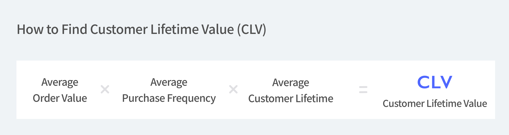

## What is CLV?

Customer lifetime value(CLV) is the total value that a customer has engaged in a business. In short, it’s a calculation of how much a customer has spent entirely. Therefore, in an eCommerce business, CLV is one of the key metrics for various activities such as advertisement budget, marketing campaign, customer acquisition investment, and more.

## Why is CLV important?

As mentioned above, it can play an important role when planning and evaluating various activities. It can also indicate whether your business is growing, who your loyal customers are, and even provide insights on how to increase your business’ profit. With such information, you can plan and create various marketing activities and build better customer relations, increasing CLV even more.

CLV can also be helpful when you wish to find insights from different customer segmentations. By looking into the customer’s activity and finding the pattern from both segments from customers in the low and high value of CLV, you can find insights into how to draw more sales from both groups.

 

1. **Better Marketing Strategy** You may have heard of KPI often, especially at the beginning of building a marketing strategy. KPI stands for Key Performance Indicator that helps to measure if the objective is being successfully achieved.  For an eCommerce business, CLV can be one of the KPIs especially when it comes to marketing.

2. **Less Customer Acquisition Cost** CAC, which is a Customer Acquisition Cost, is a cost spent to acquire a customer to purchase your product. The lower the acquisition cost, the better it is for your business and one of the tactics to lower the CAC is by increasing the CLV.

3. **More Sales** Many businesses focus on acquiring new customers, but although new acquisitions are important, generating more sales from your usual customer is also another thing you should add to your checklist. New customers have to get to know your brand, sign up, enter their address..the process of getting to know each other is tough in customer relations as well. But with customers who have already made several purchases are more fond of your brand and are likely to purchase your products based on the trust built towards the brand. With the CLV, you can plan out marketing strategies and differentiate the plan by the lower, higher CLV customer base. With such repeated sales, your CLV will increase over time as well.

4. **Customer Loyalty** In our card wallets, we not only hold our debit or credit cards but also membership cards from various stores and markets we frequently visit. It goes the same with the apps on our smartphones. Various membership apps from online to B&M stores are stacked on our smartphones. Such memberships are actually one of the ways to increase customer loyalty as well as the CLV. One of the ways is to segment your customers by the amount they’ve spent and create membership programs in levels. By this, you can run marketing campaigns for both customers with low and high LTV to engage in your site with different levels of rewards.

## How do you calculate CLV?

You must be wondering ‘how do you calculate CLV then?’ by now. You need to 3 things to find the CLV.

 

1. **Average Order Value** The average order value is the amount spent per transaction. Find the total value of revenue and divide it by the number of transactions.

2. **Average Purchase Frequency** The average purchase frequency is the number of transactions per customer made on average. Find the number of orders and divide it by the number of unique customers.

3. **Average Customer Lifetime** Lastly, the average customer lifetime lets you know the average time they shop in your store by year. Find the first and last order date from all your customers and convert that to the number of days on average. Then, divide that number by 365.

Finally, multiply the above three values and that’s your CLV.

## Let’s Improve CLV

Now we know that CLV is important and how to calculate it. So, how do we improve the CLV?

 

1. **Invest in Customer Experience** The main way to improve and increase CLV is to have customers engage you frequently in the long term is to invest and improve in customer experience. Providing clear, in-depth customer service can be one of the ways for customers to build trust in your business.

1. **Stay in Contact** Sometimes, customers can forget about your business. Considering the number of businesses a person is engaged within daily life, it’s a natural thing. So, staying in contact with your customers and promoting yourself is vital nowadays. Start email marketing like a monthly newsletter or seasonal promotional letter so your customers are reminded about you.

1. **Reward Customers** Although rewarding high-value customers is important to bring more engagement and build relationships, it’s also necessary to reward customers in purchase funnels. Rewarding first-purchase customers with free shipping or a coupon can provide a good customer experience. Also providing samples or sneak peek items before its release can also offer exclusivity to the clients.

### Wanna learn more about your store sales? Let [BoxHero](https://www.boxhero-app.com/) help you.

BoxHero’s Purchase & Sales menu provides an accurate sales analysis.

Try other smart features that can suit all industries and businesses.

Start today!
