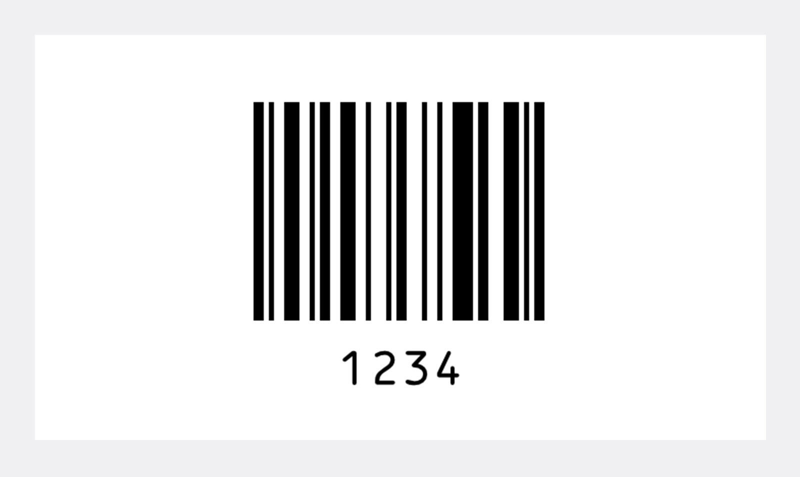
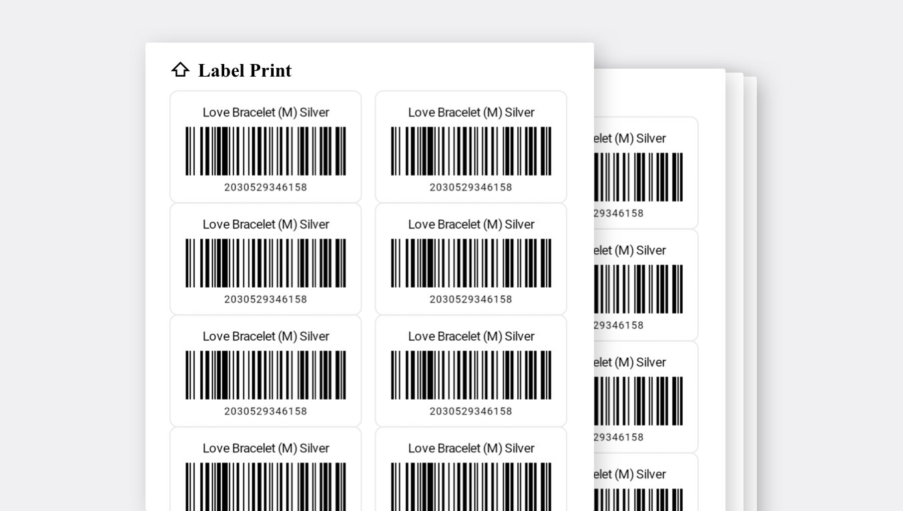

## Why Use Barcodes?

Why do all retail stores scan barcodes before making a payment? It is all because of 'efficiency.' Employees need to process a transaction quickly with an accurate calculation at the checkout counter. However, if you have items without barcodes attached, the count must be done manually along with checking the price. Considering how most supermarkets or convenience stores hold thousands of products, remembering all these products wouldn't make any sense.

Not only do barcodes hold product data, but it also allows you to leave transaction in a system. You can see many businesses using a POS(Point of Sales) when checking out the products. **This is not only a great system for transacting payment faster but also gathers all information for how many products have been sold for sales management.** Surprisingly, this is all possible thanks to barcodes.

 

This can apply to different types of businesses. If you are having trouble with tracking inventory and collecting sales analysis, let an [inventory system](https://www.boxhero-app.com/en/) do it for you. From generating barcodes to sales analysis, it can all be done in one.

## How to Make Barcodes

Barcodes are actually just a combination of numbers (and sometimes texts) that don't contain any information. The main purpose of a barcode is to grant a unique number for each product and then create a database based on barcodes with the use of machines. Therefore, barcodes can be in any order of digits. For example, if there are 100 different kinds of bread, you can randomly generate a barcode number from 1 to 100 for each bread.

On BoxHero, an inventory management system, you can easily generate random barcodes if your products don't have one, such as handmade products.

## Print your Barcode Labels

BoxHero allows you to print barcodes in the fastest and easiest way. Generate and print barcodes in less than a minute with BoxHero's 'Label Print' menu. BoxHero provides various barcode label templates with customizations you can apply to print with any information you wish to include.

Create your own barcodes now by entering the information in BoxHero's Label Print feature.

 

<video src="images/img_3.mp4" style="width:100%" muted autoplay loop playsinline></video>
<invisible></invisible>

 

In BoxHero, you can print from both thermal and general printers (inkjet, laser). If using a general printer, simply purchase an A4 label in a sticker form and print your customized label right from the BoxHero.

## Track your Inventory with Barcodes

The effectiveness of the barcode system has already been proven and is being used in almost all inventory industries - retail, medical, and manufacturing. Find the software that is the right fit for your business and be wise in choosing [the solution](https://www.boxhero-app.com/en/) for your company to save money and time. Start now and streamline your workflow immediately.

## Let BoxHero generate your barcode for you

BoxHero supports features that are ideal for managing inventory, such as:

- Categorizing items to easily sort and group for the organization.

- Checking reordering status from the 'Analysis' menu.

- Identifying items' low stock and viewing current stock status to maintain appropriate inventory management.

- Generate, scan, and print barcodes all in one system.

- Easily create purchase orders, invoice statements and sales analysis.

- BoxHero is a cloud-based inventory management system that allows you to create and share transactions with your team anywhere, anytime.

### Have a hard time managing your inventory? Try [BoxHero](https://www.boxhero-app.com/en/) now.

BoxHero is an easy inventory management solution for everyone.

BoxHero's various smart features suit all industries and businesses.

**Start inventorying right now with BoxHero!**
