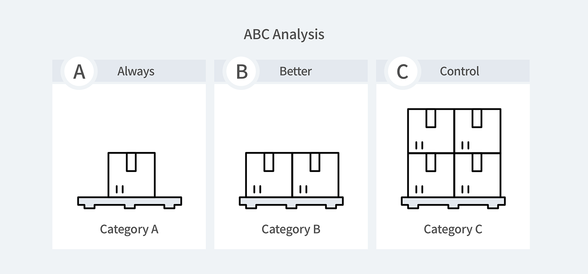
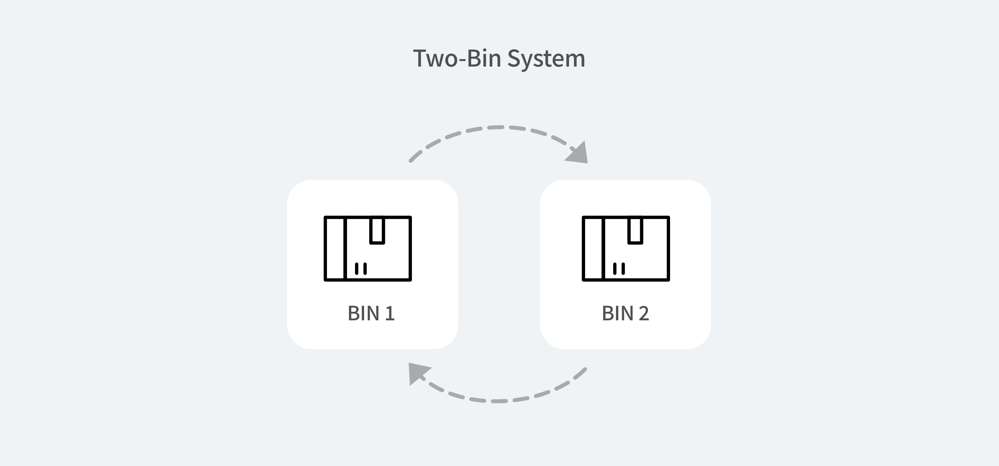

Effective inventory management is a critical aspect of success in a business. That's why several inventory tactics are existing to help you become better at inventorying. In this article, let's learn about four key methods of inventory management that can be applied to most inventory management!

## First, what is 'Inventory Management'?

Inventory management includes all activities related to keeping and managing your stock. Tracking, managing, and controlling inventory are all part of the process. The reason inventory management is so highly emphasized is that poor inventory management can result in wasting storage costs, employee salaries, and most importantly, your time. Let's not forget that all of these can lead to lower sales and customer dissatisfaction as well.

Read more about [Inventory Management](https://www.boxhero-app.com/en/blog/posts/what-is-inventory-management).

## 1. ABC Analysis

Fun fact: ABC analysis stands for Always Better Control.

How? You can do so by classifying your inventory items into three categories namely: A, B, and C, based on their values.

 

<gray-box title="ABC Analysis">

**Category A**  
Category A consists of high-priced items with a small amount of quantity. Therefore, the inventory under Category A must be controlled strictly.

**Category B** 
Category B represents items that are relatively less expensive compared to Category A with a moderate number of items. Therefore, the control level is also moderate than Category A.

**Category C** 
Category C shows items with a high number of inventory items but less investment value. Therefore, the level of control is minimal compared to Category B and C.

</gray-box>

The main purpose of ABC analysis is to help businesses distinguish and understand which products are most important to their company's financial success. This method is commonly used in a variety of markets including retail, automotive, warehousing, and manufacturing.

For example, let's say you are running a watch store and sell luxury watches, watch straps, and batteries. You will most likely be managing the luxury watches strictly, which will be categorized as Category A. Watch straps, where the cost range is in between the watched and batteries, will fall into Category B. Lastly, batteries, which are comparatively cheap with abundant quantity, will be Category C, the least control needed among the categorizations. Through such categorization, you can spare time and effort to what's most important to your business.

## 2. Just in Time (JIT)

The 'Just in Time(JIT)' method is something you can call minimalistic inventory management. It's by keeping only the inventory you need right now. Because there is no excess stock to store, it helps save storage costs. Only when there is an order from the buyer, you start the item production.

The main purpose of this method is to keep inventory at the lowest level before reordering and ultimately aim to keep production costs as low as possible. This method is also used by well-known companies such as Toyota and Dell.

 

So how does Just in Time works?

First, a customer contacts the manufacturer to make an order. When the manufacturer receives the order, they contact their suppliers to place an order. The suppliers receive the order and then provide the materials needed by the manufacturer to meet the customer's order. The manufacturer then receives the raw materials, assembles them, and sells them to the customer.

 

## 3. VED Analysis

VED Analysis (Vital, Essential, and Desirable Analysis) is an inventory management method that classifies products according to their importance. This may seem similar to the ABC analysis, but with VED analysis, you divide items into three categories based on their importance in the production process.

<gray-box title="VED Analysis">

**Vital Category**Inventory necessary for production or operation falls under this category. A lack of stock in this category may affect a negative impact heavily in its production process. Management must check properly to ensure the availability of the items in the Vital category at all times.

**Essential Category**For the essential category, it may be as critical as a vital category as stock shortage stop or disrupt other processes. However, the absence of items in this category may be not as critical as items in the vital category. Still, the management should maintain the optimal stock level for items in the essential category as well.

**Desirable Category**The items in the desirable category will cause minor disruptions in the production or other processes when if they are unavailable. The impact is the least critical among the three categories. The time that it takes to restock the items in this category is relatively shorter as well.

</gray-box>

## 4. Two-Bin System

The two-bin system, or the twin-bin system, is an inventory control system keeping two bins where if the first bin has been exhausted, the second bin is then used until the order for the first bin arrives. Then the same would apply once the second bin is depleted as well. Because the method itself is very simple and does not require as much time and effort as other methods, the tactic is primarily used for controlling low-cost items.

 

**The process can be broken down as follows:**

1. The first bin is on top or in front of the second bin. It's recommended to have a card indicating 'In Reorder' and place it on the bottom of both bins.

2. Use the stock from the first bin and once it's empty, replace it with the second bin.

3. Make a reorder for the first bin and place the 'In Reorder' card on top of it.

4. After reordering, when you receive the ordered stocks and replace them in the empty bin, the process repeats itself.

5. When you receive your order, replenish the first bin and when the second bin is depleted, repeat the above process.

### Have a hard time managing your inventory? Try BoxHero now.

BoxHero is an easy inventory management solution for everyone.

BoxHero's smart features suit all types of industries and businesses.

**Start inventorying right now with BoxHero!**

