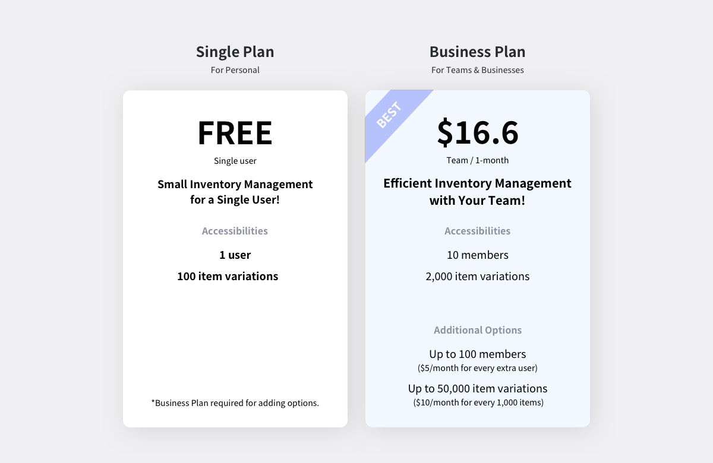
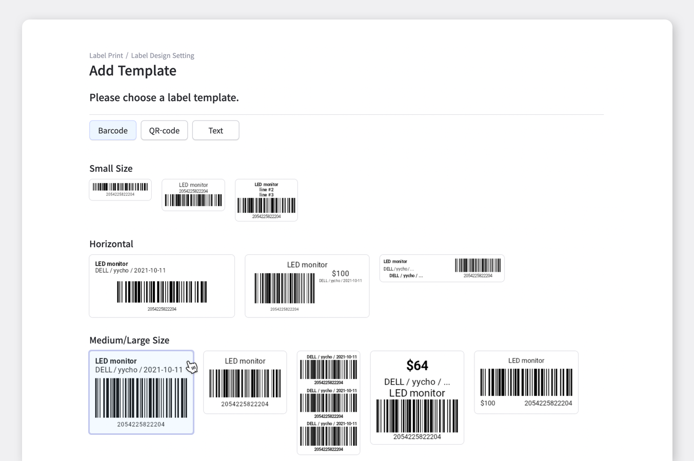
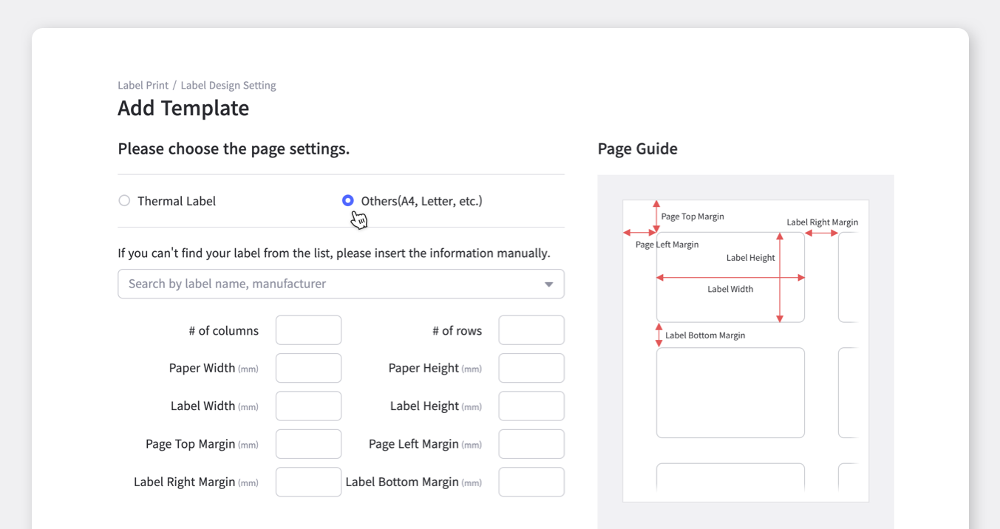
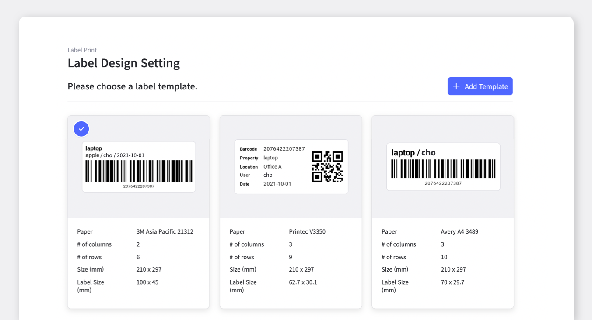
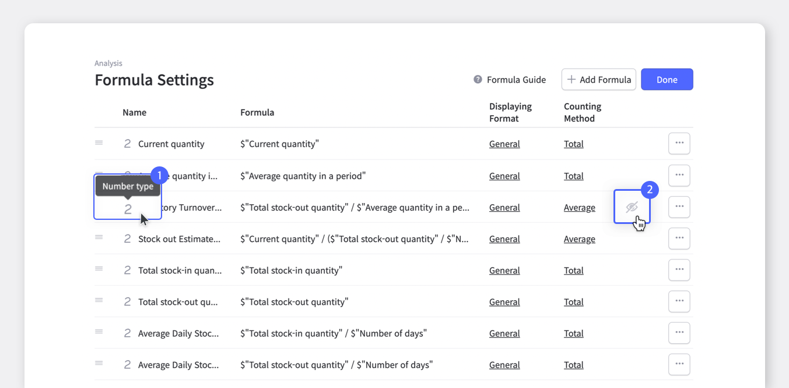
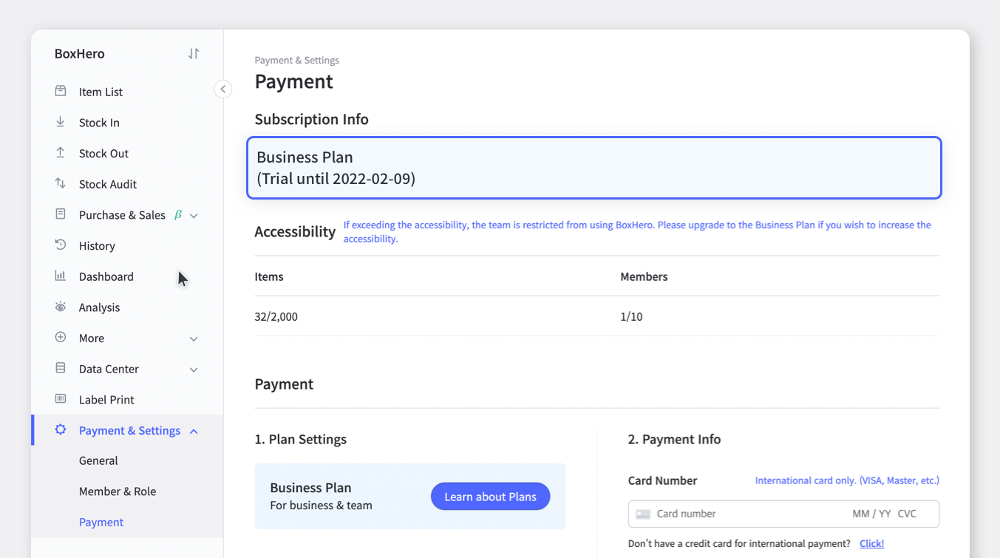

> "How do I know which inventory management software is right for my business?" 
> "What are some of the important aspects I need to check when testing software?" 
> "How can I make the most out during the BoxHero free trial?"

 

BoxHero is an inventory management service for all types of businesses. When first signing up, a 30-days free trial is provided for you to test and check out what BoxHero really is. What's better is that you do not have to insert any payment information during this free trial.

So let's find out some of the BoxHero features you must test out during your free trial.

 

After first creating your team on BoxHero, your 30-days Business Plan free trial is automatically started.

With the Business Plan, you use up to 10 members and 2,000 items variations. You can also add more options from the Payment page for up to 100 members and 50,000 items.

Sign up today and start inventorying with BoxHero's 30-days free trial!

## Easily Print Transaction Invoice

If you need to share your transaction with your supplier/vendor or need to download a copy in a PDF format.

① Select a transaction from the History menu. 
② Click 'Print' from the ‘More’ button.

## Make a Customized Barcode Label

Need barcode label? Print from BoxHero ‘Label Print’ menu!

 

- **Select a template**

Please choose the template you need from the various selections in BoxHero.

<tip-box>

If you cannot find the template you are looking for, please contact the [BoxHero customer service](mailto:support+boxhero@bgpworks.com).

</tip-box>

 

- **Choose label size**

You can choose from thermal or paper(letter, A4, etc.) from the label settings page. Please select the label type from the list and if you cannot find it from the list, please insert the label size in the settings.

- **Editing label design**

If you have successfully selected the label size, it’s time to choose what to add to the label! By clicking the blue boxes on top, it will be automatically copied. Then, simply paste it to one of the empty boxes below. You can check the preview of your label from the right.

After the final check, the label design is completed. You can always print the save labels again anytime!

<caution-box>

Label print and design are currently available only on the desktop web.

</caution-box>

## Analyze Inventory in Real-time

Checking and identifying your inventory is necessary for effective management. You may even already know that inventory analysis is imperative to learn the optimal stock level. But how? Well, BoxHero got your back.

<video src="images/img_7.mp4" style="width:100%" muted autoplay loop playsinline></video>
<invisible></invisible>

 

BoxHero’s Analysis menu offers various inventory data including, inventory turnover ratio and estimated days until stockout, to even sales analysis such as total sales, net profit, and more.

<caution-box>

Please be reminded that you must have cost and/or price categories for sales management.

</caution-box>

 

- **Formula Settings**

You can check, edit, and delete formulas saved in the `Analysis` >`Formula Add & Settings` . 
1. By placing the mouse over to each name, you can check what formula it is. 
2. With the hiding icon, you can hide data you wish to not see on the table.

 

- **Displaying Format**

You can choose how you wish to see the data in **General / Percentage / Currency** from the displaying format settings.

## What happens after the free trial is over?

You can check when your trial will be expired from `Payment & Settings` - `Payment` .

Wanna know how much you will be paying if you start the subscription after the trial? 
From the ‘Payment & Settings’, you can check your expected pricing by the wanted billing cycle.

<video src="images/img_11.mp4" style="width:100%" muted autoplay loop playsinline></video>
<invisible>Checking Expected Pricing with Options</invisible>

### Have a hard time managing your inventory? Try [BoxHero](https://www.boxhero-app.com/en/) now.

BoxHero is an easy inventory management solution for everyone.

BoxHero's various smart features suit all industries and businesses.

**Start inventorying right now with BoxHero!**

