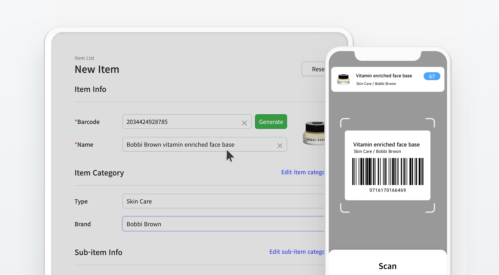

> I'm having a hard time managing inventory in my drug store.
> It's hard to manage products without barcodes.
> How can I efficiently manage my inventory?

## Why is Inventory Management Important in Pharmacies?

If a customer cannot find the drug they are looking for, there's a high chance that the customer will go to the next drugstore they can find. There's an even higher chance that they may never come back the next time they need their medicines. If you think about it, no one writes their name down on a waiting list for a medicine. It's a matter of emergency. So what can we do to avoid these situations? For pharmacies, it's crucial to keep a steady amount of quantity as well as to conduct an inventory count routinely. 

Inventory management not only allows you to save time by keeping track of what items are in stock but also allows you to know what items need to be reordered in advance. Building this system helps you to grow a great customer relationship in two ways: having stock and knowing when stocks will come in. Customers aren't always mad about stockout, they get mad when it's never in stock. If you can manage a great inventory system and even get to keep track of your item's lead time, you can provide when items will be available again and this can allow you to build a strong customer relationship based on trust. 

## 3 Tips on Efficiently Managing Pharmaceutical Supplies

So, let's get into where we can start to build that strong customer relationship.

 

**1. Make it Automated** 
An automated system allows increasing the credibility of your inventory data. It's like a calculator. Even it's adding and subtracting simple numbers, repetition done by humans can cause errors. Rather than counting and writing your inventory on paper, scan all barcodes and let machines do the counting for you. 

 

**2. Categorize your Inventory** 
Separating bookshelves by the genres in the library not only allows visitors to find books they are looking for, but also allows the librarians to check how many books are available for each genre. In inventory control, categorization is crucial as it not only allows you to learn more about your inventory but also lets you know how many stocks are available for each category.

For example, if you categorize and sort your inventory by brand, you can immediately check the most and the least amount of stocks that are available for each brand. From here, the analysis goes on. For example, you can analyze by the date to check which brand is most popular at a certain season and prepare for restock next year.

 

**3. Use a Cloud-Based System** 
Have difficulties in managing and sharing inventory data on paper or spreadsheet? Better your inventory management and have efficient teamwork by using a cloud-based system. Checking and tracking all items and transactions is possible in one solution.

Moreover, with a cloud-based inventory management system, all information and transaction are updated in real-time. All inventory status is available in real-time and everyone can access the solution together from both PC or mobile. Avoid inventory errors. miscommunication and better your stock control today. 

## So why not try using an Inventory Management System?

Time is also gold to customers. Do not let them wait for too much to buy your goods. Keep track of the quantity and location of your products by using an inventory control system. It's much easier to manage stocks by using BoxHero's powerful features that can suit your business like a custom solution. Simply register your item and transactions, all analyses including turnover rate, profit, inventory asset and so much more are all done by BoxHero. 

## Start Efficient Pharmaceutical Supply Management with BoxHero

BoxHero supports features that are ideal for managing inventory in pharmacy, such as:

<gray-box>

1. Check your inventory status with Analysis feature.

2. Keep track of stock status to maintain a steady inventory rate. 

3. Generate, scan, and print barcodes from both mobile app and desktop web. 

4. Easily create purchase and sales orders, invoice statements, and more.

5. BoxHero is a cloud-based inventory management system that allows you to create and share transactions with your team anywhere, anytime.

</gray-box>

[Start Now - It's Free.](https://www.boxhero-app.com/en/)

# Conclusion

A strong pharmaceutical supply management system is critical to operating efficacy in medical institutions. This may be accomplished by understanding the inventory challenges. Avoid inventory data errors and stockouts by using a cloud-based inventory system. Implement the provided three tips to improve your inventory management.

### Have a hard time managing your inventory? Try BoxHero now.

BoxHero is an easy inventory management solution for everyone.

BoxHero's various smart features suit all industries and businesses.

Start inventorying right now with BoxHero!

