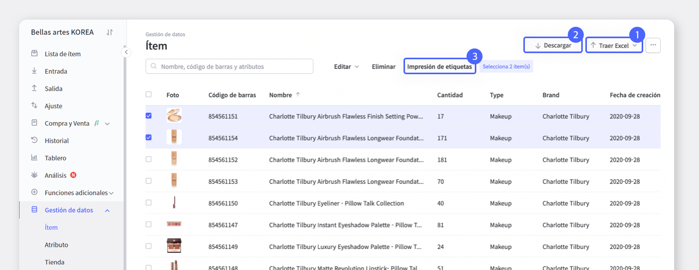
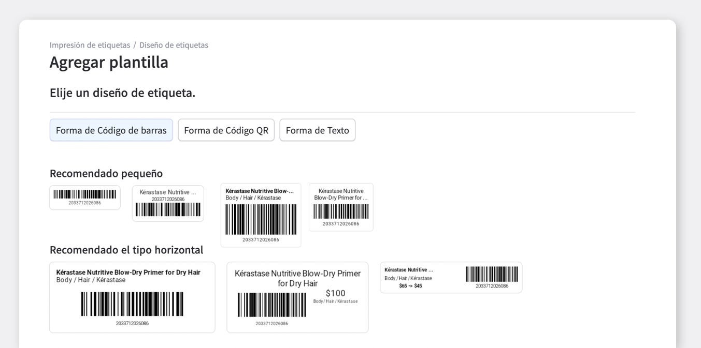
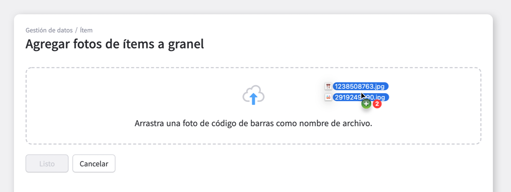
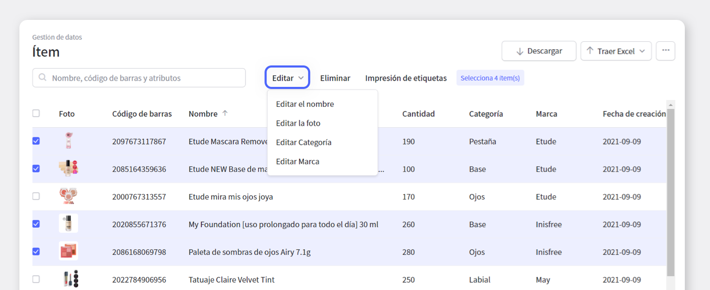
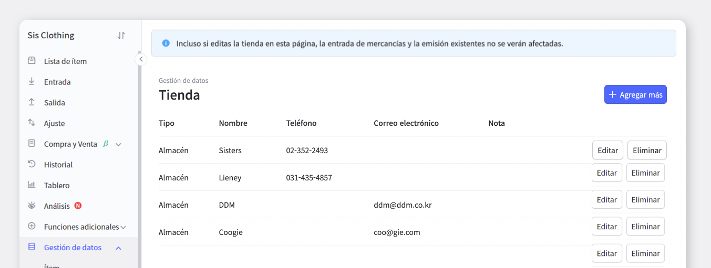

Administrar tantos tipos diferentes de inventario a la vez no es fácil. Organizar datos para muchos productos no es una tarea fácil. Es una tarea que requiere mucho esfuerzo y tiempo.

¿No sería más fácil administrar el inventario administrando los datos por producto, atributo y tienda?

Comencemos con la gestión de datos con BoxHero.

## Gestión de Datos

### Ítem

Si enumeramos brevemente las funciones en `Gestión de datos`> `Menú` de productos

 

**1. Registrar producto con Excel**  
Se puede aplicar a BoxHero usando el archivo que previamente se manejó en Excel.

 

**2. Descargue los datos de información del producto a Excel**  
Puede descargar códigos de barras y atributos según el producto como un archivo de Excel y conservarlos. 
Utilice el menú Descargar Excel en la parte superior derecha de la pantalla.

 

**3. Crear / imprimir etiquetas de productos seleccionados** 
Puede imprimir etiquetas seleccionando solo los productos que requieren etiquetas.

<video src="images/img_3.mp4" style="width:100%" muted autoplay loop playsinline></video>
<invisible>Crear / imprimir etiquetas de productos seleccionados</invisible>

¡También puede crear diseños de etiquetas para productos seleccionados por separado! 
Si hace clic en el botón Establecer diseño de etiqueta en la parte inferior, irá automáticamente a la ventana de diseño de la plantilla.

**4.Productos eliminados recientemente**  
En el menú de productos eliminados recientemente, se enumeran todos los productos eliminados después de que se creó el equipo, y es una función útil que se puede restaurar en caso de eliminación accidental.

Sin embargo, los datos se guardarán solo durante 30 días después de la eliminación.

 

**5.Cargar masiva de fotos**  
Entre las consultas de BoxHero, recibimos muchas consultas sobre si es posible transferir productos e información de productos del equipo original al nuevo equipo. ¡Sí, es posible! Desafortunadamente, la función del pasado hasta la historia pasada no es compatible.

Además, cargar fotos diariamente al registrar un producto requiere mucho tiempo y esfuerzo, por lo que puede usar la función de carga masiva. 

Sin embargo, El código de barras debe guardarse como el nombre de archivo de la foto para poder cargar la foto. ¡Tenga esto en cuenta!

 

**6. Modificar o eliminar producto**  
Puede trabajar seleccionando solo aquellos productos que necesitan ser modificados o eliminados de la lista.

Si hace clic en el botón Eliminar, el producto se eliminará inmediatamente. Si quiere editar, puede seleccionar los atributos por separado y editar solo parcialmente la parte que quiere editar.

### **Atributo**

**1.** **Agregar los atributos**

<video src="images/img_7.mp4" style="width:100%" muted autoplay loop playsinline></video>
<invisible> Agregar los atributos</invisible>

Si hay atributos del producto que desea agregar, excluida los atributos existentes, puede agregarlos directamente.

<video src="images/img_8.mp4" style="width:100%" muted autoplay loop playsinline></video>
<invisible>Agrupar productos por atributos</invisible>

Puede agrupar productos por atributos.

Ingrese la información del producto agregando los atributos necesarios, como el tamaño, el color y el número de pieza. 
Puede agrupar productos de acuerdo con la información de atributo ingresada y administrarlos de manera eficiente.

 

Esta es una función eficiente porque si agrupa y administra productos por atributo, puede seleccionar y administrar solo productos de acuerdo con los atributos que desee.

**2. Tienda**

¿No está complicado de ingresar y administrar mucha información nueva de clientes cada vez que almacena y envía?

En BoxHero, puede registrar la información del cliente por adelantado y seleccionar el cliente deseado para la entrante y saliente.

No es necesario tener una libreta de direcciones de las tiendas separada. Ingrese a la pestaña de clientes del menú de administración de datos con BoxHero y registre la información necesaria del cliente, como el número de teléfono y el correo electrónico, para administrar de manera eficiente los socios comerciales.

<tip-box>

Sin embargo, incluso si modifica el cliente en `Gestión de datos`> `Tienda`, la entrante y saliente de mercancías existentes no se verán afectados.

</tip-box>

## ¡Resuelve la gestión de datos + Gestión de inventario con BoxHero a la vez!

- Puede aplicar fácilmente el archivo de Excel que utilizó para administrar su inventario a BoxHero.

- La gestión de inventario sin complicaciones es posible agrupando productos por atributo.

- Puede registrar la información del cliente con anticipación y seleccionar el cliente que desea recibir y enviar.

## BoxHero se puede usar en todos los entornos como en PC y dispositivos móviles.

La gestión de inventario continúa sin detenerse incluso en un entorno sin una PC.

Al admitir una potente aplicación móvil, puede usar BoxHero en su celular.

- Ahora gestione su inventario sin problemas con BoxHero en cualquier momento y cualquier lugar.

