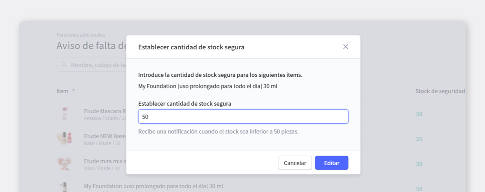
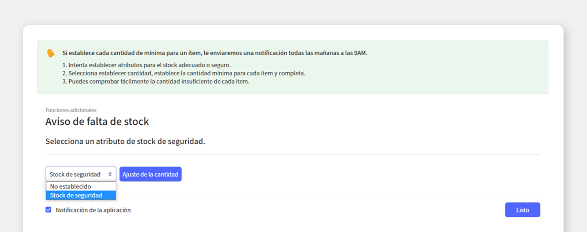
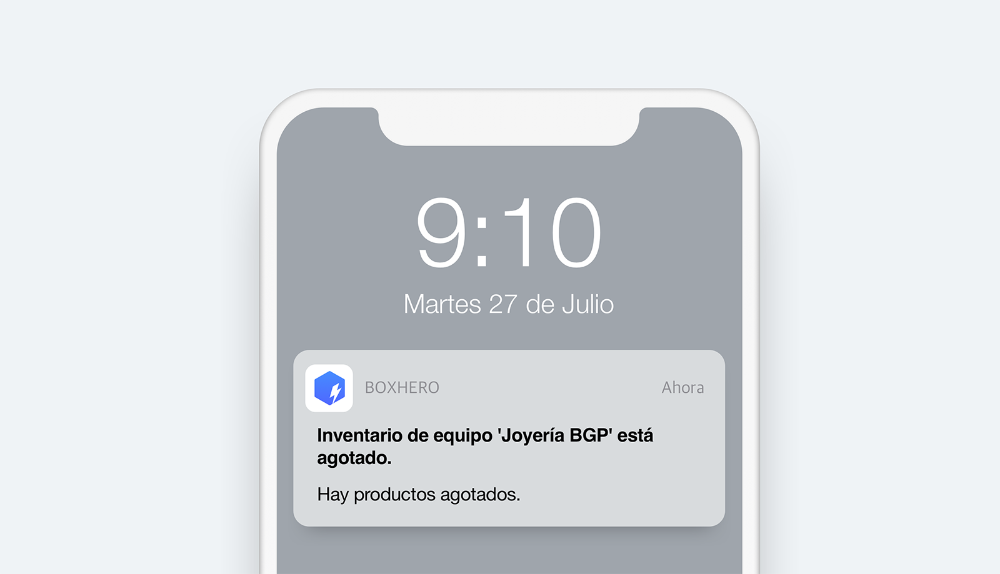

Si alguna vez ha operado un negocio, ¡debe haber sentido la necesidad de inventario de seguridad!

Un aumento inesperado de la demanda puede ser una buena noticia para el funcionamiento de una empresa, pero los pedidos y entregas repentinos pueden generar costos inesperados y, sobre todo, generar insatisfacción del consumidor.

Con el stock de seguridad, puede verificar fácilmente la escasez de cada artículo, y si el stock permanece por debajo del stock de seguridad, puede prepararse para una situación peligrosa con un mensaje de advertencia y calcular la cantidad del pedido teniendo en cuenta el stock de seguridad. ¡También puede utilizar un sistema que automatiza las tareas para que no se pierda situaciones de falta de existencias y se prepare con anticipación!

En esta publicación, veamos **BoxHero + Inventario de seguridad / Notificación de falta de stock**

## En BoxHero Puede recibir alertas sobre inventario insuficiente.

Si utiliza la función de stock seguro de BoxHero, puede recibir una alarma sobre stock insuficiente. **Funciones adicionales**  Haga clic en el menú y luego en la pestaña **Notificación de falta de stock** para acceder a la función.

Primero, ¿cómo se deben establecer las existencias de seguridad para cada producto?

### 1. Configuración de stock seguro

<video src="images/img_2.mp4" style="width:100%" muted autoplay loop playsinline></video>
<invisible>Configuración de stock seguro </invisible>

Puede agregar la cantidad de existencias de seguridad a las propiedades de un producto a través del proceso de `'Lista de productos'`> `'Agregar producto'`> `'Editar propiedades del producto'`> 'Agregar existencias de seguridad'. 

¡Consulte el video **gif** anterior para conocer el proceso detallado!

### 2. Establecer / modificar la cantidad de stock de seguridad

Si hace clic en la pestaña de notificación de agotamiento de existencias, puede ver de un vistazo los productos que están agotados / excedentes, así como la capacidad de editar / establecer existencias de seguridad para cada producto.

<tip-box>

**Stock insuficiente**: cuando el número de stocks de seguridad registrados es igual o menos.

**Exceso de existencias**: cuando el número de existencias de seguridad registradas es 3 veces o más 

</tip-box>

 

- **Configuración de inventario de seguridad en la aplicación móvil de BoxHero**

<video src="images/img_4.mp4" style="width:100%" muted autoplay loop playsinline></video>
<invisible>Configuración de inventario de seguridad en la aplicación móvil de BoxHero</invisible>

Ahora, una vez que haya establecido la cantidad de stock segura, aquí le mostramos cómo configurar **alerta de falta de stock**.

### 3. Configurar notificaciones de falta de stock

Si establece una cantidad mínima para un producto, ¡le enviaremos una notificación todas las mañanas a las 9 a.m. para los productos que están agotados! 

<gray-box>

1. Intente establecer propiedades para el stock adecuado o seguro.

1. Seleccione Establecer cantidad, establezca la cantidad mínima para cada producto y complete.

1. ¡Puede comprobar fácilmente la cantidad insuficiente de cada producto!

</gray-box>

 

- **Configuración de información del producto y Configuración de notificación de stock bajo en la configuración de stock de seguridad móvil.**

En la aplicación móvil BoxHero, puede configurar fácilmente la información del producto y la configuración de notificación de stock bajo.

<video src="images/img_6.mp4" style="width:100%" muted autoplay loop playsinline></video>
<invisible>Configuración de notificación de stock bajo</invisible>

### 4. **9 de la mañana, ¡Ding-dong!**

¡Así **todas las mañanas a las 9:00** , aparecerá una notificación de un producto que está agotado en la pantalla de su teléfono!

<caution-box>

Para recibir notificaciones de falta de existencias, ¡debe activar push notification en la aplicación BoxHero en su teléfono!

</caution-box>

Del mismo modo, es posible mantener una lista de información del producto sobre **stock insuficiente / stock inminente / exceso de stock** a través de Excel. Si usa la pestaña **Descarga de Excel** en la parte superior derecha, puede convertirlo en un archivo de Excel y guardarlo.

## ¡Use la función de notificación de falta de stock de BoxHero para estar perfectamente preparado para situaciones repentinas de falta de stock!

BoxHero incluye funciones útiles que son perfectas para situaciones de falta de stock a través de notificaciones de falta de stock, como:

- ¡Intente agregar **stock de seguridad** en la función de edición de atributos de productos de la adición de productos!

- Puede recibir notificaciones sobre productos agotados todas las mañanas a las 9 am a través de la función de notificación de agotamiento del complemento.

- Puede descargar la lista de información del producto correspondiente a **falta de stock / escasez de stock inminente / exceso de stock** en Excel.

<tip-box>

**Se puede usar BoxHero en PC y dispositivos móviles, todos los entornos.**

La gestión de inventario continúa sin detenerse incluso en un entorno sin una PC.

Al admitir una potente aplicación móvil, puede usar BoxHero en su teléfono.

</tip-box>

