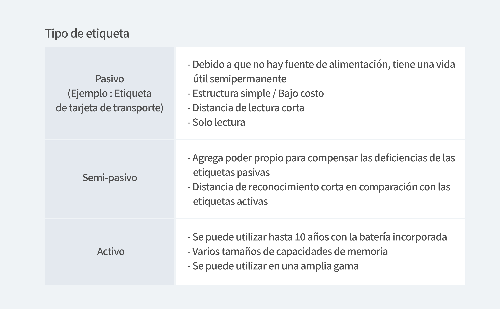
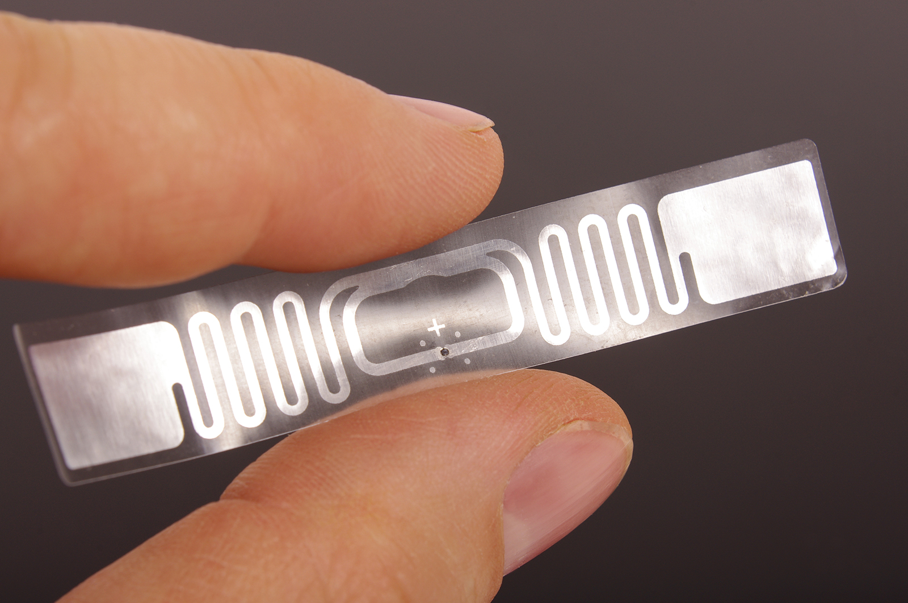
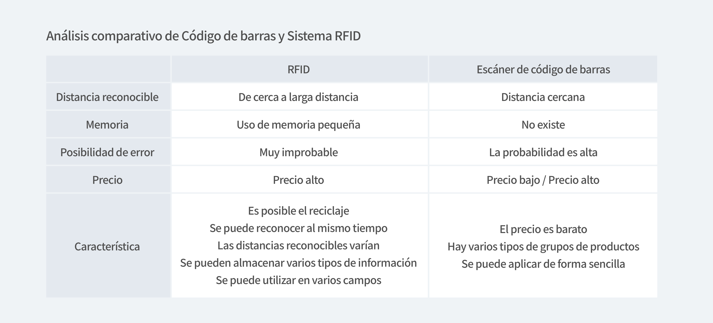
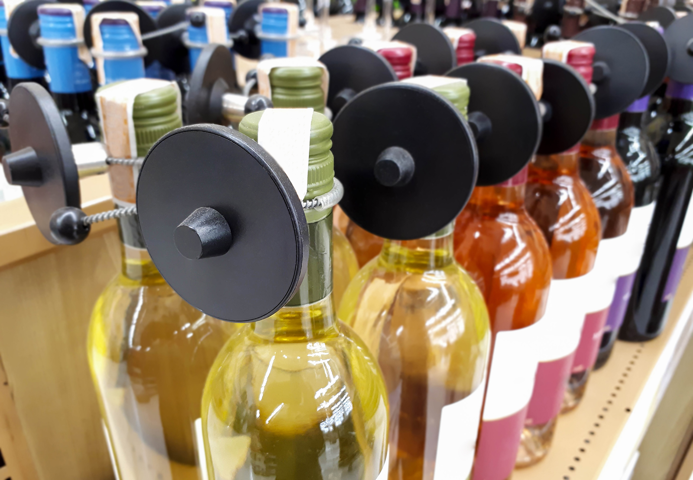

¿Sabes cómo funciona la tarjeta de transporte cuando subes al autobús? ¿Cómo entra y sale el dinero con solo pasar la tarjeta en la máquina de etiquetas? ¿Alguna vez se ha preguntado si puede pagar etiquetando su teléfono? Aunque la palabra RFID puede parecer un poco desconocida, es un sistema que ya está presente en nuestras vidas.

 

Tomemos como ejemplo una tarjeta de autobús. A diferencia de hace unos años, hoy en día pocas personas utilizan dinero en efectivo para utilizar los autobuses urbanos. Esto se debe a que estamos usando un sistema que paga automáticamente la tarifa del autobús con un sonido de "Bbip" cuando una tarjeta de débito / tarjeta de crédito está etiquetada en la terminal de la tarjeta.

Tal sistema se llama sistema RFID. Eso significa identificación por radiofrecuencia y se refiere a una tecnología que lee información a larga distancia utilizando ondas de radio. Para utilizar esta tecnología, es absolutamente necesario un lector RFID (como un autobús, por ejemplo, un terminal de tarjetas de transporte), al igual que un autobús.

## Componentes de un sistema RFID

Hay cuatro componentes de un sistema RFID.

- Etiquetas RFID 
Cada uno de ellos contiene información única y tiene un chip IC integrado que registra información y una antena que transmite datos al lector. Se divide en tipo activo y tipo pasivo según la presencia o ausencia de poder.

- Antena 
Es responsable de enviar y recibir datos. Se puede producir en varios tamaños y es un factor importante para determinar la forma de la etiqueta.

- Líder 
Lee y recupera información de etiquetas. Se divide en tipo fijo, tipo móvil y tipo portátil según el uso.

- Servidor 
Es responsable de administrar el sistema líder distribuido.

<tip-box>

La etiqueta RFID y el lector intercambian datos a través de la antena y finalmente, el servidor gestiona los datos leídos.

</tip-box>

 

Una tecnología similar, el código de barras, usa luz visible o luz infrarroja, mientras que el sistema RFID usa ondas de radio.

Actualmente, se han establecido varios estándares para asegurar la compatibilidad RFID a nivel internacional, los tipos más representativos son el TIPO A y el TIPO B, y ambos tipos tienen la misma frecuencia a 13,56 Hz. En Corea, todas las tarjetas de transporte publicadas después de T-money cumplen con los estándares internacionales. Por lo tanto, las tarjetas de transporte prepago / pospago no utilizadas se pueden utilizar como etiquetas NFC.

## Entonces, ¿Cuáles son las ventajas y desventajas de los sistemas RFID?

La ventaja del sistema RFID es que puede registrar más información y más diversa que los códigos de barras que registran etiquetas en tonos simples de blanco y negro, y cuando se adjunta a los productos, se pueden asignar números de serie a cada producto. También es semipermanente y se puede reutilizar repetidamente. Además se puede decir que la fiabilidad de los datos es alta.

Sin embargo, la desventaja es que el precio es alto. Además, como se vio anteriormente, la frecuencia de cada país es diferente, por lo que es inferior en términos de compatibilidad, y también en términos de seguridad porque la información se puede leer a distancia mediante ondas de radio. Por lo tanto, existe un gran riesgo de invasión de la privacidad, y es un sistema que debe usarse con más cuidado porque la ubicación se puede rastrear leyendo una etiqueta adherida a una tarjeta de identificación distante a través de una antena. Además, no hay muchos lugares donde se pueda usar porque el público objetivo es muy limitado.

 

## Entonces, ¿Cómo se pueden usar más los sistemas RFID en el futuro?

Como se mencionó al principio de este artículo, la tecnología de RFID se utiliza actualmente en una amplia variedad de campos. Es una tecnología que se usa ampliamente no solo para tarjetas de transporte, sino también para registrar y reconocer información personal adjuntando etiquetas de pasaporte e identificación. Además en Corea, desde 2010, se ha adjuntado un chip RFID a la botella de licor para acabar con el licor falso con un teléfono inteligente. En ese momento, Corea fue la primera en el mundo en tercer un sistema que permite a los consumidores verificar directamente si existe o no un licor falos usando RFID. Además, en Osaka, Japón, las etiquetas se colocan en los bolsos y la ropa de los estudiantes de la escuela primaria y se utilizan como tarjetas de identificación para controlar el acceso a los edificios. En particular, los sistemas RFID actuales están atrayendo mucha atención como reemplazo de los códigos de barras.

 

- **Leer más**

En el próximo artículo, ¿Veremos la historia de ZARA, que se ha convertido en líder en marcas de moda que utilizan la tecnología de etiquetas RFID?

[Cómo convertirse en un líder de marca de moda, RFID](/es/blog/posts/como-convertirse-en-un-lider-de-marca-de-moda-rfid)

### ¿Tiene problemas al comenzar con la administración de inventario?

¡Administre su inventario de manera fácil y precisa con BoxHero!

### Al utilizar la información anterior, puede administrar su inventario de manera eficiente y precisa.

¿Necesita un programa de gestión de inventario más simple y sencillo? BoxHero se dedica a ayudarlo a administrar su inventario al proporcionar funciones inteligentes que incluyen análisis de datos, importación de archivos de Excel, escaneo de códigos de barras, conteo de inventario, administración de ubicación y más.

BoxHero es la solución de gestión de inventario más sencilla que admite todo tipo de dispositivos.

¡Verifique y administre fácilmente su inventario en cualquier momento y en cualquier lugar en tiempo real!

