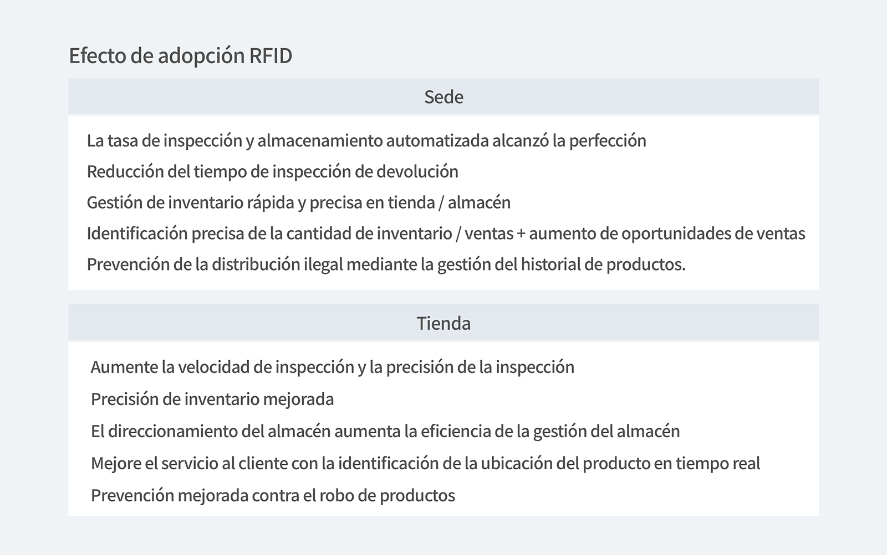

## Cómo ZARA usa etiquetas RFID de manera eficiente para sobrevivir en el mercado de la moda

Nuevos productos y tendencias, ahora y ahora, vivimos en una era de moda rápida donde se crean nuevas tendencias todos los días. En esta publicación, echemos un vistazo a ZARA, que se ha convertido en un líder en marcas de moda mediante el uso de la recopilación de datos masivos mediante RFID (identificación por radiofrecuencia).

Primero, hablemos de qué tipo de sistema es RFID.

<tip-box>

**¿Qué es un sistema RFID?**

- 'RFID' es una abreviatura de  **R**adio** F**requency **ID**entification que reconoce la radiofrecuencia. Se refiere a una tecnología que permite la identificación de objetos, como objetos o personas. ,a través de lector RFID.

</tip-box>

Zara produce 450 millones de productos al año. ¡La cantidad de estilos es incontable! Y es una marca global que se vende en todo el mundo hasta el punto que nadie conoce la marca ZARA. Entonces, por supuesto, para producir y administrar de manera eficiente un número infinito de productos, inevitablemente requerirá una gran cantidad de mano de obra, costos, tiempo y esfuerzo, ?cierto?

Para minimizar este inconveniente, Zara lleva experimentando con la tecnología RFID desde 2007, hace unos 14 años. Y finalmente, en 2014, cada tienda introdujo el sistema RFID en serio, y no es exagerado decir que el sistema RFID se está utilizando en casi todos los procesos, desde el diseño del producto hasta la gestión del inventario y la gestión de la tienda después de la entrega. Como resultado, ZARA ha logrado mucho al construir un sistema que está muy por delante de sus otros competidores de la moda. Y ahora, todos los productos de ZARA están equipados con etiquetas RFID, y ahora, no solo ZARA, sino también muchas marcas como Uniqlo y 8 Seconds están utilizando este sistema. Para una marca de moda, el solo hecho de resolver el problema de la escasez de existencias en las tiendas puede conducir hasta cierto punto a un aumento de las ventas. Por ejemplo, en una tienda con un sistema RFID, es posible verificar rápidamente dónde se encuentra cada producto en tiempo real, por lo que se puede administrar de manera más eficiente que cuando un empleado verifica personalmente el inventario.

La gestión eficiente del inventario conduce a una mejora de la productividad del trabajo. Como las etiquetas RFID pueden reducir el tiempo de recuento / recuento de inventario de más de 40 horas a solo 4-5 horas, los empleados pueden dedicar más tiempo al servicio al cliente, lo que tiene el efecto de aumentar la satisfacción del cliente y la productividad del trabajo.

## Vamos a ver rapidamente al efecto de la introducción del sistema RFID.

En primer lugar, el efecto de la introducción del sistema RFID se puede dividir en dos perspectivas: el punto de vista de la oficina central de la tienda y el punto de vista de la tienda.

Sin embargo, no todas las marcas pueden adoptar sistemas RFID.

La tasa de adopción de sistemas RFID en la industria cara a cara es realmente muy baja. Otra razón es que puede ser oneroso porque el costo de introducción inicial es alto y todavía hay pocos casos exitosos de introducción del sistema RFID. En cuanto a las deficiencias del sistema RFID, a veces el chip adjunto a la etiqueta está defectuoso y el chip no se reconoce bien. Y si el producto en sí es pequeño y hay muchos materiales subsidiarios de metal, la tasa de reconocimiento puede reducirse dependiendo de la ubicación donde se adjunta.

Sin embargo, se puede decir que el sistema RFID es un paso esencial para recopilar una gran cantidad de datos. El efecto directo de la introducción de este sistema (la información de todos los productos desde la logística hasta las tiendas no solo se data, sino que también se acumulan los datos en análisis en tiempo real), sino que finalmente los datos recopilados por el sistema RFID se convierten en el activo de una moda. marca como ZARA, y puede conducir al rendimiento.

### ¡Vamos a ver los casos de 8 Seconds / Spao, las marcas Coreanas!

**8 seconds**

Actualmente, a partir del 1 de julio de 2020, 8 Seconds gestiona todos los sistemas, desde los productos de temporada hasta la logística y las tiendas, mediante la aplicación de RIFD. Al adoptar este sistema, 8 Seconds ha podido reducir significativamente varios costos operativos, como la precisión del inventario en los almacenes y tiendas, el aumento de la tasa de ventas y la disminución de la tasa de pérdidas.

**SPAO**

SPAO también está introduciendo el sistema RFID en las soluciones de marketing.

Por ejemplo, si se para frente a un espejo sosteniendo una camiseta de un personaje de Disney lanzada por SPAO, una imagen de video con el estilo del producto que está sosteniendo aparece en la pantalla en el espejo, y puede verse como un mensaje de marketing. solución en la que puede obtener consejos sobre cómo peinar con este producto. Esta es una solución de marketing de contenido de video en el espejo que utiliza tecnología RFID desarrollada por Yusungsoft, una subsidiaria de SPAO. Puede verse como una solución de marketing que permite a los clientes divertirse y obtener consejos al mismo tiempo al comprar productos en tiendas fuera de línea, así como una adopción a largo plazo.

En los primeros días del desarrollo del sistema RFID, se aplicó y se utilizó solo en el proceso de logística, pero hoy en día se están desarrollando servicios ampliados que utilizan RFID. Por ejemplo, en el proceso de logística, si se requirieran 20 empleados para realizar el recuento de inventario en la tienda, ahora puede llevar de 2 a 1 a 2 horas. También permite un conteo rápido de inventario bajo demanda, lo que puede reducir significativamente la escasez de inventario en la tienda.

**Utilice el big data de las etiquetas RFID de varias formas para lograr el crecimiento de una marca de moda.**

### ¿Tiene problemas al comenzar con la administración de inventario?

¡Administre su inventario de manera fácil y precisa con BoxHero!

### Al utilizar la información anterior, puede administrar su inventario de manera eficiente y precisa.

¿Necesita un programa de gestión de inventario simple y sencillo? BoxHero se dedica a ayudarlo a administrar su inventario al proporcionar funciones inteligentes que incluyen análisis de datos, importación de archivos de Excel, escaneo de códigos de barras, conteo de inventario, administración de ubicación y más.

BoxHero es la solución de gestión de inventario más sencilla que admite todo tipo de dispositivos.

¡Verifique y administre fácilmente su inventario en cualquier momento y en cualquier lugar en tiempo real!

