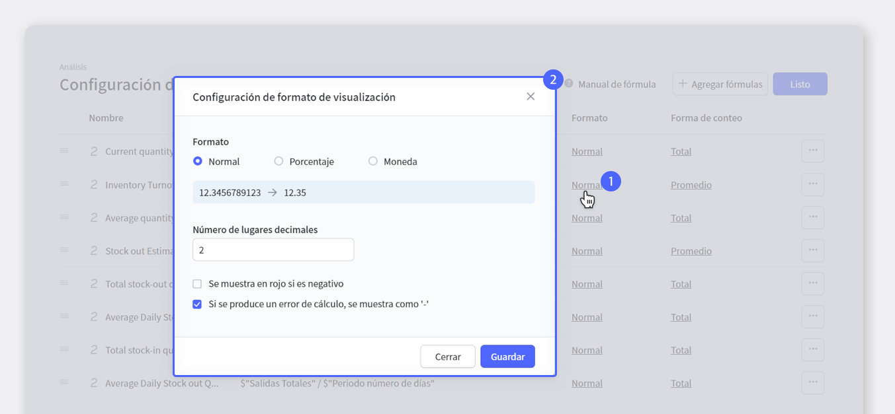
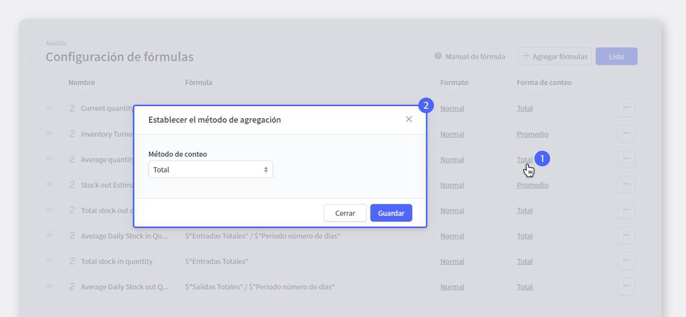
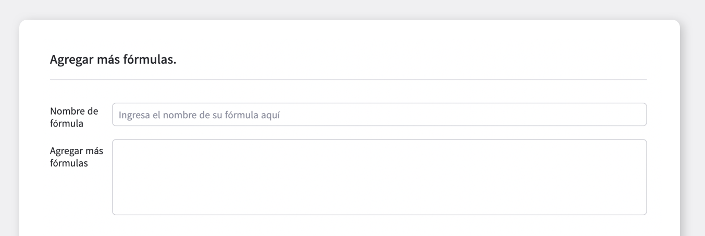

Para una gestión eficaz del inventario, es muy importante tener una comprensión clara del inventario que está gestionando. Necesita conocer su inventario para poder administrarlo en consecuencia, ¿verdad? Por lo tanto, la función  <mark>**'Análisis de inventario'**</mark> es absolutamente necesaria.

No es necesario utilizar fórmulas complicadas, simplemente haga clic en la información de análisis que quiere ver. BoxHero proporciona diversa información de análisis de inventario basada en los datos acumulados mientras se administra el inventario.

Incluso si no tiene la información de análisis que quiere, puede agregar un elemento de análisis ingresando una fórmula directamente.

Ahora, administre su inventario con información de ventas, como el inventario promedio y la rotación de inventario, así como las ventas y el margen de ganancias, que fueron difíciles de calcular a través de la función de análisis de inventario. ¡BoxHero calculará todo! 

## Análisis de inventarios

<video src="images/img_2.mp4" style="width:100%" muted autoplay loop playsinline></video>
<invisible>Análisis de inventarios</invisible>

La función <mark>**'Análisis de inventario'**</mark> calcula automáticamente la cantidad de inventario actual, las ventas totales, la rotación de inventario y los envíos totales por período, y proporciona una tabla para una fácil visualización de un vistazo. Por supuesto, toda la información se puede descargar y almacenar en Excel. Si quiere información diferente a la proporcionada por BoxHero de forma predeterminada, puede agregar su propia fórmula o utilizar la fórmula básica que proporcionamos.

Sin embargo, para poder gestionar las ventas, el coste, el precio de venta, etc. deben gestionarse como atributos. Si no hay ningún artículo relacionado, debe ingresar información para cada producto después de agregar un artículo en `Gestión de datos`>`Atributos`

## Ajuste de fórmulas

<video src="images/img_3.mp4" style="width:100%" muted autoplay loop playsinline></video>
<invisible>Ajuste de fórmulas</invisible>

Puede ver, editar y eliminar fórmulas guardadas. Puede ver el tipo de fórmula colocando el mouse sobre el ícono al lado del nombre. ¡También puede ocultar los datos deseados en la tabla de atributos de inventario haciendo clic en el emoticono de ojo!

 

La configuración del formato de visualización de la fórmula se puede dividir en **Normal / Porcentaje / Moneda** .

 

<gray-box title="NOTA">

- **Actualmente, solo los tipos de fórmulas numéricas pueden cambiar el formato de visualización.**

- Puede establecer el número de decimales, el porcentaje y la moneda.

- Se pueden especificar estilos, como mostrar **un número negativo** en rojo o mostrar un error de cálculo con '-'.

</gray-box>

 

- **El método de agregación predeterminado** también se puede configurar por separado. <gray-text>(Actualmente solo los tipos de fórmulas numéricas pueden cambiar el método de agregación.)</gray-text>

- Métodos de agregación de números admitidos: suma, promedio, mínimo, máximo, cantidad

 

## Agregar fórmula

### 1) Agregar fácilmente

<video src="images/img_7.mp4" style="width:100%" muted autoplay loop playsinline></video>
<invisible>Agregar fórmula más fácilmente</invisible>

Elija uno de los atributos básicos, la gestión de ventas o la gestión de inventario en el menú `Facil de Agregar`. Si selecciona **Propiedad básica**, ingrese el nombre de la fórmula deseada, seleccione la propiedad que desea ver y haga clic en el botón `Guardar` para agregar la fórmula.

Haga clic en uno de **Administrar ventas, Administrar inventario** y aparecerá una variedad de artículos donde puede agregar fórmulas.

Cuando hace clic en un elemento, aparece un área donde puede ingresar los valores requeridos para guardar la fórmula.

Ingrese un nombre para la fórmula, y si la fórmula tiene un valor que debe seleccionarse, toque el cuadro de entrada para seleccionar el valor apropiado y finalmente presione el botón `Guardar` para agregar la fórmula.

 

<tip-box>

Si hay un elemento que requiere selección, aparece un elemento sugerido en texto azul en el cuadro de entrada. Consulte esto y selecciónelo. Si no hay una propiedad relacionada, debe agregarla en `Gestión de datos`>`Atributo` e ingresar la información. Después de ingresar, agregue la fórmula nuevamente. 

</tip-box>

## 2) Agregar Manualmente

<video src="images/img_8.mp4" style="width:100%" muted autoplay loop playsinline></video>
<invisible>Agregar fórmula malnualmente</invisible>

Si la fórmula que desea no está incluida en la fórmula básica de BoxHero, puede agregar la fórmula usted mismo para obtener los datos que desea. ¡Haga una fórmula que haga referencia a la función de autocompletar y las funciones / ejemplos disponibles!

 

<tip-box>

En la entrada de fórmula directa, se proporciona la función de autocompletar.

- Si se ingresa {{, se cargan las propiedades guardadas y los resultados de la fórmula.

- Si ingresa $, se llama a una variable que puede utilizar datos relacionados con el inventario.

</tip-box>

 

<caution-box>

**¡Precaución!**

Si edita una fórmula y causa un error en otras fórmulas, sus ediciones no se guardan. 
Las modificaciones se guardan temporalmente, y si todas las fórmulas relacionadas se modifican o eliminan para evitar errores, el historial de almacenamiento temporal se guarda automáticamente de una vez. Puede verificar los detalles del error que ocurrió en la fórmula a través del mensaje de error.

</caution-box>

## ¡Complete la gestión de inventarios con BoxHero con la función de análisis!

BoxHero incluye funciones útiles que son perfectas para el análisis de inventario, como:

- Puede obtener los datos que desee mediante el uso de varias fórmulas proporcionadas por BoxHero.

- Puede aplicar datos que no están incluidos en BoxHero ingresando directamente la fórmula.

### BoxHero se puede usar en PC y dispositivos móviles, en todos los entornos.

La gestión de inventario continúa sin detenerse incluso en un entorno sin una PC.

Al admitir una potente aplicación móvil, puede usar BoxHero en su teléfono inteligente.

- Ahora gestione tu inventario sin problemas con BoxHero en cualquier momento y lugar.

