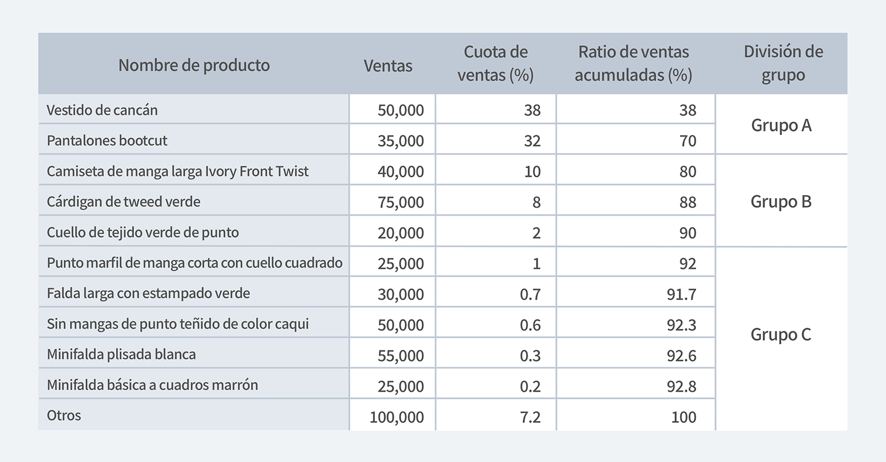

## Analice de manera eficiente los datos de inventario con análisis ABC y análisis VED

El análisis minucioso de los datos es fundamental para una gestión eficiente del inventario.

Nos gustaría mostrarle dos métodos de análisis de datos de inventario para una gestión de inventario más precisa.

### 1. Análisis ABC

El análisis ABC comenzó con la noción de que no todos los productos que maneja deben tratarse de la misma manera en el mismo nivel. Además, la afirmación de que el 20% de los productos representan el 80% de las ventas también se basa en el análisis ABC.

El análisis ABC es un método de categorizar las ventas de productos según su importancia, se agrupan todos los productos que se manejan, y entre ellos, el grupo de productos que representa el 70% de las ventas es A, el 20% es B, el 10% es C. Es una técnica para clasificar y analizar dividiendo en tres categorías. El Grupo A, que se evalúa como de alta contribución a las ventas, tiene una alta rotación de inventario, por lo que es necesario prestar mucha atención en términos de gestión de inventario y marketing, mientras que el Grupo C, que tiene una contribución relativamente baja a las ventas. , podrá gestionarlo de forma eficiente con menos atención. Los criterios de análisis pueden basarse en varios métodos, como las ventas y el volumen de ventas.

---

#### Análisis ABC utilizando datos identificados como ejemplos

El siguiente ejemplo calcula la proporción y el porcentaje acumulado de las ventas totales de una empresa al organizar los productos vendidos en una tienda de ropa en el orden de venta.

Los vestidos de cancán a cuadros y los pantalones bootcut, que alcanzaron el 70% de las ventas acumuladas al sumarlos en orden de aumentar las ventas por producto, se agruparon en el Grupo A, y las camisetas de manga larga marfil y tweeds verdes que representaron el 80-90% de las ventas. Ventas acumuladas Las rebecas y los tejidos de punto verdes se dividieron en el grupo B, y el resto de los productos se dividieron en el grupo C.

<invisible>
Ventas, Cuota de ventas, Ratio de ventas acumuladas, División de grupo
</invisible>

Como tal, el análisis ABC más básico es dividir los productos en grupos A / B / C / de acuerdo con la contribución a las ventas de la tienda. No solo tienes que dividirlo en grupos, es hora de comenzar a analizar, ¿verdad?

Ahora comencemos a analizar por grupo según su contribución a las ventas.

1. **Grupo A** con la mayor contribución a las ventas
También ocupará la mayor parte del espacio del almacén. Este es un grupo que necesita hacer pronósticos de ventas más planificados haciendo referencia a datos de ventas anteriores. Es una tienda de ropa, ¡así que recomiendo desglosarla por temporada! Además, dado que es el grupo con mayor contribución a las ventas, se requiere una gestión minuciosa y meticulosa para asegurar que el inventario no caiga tanto como sea posible.

2. **Grupo B** con una contribución moderada a las ventas
Ocupa una proporción intermedia entre el Grupo A y el Grupo C. Al predecir el volumen de ventas adecuado, es posible administrarlo haciendo nuevos productos o importando
productos cuando se agoten.

3. **Grupo C** con la menor contribución a las ventas
Es efectivo tener una cantidad mínima por prenda en el almacén. Está bien si hay un fenómeno de falta de existencias sin predecir por separado el volumen de ventas. Sin embargo, si las ventas no son tan buenas como cree, debería pensar en no importarlas.

---

El propósito del análisis ABC es encontrar métodos de gestión de inventario adecuados para cada grupo.

**Entonces, ¿cuándo se puede utilizar el análisis ABC?**

1. Cuando quiera concentrarse en administrar productos que contribuyan a las ventas
2. Cuando desee saber en qué tipo de producto necesita invertir su dinero de marketing.
3. Cuando desee aumentar las ventas centrando el marketing en el grupo A únicamente

¡El análisis ABC no es la única forma de analizar eficazmente los datos de inventario!

Vamos a ver el análisis VED, que a menudo se discute junto con el análisis ABC.

### 2. Análisis VED

El análisis VED es uno de los análisis que se utiliza como indicador de la disponibilidad de stock en un almacén cuando es necesario, además de ayudar a los gerentes de materiales a determinar el nivel de servicio deseado y, en última instancia, la cantidad de stock de seguridad necesaria para alcanzar ese nivel de servicio. Por lo tanto, el análisis VED es una técnica de gestión de inventario que clasifica el inventario de acuerdo con su importancia funcional y se puede dividir en tres categorías de acuerdo con la importancia de la organización y la necesidad de producción u otras actividades.

---

- V - Categoría Vital : Artículos que deben estar en stock cuando se necesiten 'Debidos'

En la categoría vital, los productos que incurren en un alto costo de oportunidad o tienen un impacto catastrófico, como la interrupción del negocio, deben evitarse en extremo. Por ejemplo, en el caso de la gestión de inventarios de medicamentos en hospitales y farmacias, que son negocios que utilizan mucho el análisis de VED, los medicamentos que afectan la vida de una persona deben clasificarse en la categoría vital.

- E - Categoría requerida:  Artículos que deben estar en stock como productos básicos 'Deberían'

Existe una alta probabilidad de que se produzca una interrupción significativa de las existencias en la categoría Esenciales, pero no tan alta ni muy riesgosa como en la categoría Vitales. Tomando los productos farmacéuticos como ejemplo, los productos que deberían incluirse en la categoría esencial pueden considerarse retrasados hasta cierto punto, pero tenga cuidado, ya que esto puede costar una vida o hacer imposible su reemplazo.

- D - Categoría deseada : Artículos que pueden estar en stock 'Lata'

En el caso de una categoría deseada, es un producto que tiene un bajo costo en caso de una situación de falta de stock, o es una categoría de productos que todavía están en riesgo de quedarse sin stock. Los medicamentos como las vitaminas y los complementos alimenticios entran en esta categoría.

---

#### Entonces, ¿por qué es tan importante el análisis VED?

Lo más importante en la gestión de inventarios es mantener niveles óptimos de stock en todas las áreas. El mantenimiento del inventario tiene un costo, y este análisis divide su inventario en tres categorías para ayudarlo a tomar decisiones administrativas sobre el mantenimiento del inventario.

---

**Cuatro tipos de costos de mantenimiento de inventario**

1. Costo del artículo : El costo o precio de un artículo del inventario. El valor de compra real del inventario que tiene actualmente. Entonces, cuanto más inventario tenga, más alto será y viceversa.
2. Costo de pedido / instalación : Las compras de inventario incluyen ciertos costos, incluidos el envío, el embalaje, etc.
3. Costo de mantenimiento : incluye el almacenamiento de inventario, el seguro y los costos de mano de obra relacionados con el manejo del inventario, así como daños, fugas o robo del inventario que tenga.
4. Costo por falta de existencias : El costo por falta de existencias es el resultado de la desabastecimiento de un artículo de inventario. Esto incluye pérdidas de producción debido a productos agotados, lo que puede retrasar las ventas del producto. Además, a veces el producto en sí está agotado y estas pérdidas se incluyen como parte del costo de agotamiento de existencias.

---

#### Obtenga más información sobre el uso de análisis VED

Las empresas que solicitan con mayor frecuencia el análisis de VED mantienen inventarios médicos en farmacias y hospitales.

Los medicamentos y los suministros relacionados constituyen una parte importante del presupuesto de un hospital, y mantener muchos medicamentos en condiciones óptimas es una de las tareas más importantes pero difíciles de administrar. Quedarse sin medicamentos esenciales puede provocar la pérdida de vidas, pero, por otro lado, un inventario excesivo de medicamentos no esenciales puede provocar un desperdicio de inventario. Debido a esto, los métodos científicos como el análisis VED son muy útiles para mantener niveles óptimos de existencias sin riesgo de escasez o falta de disponibilidad de piezas o productos esenciales.

---

## ¿Tiene problemas para administrar su inventario? Empieza a jugar BoxHero ahora mismo.

BoxHero es una solución especializada en gestión de inventario que cualquiera puede usar fácilmente. 
Puede introducirse en cualquier negocio independientemente de la industria a través de varias funciones de gestión de inventario. 
**Ahora gestione su inventario de forma fácil y precisa con BoxHero.**

<tip-box>

**BoxHero se puede usar en PC y dispositivos móviles, en todos los entornos.** 
La gestión de inventario continúa sin detenerse incluso en un entorno sin una PC. 
Al admitir una potente aplicación móvil, puede usar BoxHero en su teléfono inteligente.

</tip-box>
