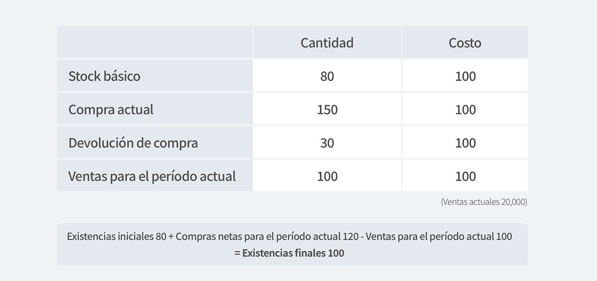

En la última publicación, aprendimos sobre la definición de inventario, tipos de inventario y adquisición / costo de ventas. En este artículo, aprenderemos cómo determinar la cantidad / precio unitario del inventario y cómo evaluar el final del año.

## 1. Cómo determinar la cantidad de activos de inventario

Los métodos para determinar la cantidad de activos de inventario se pueden dividir en términos generales en el método de inventario real y el método de inventario permanente. El método de inventario real es un método en el que se inspecciona un almacén al final del período de informe para determinar la cantidad de existencias final, y la cantidad restante excluyendo la cantidad de inventario final entre las ventas disponibles se considera vendida o utilizada. Este método evita la complicada situación de registrar cada almacenamiento / envío cuando hay muchos tipos, categorías y cantidades de activos de inventario, pero dado que la disminución en el robo y la pérdida se incluye en el volumen de envío actual, es difícil averiguar la causa. de la escasez de inventario La desventaja es que la gestión y el control no se pueden realizar al mismo tiempo.

El método de encuesta de inventario real es un método en el que la cantidad de stock final se identifica a través de una inspección de inventario regular y la diferencia con la cantidad de ventas disponible (inventario básico + inventario comprado actual) se considera como la cantidad vendida.

<tip-box>

Ventas actuales según el método de encuesta de inventario real = stock inicial + compra actual - stock real final

</tip-box>

- Ejemplo de método de inventario real

Por ejemplo, suponiendo que las ventas actuales son 20.000,

<invisible>
Stock básico, Compro actual, Devolución de compra, Finalización del recuento de inventario
</invisible>

El método de inventario perpetuo es un método en el que los inventarios que quedan al final del período se determinan como inventarios finales al agregar continuamente al inventario inicial cada vez que se compra o fabrica el inventario, y restarlo continuamente cada vez que se vende el inventario en el período actual. .

En resumen, el método de inventario perpetuo es un método para reconocer las ventas a medida que ocurren. Esto tiene la ventaja de ser preciso, pero es caro, lo que puede resultar problemático cuando el costo supera la eficiencia. Además, mediante la gestión a través del inventario permanente, el saldo de los activos de inventario y el costo de los bienes vendidos se puede conocer en cualquier momento, lo que permite una gestión estadística continua de los activos de inventario. Sin embargo, la pérdida por robo o pérdida se incluye en el inventario de fin de año, por lo que las ganancias pueden sobreestimarse.

- Ejemplo de método de inventario

Por ejemplo, suponiendo que las ventas actuales son 20.000,

<invisible>
Stock básico, Compro actual, Devolución de compra, Finalización del recuento de inventario
</invisible>

Se puede calcular como stock inicial 80 + compras netas para el período actual 120 - ventas para el período actual 100 = stock final 100.
Aquí, las compras netas para el período actual se pueden obtener restando la inversión de compra de las compras para el período actual.

## 2. Cómo determinar el precio unitario de los activos de inventario

El método para determinar el precio unitario de los inventarios es comprender el flujo volumétrico y el flujo de costos (asumiendo el orden en que se venden los inventarios si el precio unitario de compra de los inventarios fluctúa continuamente dependiendo del momento de adquisición de los inventarios)., El último- El método in-first-out se puede dividir.

**① Acto individual**

Este método registra el precio de compra de cada inventario por separado y registra el precio de compra del inventario como costo de ventas cuando se vende el inventario. El método individual es el método más ideal en el que coinciden el flujo de costos y el flujo de objetos físicos, pero en realidad, cuando hay muchos tipos de activos de inventario y transacciones frecuentes, es inconveniente y costoso de usar en la práctica. Cuando los costos son identificables por producto, por ejemplo al ordenar y producir máquinas especiales, el método individual puede usarse para determinar los costos. Sin embargo, estos métodos no son apropiados para aplicar grandes volúmenes de productos homogéneos e intercambiables.

- Ventaja: Es posible calcular con precisión el flujo de cantidad real y el flujo de costos.
- Desventajas: Cuando la cantidad o artículo de inventario es grande, es difícil aplicarlo de manera realista porque requiere mucho tiempo y dinero.

**② Primero en entrar, primero en salir (FIFO)**

El método de primero en entrar, primero en salir es un método para determinar la cantidad final del inventario después de suponer que los artículos del inventario comprados primero se usan o se venden primero, independientemente del flujo real de la cantidad. Esta suposición es un método que se utiliza a menudo para igualar el flujo de cantidad y el flujo de costo cuando existe un riesgo de deterioro de la calidad cuando el producto debe almacenarse durante un período prolongado. En el método de inventario real, el costo unitario se calcula solo al final del período, y en el método de inventario perpetuo, el costo unitario se calcula en el momento de la compra o liberación. El inventario final y el costo de ventas son los mismos.

- Ventajas: Es consistente con el flujo de volumen general, y los activos de inventario en el estado de situación financiera se pueden evaluar como una aproximación del costo actual.
- Desventajas: Las ganancias y los gastos se manejan de manera inapropiada y, en caso de inflación, existe la posibilidad de que las ganancias se expresen en gran medida, por lo que habrá una gran cantidad de salida de efectivo.

**③ ltimo en entrar, primero en salir (LIFO)**

El método de último en entrar, primero en salir es un método para determinar el monto final del inventario en el supuesto de que los artículos del inventario se venden o se usan en el orden inverso de compra, independientemente del flujo de volumen real. Es especialmente importante tener en cuenta que los inventarios finales y el costo de los bienes vendidos se calculan de manera diferente en este método, a diferencia del método de primero en entrar, primero en salir, ¡dependiendo de cuál de los métodos de registro de inventario se utilice!

- Ventajas: Es el método más adecuado para responder a los costos e ingresos corrientes, y se puede aplicar bien al principio de ingresos, es decir, respuesta de costos, y en caso de inflación, el efecto de diferir el impuesto de sociedades puede ser visto.
- Desventajas: los ingresos netos se muestran como los más pequeños, es posible que no coincidan con el flujo de volumen general y el inventario final se muestra al precio anterior, lo que puede distorsionar en gran medida el análisis financiero.

Entonces, resumamos brevemente cómo determinar el precio unitario de los activos de inventario.

- <internal-link to="/blog/posts/que-es-el-inventario-activo">Leer más: ¿Qué es el inventario actual?</internal-link>

---

## Con BoxHero, puedes administrar tu inventario de manera efectiva.

BoxHero incluye funciones útiles que son perfectas para la gestión de inventario, como:

- Puede calcular rápidamente los activos de inventario mediante el uso de fórmulas en la función de análisis de inventario.
- Es posible ingresar directamente fórmulas para valores requeridos, así como activos de inventario.
- Puede averiguar el inventario que tenía en un momento específico y calcular sus activos de inventario históricos.

<tip-box>

**BoxHero se puede usar en PC y dispositivos móviles, en todos los entornos.** 
La gestión de inventario continúa sin detenerse incluso en un entorno sin una PC. 
Al admitir una potente aplicación móvil, puede usar BoxHero en su teléfono inteligente.

</tip-box>
