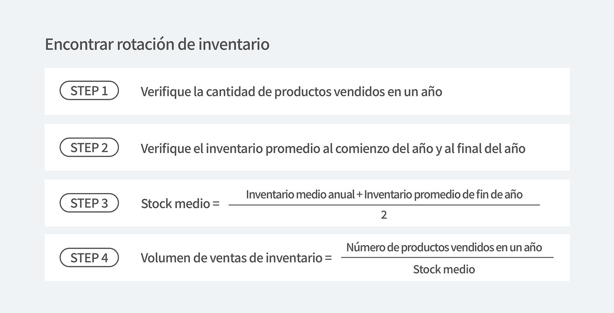

Para que una empresa funcione bien, la gestión de inventario es el indicador más poderoso del éxito futuro.

Un conocimiento sólido de la rotación de inventarios puede convertir las expectativas comerciales en realidad. La rotación de inventario se utiliza como un indicador de la eficiencia con la que una empresa maneja el inventario que ingresa a su cadena de suministro de sus proveedores.

Vamos a ver la rotación de inventario, una de las muchas formas de determinar si una empresa está funcionando sin problemas.

## 1. ¿Qué es la rotación de inventario?

<mark>La rotación de inventario es una medida de cuántos artículos se han vendido del inventario durante un período determinado.</mark> Por definición, está claro que la rotación de inventario es una medida importante de qué tan bien una empresa está vendiendo su mercancía. Aquí, el índice de rotación de inventario se refiere a la relación entre la cantidad de bienes, productos y materias primas emitidas y la cantidad en stock durante un período determinado. Como ejemplo simple, indica cuántas veces se rota el inventario en un año. Si dice 500%, significa que el inventario rota 5 veces en un año.

<mark>En términos más simples, la rotación de inventario es la tasa a la que el inventario se vende y se recarga durante un período de tiempo.</mark> La cantidad de mesas llenas y vacías en un restaurante se llama "facturación", ¿cierto? Será más fácil de entender si lo piensa como un almacén que gestiona un restaurante aquí.

## 2. Entonces, ¿Cómo podemos obtener el índice de rotación de inventario?

El índice de rotación de inventario es [volumen de envío (ventas) ÷ volumen de inventario promedio (valor promedio de activos de inventario) x 100] (%), pero generalmente se expresa en 'varias vueltas' en lugar de %.

¿Quiere aprender más sobre cómo calcular la rotación de inventario?

<invisible>
Encontrar rotación de Inventario : Verifique la cantidad de productos vendidos en un año, Verifique el inventario promedio al comienzo del año y al final del año, Stock medio = Inventario medio anual + Inventario promedio de fin de año, Volumen de ventas de inventario = Número de productos vendidos en un año / Stock medio
</invisible>

---

1. Encuentre la cantidad de inventario vendido dentro del período.
<gray-text>El período se puede aplicar a varios períodos, como un año o un mes.</gray-text>
2. Encuentre las cantidades iniciales y finales dentro del período.
<gray-text>Se recomienda obtener inventario al principio del año y al final del año / cuando se aplica como mes, al principio y al final del mes. ¡No olvide que las cantidades iniciales y finales deben estar dentro del mismo período que el que se aplica a la cantidad de existencias!</gray-text>
3. Sume las cantidades iniciales y finales y divida por 2 para obtener el inventario promedio.
4. Finalmente, el número de inventario vendido en un período dividido por el inventario promedio es el índice de rotación de inventario.

---

## 3. Lo que puede saber sobre la rotación de inventario

### ¿Qué pasaría con la alta rotación de inventario?

<mark>Una alta tasa de rotación de inventario significa que hay mucho movimiento de inventario en el almacén.</mark> Esto aumenta el rendimiento del capital, previene y previene la pérdida de inventario de productos, así como también ahorra primas de seguro y tarifas de almacenamiento, lo cual es muy ventajoso para las empresas. El índice de rotación de inventario ideal puede verse como 4-6, pero esto no es aplicable a todos los sitios comerciales, por lo que es solo una referencia. Debido a la naturaleza del negocio, puede ser un negocio con una tasa de rotación alta o baja, por lo que sería útil compararlo con empresas que tienen una tasa de rotación similar a la suya.

Sin embargo, si el índice de rotación de inventario es excesivamente alto, puede ocurrir una escasez de materias primas / productos, lo que puede causar dificultades en la producción de productos o en las actividades de ventas. Además, si tiene demasiado inventario en su almacén durante demasiado tiempo, es posible que tenga demasiado inventario y tenga más inventario del que los consumidores están pidiendo. Por otro lado, si está reordenando constantemente, podría ser una señal de que no hay existencias. Esto podría significar que el producto se agota demasiado rápido o que las existencias son demasiado bajas para satisfacer la demanda de los consumidores. ¡La rotación de inventario sirve para determinar qué tan efectiva es la gestión de su inventario de una manera eficiente!

### ¿Por qué necesita la rotación de inventario?

Para resumir por qué es necesaria la rotación de inventario, Si hay demasiado inventario en el almacén, es necesario sospechar que hay exceso de existencias. Por supuesto, es bueno que el inventario se agote rápidamente porque significa un aumento de las ventas, pero tal vez sea porque no ha identificado correctamente el punto de reorden donde realiza el pedido. "¿Mi inventario actual es adecuado?" En caso de duda, debes calcular la rotación de su inventario.

<tip-box>

**Revisa** > Cómo calcular la rotación de inventario 
Rotación de inventario = ventas totales / inventario promedio, [envíos (ventas) ÷ inventario promedio (activos de inventario promedio) x 100] (%)

</tip-box>

---

## Con BoxHero, puedes gestionar eficazmente la rotación de inventario.

BoxHero tiene una serie de funciones que le permiten calcular y analizar la rotación de inventario.

- Usando el menú de análisis de inventario, puede calcular rápidamente la rotación de su inventario y verificarlo de un vistazo.
- Puede comprender fácilmente el estado de la rotación del inventario y responder rápidamente a cada situación.
- Comprender con precisión la rotación de inventario para garantizar niveles óptimos de inventario.

<tip-box>

**BoxHero se puede usar en PC y dispositivos móviles, en todos los entornos.** 
La gestión de inventario continúa sin detenerse incluso en un entorno sin una PC. 
Al admitir una potente aplicación móvil, puede usar BoxHero en su teléfono inteligente.

</tip-box>
