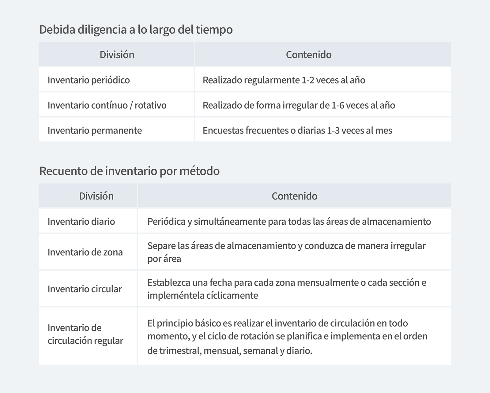

> Estoy trabajando en farmacia, pero la gestión de inventario no es fácil. 
> Y para los productos sin códigos de barras, es difícil saber cómo administrar el inventario. 
> ¿Cómo puedo administrar mi inventario de manera más eficiente?

Las farmacias venden una amplia variedad de medicamentos, suplementos nutricionales y otros suministros médicos.
Además, no es fácil administrar el inventario todos los días debido a la naturaleza de la industria siempre ocupada, y es muy complicado administrar productos sin códigos de barras uno por uno.

En este caso, la gestión de inventario es fácil y eficiente con la operación de 'Diligencia debida de inventario'.
Cree y adjunte códigos de barras a productos sin códigos de barras, y pruebe el recuento de inventario en un ciclo que coincida con las características de cada farmacia.

Entonces, primero, vamos a ver la 'diligencia debida de inventario' más necesaria en la gestión del inventario de medicamentos.

## 1. ¿Qué es el recuento de inventario?

<mark>Se refiere al resultado obtenido al inspeccionar la cantidad real de productos o materiales que quedan.</mark>

- **Por qué es necesaria la diligencia debida de inventario**
- Para comprobar si cada producto o material es coherente con la cantidad informatizada
- Si no coinciden, averigüe la causa,
- Si es necesario, haga ajustes a los libros computarizados.

Hay dos métodos principales de recuento de inventario:

<invisible>
Debida diligencia a lo largo del tiempo /
Inventario peiódico : Realizado regularmente 1-2 veces al año.
Inventario contínuo/rotativo : Realizado de forma irregular de 1-6 veces al año.
Inventario permanente : Encuestas frecuentes o diarias 1-3 veces al mes.

Recuento de inventario por método /
Inventario diario : Periódica y simultáneamente para todas las áreas de almacenamiento.
Inventario de zona : Separe las áreas de almacenamiento y conduzca de manera irregular por área.
Inventario circular : Establezca una fecha para cada zona mensualmente o cada sección e impleméntela cíclicamente.
Inventario de circulación regular : El principio básico es realizar el inventario de circulación en todo momento, y el ciclo de rotación se planifica e implementa en el orden de trimestral, mensual, semanal y diario.

</invisible>

**(1) Inspección periódica de inventario**

<mark>Este es un método de encuesta de inventario que realiza un inventario una vez al año o una vez cada trimestre / medio / mensual.</mark> Sin embargo, existe una desventaja de que es difícil de mejorar porque no es posible saber dónde está la causa del error si el inventario se realiza de forma regular. Además, dado que en su mayoría son realizados por no profesionales, pueden ser propensos a errores y la precisión del inventario tiende a ser baja en comparación con la pérdida de cerrar el negocio.

**(2) Inspección de inventario circular**

<mark>Este es un método de estudio de inventario que se ejecuta a intervalos regulares para mantener la precisión del inventario entrante / saliente.</mark> La frecuencia y el nivel de gestión de todos los artículos sujetos a inspección de inventario variarán según su importancia. En la mayoría de los casos, esta tarea la realiza un trabajador calificado, por lo que es fácil encontrar la causa del error y es posible una mejora suficiente. Esto se hace de forma regular, sin cerrar el negocio, lo que garantiza un nivel constante de precisión del inventario en todo momento.

## 2. Entonces, ¿cuáles son las causas de los errores de recuento de inventario?

1. Hay una diferencia en la cantidad de inventario debido a la diferencia entre el comprobante y el producto real.
2. Existe una diferencia en la cantidad de inventario debido a robo o pérdida
3. Se produce una diferencia en la cantidad de inventario debido a un error al determinar la cantidad del implementador o investigador.
4. Diferencia en la cantidad de inventario debido a errores u omisiones en el libro

etc.

## 3. ¿Cómo lidiar con los errores en el recuento de inventario?

1. Si el inventario computarizado es mayor que el producto real: Emitiremos una gran cantidad en la computadora.
2. Si el inventario computarizado es más pequeño que el producto real: Recibiremos una pequeña cantidad del inventario computarizado.

## 4. ¿Cuáles son los problemas con los errores de recuento de inventario?

1. Si el inventario no es exacto, la entrega, la planificación de la producción, las ventas, etc. pueden verse interrumpidas.
2. Pasar por altos niveles de inventario aumenta los costos de inventario porque los niveles de inventario no son confiables.

## ¿Estás trabajando en una farmacia?

El conteo de inventario es más eficiente si elige un método que se adapte a las características de cada farmacia. Es posible una gestión eficiente del inventario sin errores si hace un buen uso de la función de diligencia debida del inventario en BoxHero.

La gestión de inventario es un activo, ¿verdad?

---

## Verificación de inventario de farmacia, con BoxHero.

BoxHero incluye no solo funciones de recuento de inventario, sino también funciones útiles que son perfectas para la gestión de inventario de farmacia.

- Puede clasificar y administrar productos de acuerdo con sus necesidades, como el fabricante, el nombre del producto y el número de serie.
- La función de análisis de inventario lo ayuda a verificar su inventario para reordenar.
- Identifique con precisión la escasez de existencias para garantizar niveles óptimos de inventario.
- Es posible una operación de recuento de inventario más conveniente utilizando la función de creación / escaneo / impresión de códigos de barras de manera apropiada.

<tip-box>

**BoxHero se puede usar en PC y dispositivos móviles, en todos los entornos.** 
La gestión de inventario continúa sin detenerse incluso en un entorno sin una PC. 
Al admitir una potente aplicación móvil, puede usar BoxHero en su teléfono inteligente.

</tip-box>
