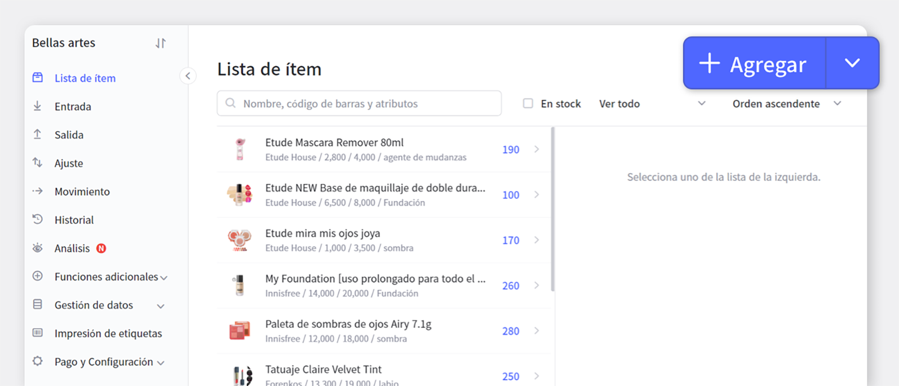
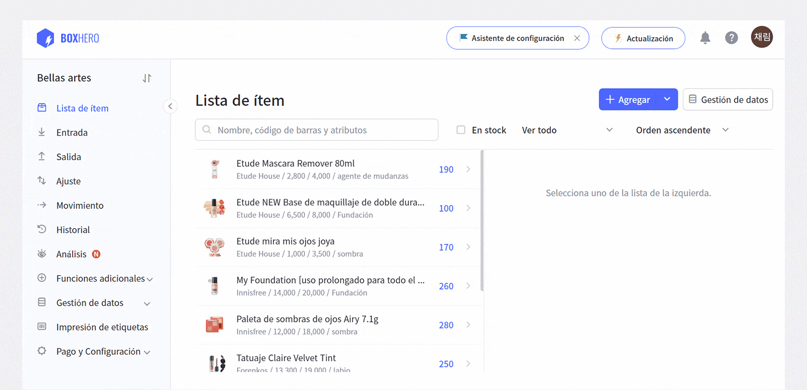
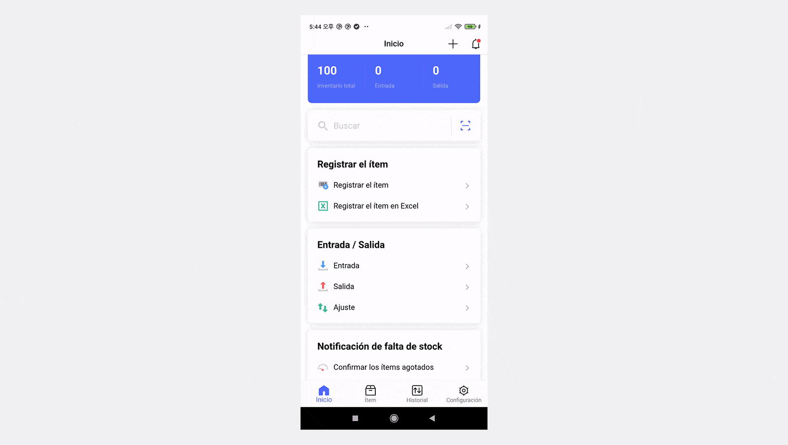
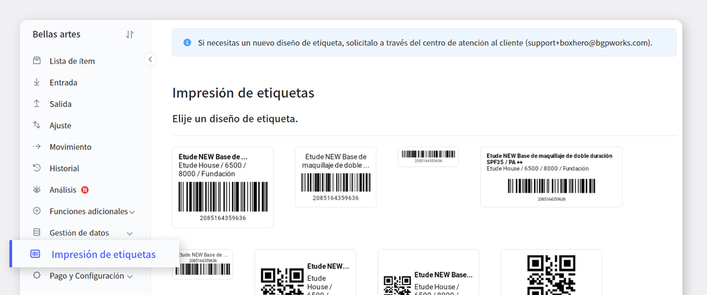
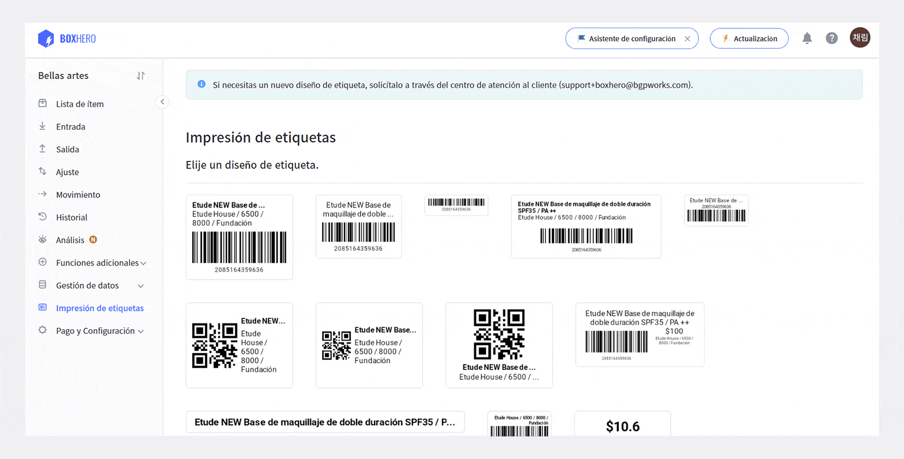
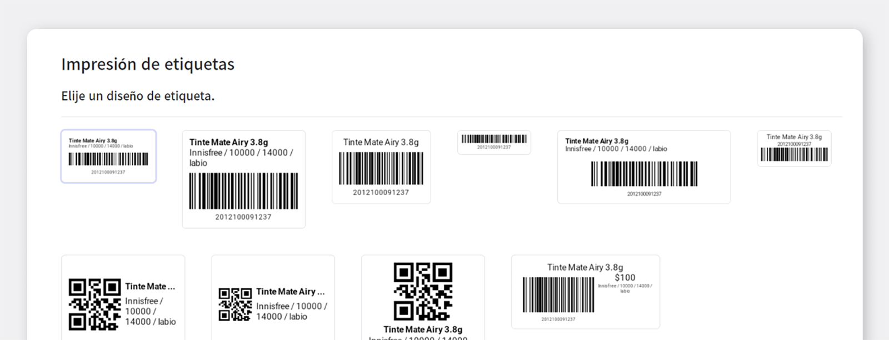
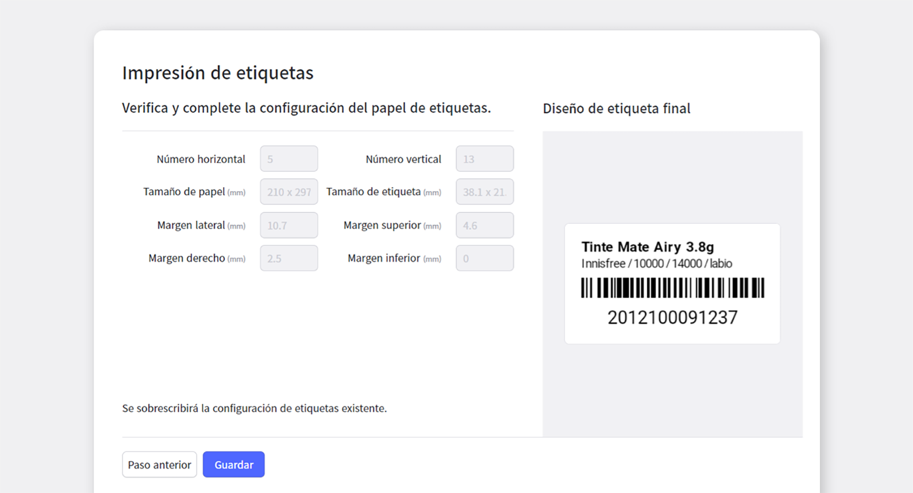

Si miras la parte inferior de la parte trasera del producto cuando normalmente compras algo, debes haber visto no pocas escenas donde se emite una luz roja al código de barras para calcularlo automáticamente. Un código de barras es una franja negra que es como una contraseña. Si observa detenidamente el código de barras, verá una mezcla de barras blancas y negras de diferentes espesores una al lado de la otra, llamadas códigos de barras.

<gray-text>Este artículo está lleno de consejos útiles de Boxhero para aquellos que desean administrar el inventario creando / imprimiendo códigos de barras. </gray-text>

**Antes de profundizar en cómo crear códigos de barras, primero comprendamos por qué los necesitamos.**

La razón número uno para usar códigos de barras es la "eficiencia". En el mostrador de pago, debe calcular con precisión lo más rápido posible, pero si no hay un código de barras, debe contar manualmente cuántos productos están disponibles. El problema es que es imposible para las personas que trabajan en mercados o tiendas de conveniencia memorizar miles de productos, y hay muchos productos que se ven muy similares, lo que dificulta que el ojo humano los distinga. Código de barras, un sistema imprescindible, ¿verdad?

¡Junto con BoxHero, haremos de todo, desde la creación de códigos de barras hasta la impresión!

## 1. Generar códigos de barras

Para crear un código de barras, primero vaya al menú 'Agregar producto' en la esquina superior izquierda.

Hay dos formas de generar códigos de barras.

1. Cree un código de barras automáticamente> Haga clic en el botón 'Generar automáticamente'  para crear

1. Entrada directa de código de barras> Puede ingresar directamente el número de código de barras deseado.

Primero, ¡veámoslo juntos en la versión web para PC!

Si desea utilizar la versión móvil,

En BoxHero, no solo puede crear códigos de barras, sino también diseñar e imprimir etiquetas de acuerdo con los códigos de barras que cree. No es difícil, ¡Así que tómatelo con calma!

## 2. **Cree / imprima papel de etiquetas usando código de barras**

Primero, vaya al menú 'Imprimir etiqueta' en la parte inferior del menú de la izquierda.

En el menú de impresión de etiquetas, puede configurar el diseño que desee, así como imprimir la etiqueta.

Así que comencemos paso a paso, ¿De acuerdo?

Si hace clic en el menú 'Configuración de diseño de etiquetas' en la parte inferior de la etiqueta impresa, puede seleccionar una plantilla de etiqueta.

Puede elegir la plantilla de etiqueta que desee y, si tiene un diseño que desee, comuníquese con el Centro de atención al cliente de BoxHero y haremos todo lo posible para ayudarlo.

Actualmente, BoxHero puede producir papel para etiquetas utilizando papel normal y papel térmico. Se puede hacer con el papel que desee, y si hay otro papel que desee, incluso en papel normal, se puede hacer con ese papel.

Consulte la imagen de descripción del papel en el lado derecho de la pantalla e ingrese cada número para completar el proceso básico de producción de papel para etiquetas. Para algunos trabajos, los números se calculan automáticamente, ¡así que no tienes que ingresar nada!

Después de colocar el papel de la etiqueta, el siguiente paso es configurar el contenido que se mostrará en la etiqueta. Si hace clic en el valor de propiedad correspondiente, se copia automáticamente y puede agregar fácilmente el valor copiado pegándolo en el área deseada.

Al ajustar el tamaño de fuente / número máximo de líneas, puede incluir todas las propiedades del producto que desea o puede excluir las propiedades que no necesita.

Después de revisar el diseño final, guardar completa el diseño de la etiqueta.

¡Puede obtener una vista previa de la etiqueta que se va a imprimir a través de la función de vista previa antes de imprimir!

<caution-box>

Las funciones de diseño e impresión de etiquetas solo están disponibles en la versión web para PC.

</caution-box>

## ¡Crea / imprime códigos de barras con BoxHero!

BoxHero incluye funciones útiles que son perfectas para la creación e impresión de códigos de barras, como:

- Puede crear fácilmente códigos de barras con entrada directa / menú de creación automática.

- Puede imprimir etiquetas de códigos de barras utilizando el código de barras creado.

- El papel de etiquetas de códigos de barras se puede diseñar de acuerdo con la forma deseada.

- Puede escribir los atributos del producto que desee en el papel de la etiqueta.

<tip-box>

BoxHero se puede usar en PC y dispositivos móviles, en todos los entornos.

La gestión de inventario continúa sin detenerse incluso en un entorno sin una PC.

Al admitir una potente aplicación móvil, puede usar BoxHero en su teléfono.

</tip-box>

