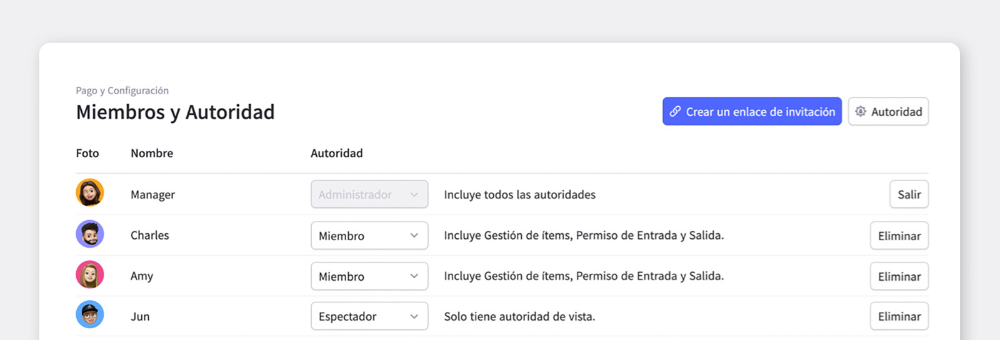
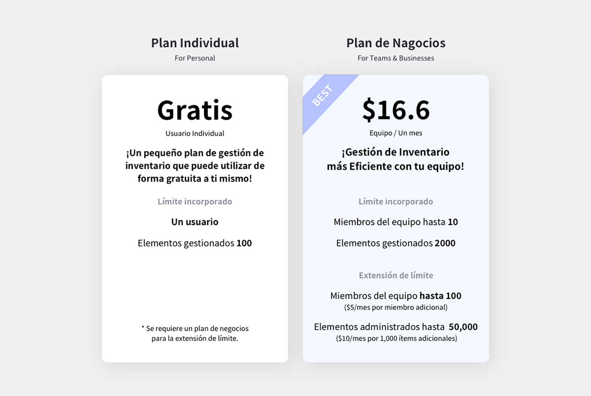

¿Cuál es el mayor inconveniente al administrar el inventario en una empresa con varias personas en lugar de hacer solas? El hecho es que es imposible compartir el estado de la gestión del inventario con los compañeros en tiempo real. Si puede compartir información sobre almacenamiento, entrega y conciliación con los miembros de su equipo en tiempo real, su trabajo será más eficiente. En esta publicación, veamos cómo puede compartir su inventario con sus compañeros de equipo con BoxHero.

## 1. Invitar miembros

Para formar un equipo en BoxHero, primero debe invitar a sus compañeros del equipo como miembro, ¿verdad?

<video src="images/img_2.mp4" style="width:100%" muted autoplay loop playsinline></video>
<invisible>Vamos a invitar más miembros.</invisible>

Después de iniciar sesión en BoxHero, haga clic en el botón Crear enlace de invitación en el menú `Configuración de pago` a la izquierda para copiar automáticamente el enlace de invitación. Después de enviar el enlace copiado al miembro del equipo al que desea invitar, si el miembro hace clic en el enlace para conectarse, la incorporación al equipo se completa automáticamente.

## 2. Agregar miembros

<video src="images/img_3.mp4" style="width:100%" muted autoplay loop playsinline></video>
<invisible>Vamos a agregar más miembros.</invisible>

Cuando reciba el enlace de invitación y haga clic en el enlace para acceder e iniciar sesión con su cuenta, la adición del miembro del equipo se completa automáticamente.

 

</caution-box>

El enlace de invitación es válido durante 24 horas y, una vez transcurrido el tiempo, puede volver a crear un enlace para invitar a los miembros del equipo.

</caution-box>

## 3. Configuración detallada de las funciones disponibles para cada miembro

Es posible otorgar permiso para usar funciones por miembro a través de la configuración de permisos. Haga clic en el menú Configuración y haga clic en el botón Permisos en la pestaña 'Configuración de miembros' para especificar los permisos para cada miembro. Si hace clic en el botón Administrar permisos, puede configurar las funciones disponibles para cada permiso en detalle, por lo que puede otorgar solo tantos permisos como necesite. Consulte a continuación para obtener más detalles.

 

<tip-box>

Solo los administradores pueden cambiar los privilegios de los miembros.

</tip-box>

 

<video src="images/img_5.mp4" style="width:100%" muted autoplay loop playsinline></video>
<invisible>Cómo configurar los permisos de cada miembro</invisible>

<gray-box title="Ejemplo de gestión de permisos">

Los administradores pueden asignar privilegios a los miembros.  
(Los permisos se pueden agregar en cualquier momento).

- Administrador: Todos los derechos reservados

- Miembro: Solo son posibles la gestión, el almacenamiento y la entrega de productos

- Visor: Solo ver

</gray-box>

 

<video src="images/img_6.mp4" style="width:100%" muted autoplay loop playsinline></video>
<invisible>Agregar y quitar permisos</invisible>

## P) Si hay varios miembros, ¿hay una tarifa adicional?

El Plan de inventario pequeño solo está disponible para usted (solo se permite 1 miembro del equipo).

En cambio, el plan de negocios le permite agregar hasta 10 miembros del equipo. (¡Si expande el límite, puede agregar hasta 100 personas y tendrá que pagar más!)

Además, dado que BoxHero es pagados por equipo, los miembros del equipo no necesitan pagar por separado. Si se excede el límite básico proporcionado por el plan, el servicio no se puede utilizar normalmente. Deberá ajustar su uso dentro de los límites predeterminados o, si está usando un plan personal, deberá actualizar a un plan de negocios, y si está usando un plan de negocios, deberá ampliar sus límites. **El precio está en dolares.**

### P) ¿Cómo extiende el límite de uso proporcionado por el plan? 

El límite de uso se puede expandir en cualquier momento ingresando al menú `Pago y configuración` y seleccionando Uso en la página `Configuración de pago`.

Cuando se extiende el límite de uso, la tarifa de extensión se calcula para el período restante hasta la próxima fecha de pago y se paga inmediatamente a la tarjeta registrada en el pasado. Las siguientes extensiones de límite del plan se facturarán automáticamente junto con la tarifa del plan de acuerdo con el ciclo de facturación en la fecha de pago.

### P) ¿Podría ampliar el límite de uso proporcionado por el plan y luego reducirlo de nuevo? 

El límite de uso ampliado se puede reducir en cualquier momento ingresando al menú Pago y configuración y seleccionando Uso en la página `Configuración de pago`.

Cuando se reduce el límite de uso, la cantidad restante hasta la próxima fecha de pago se calcula a partir del pago anterior y se carga como crédito. Después de eso, el cargo se deducirá automáticamente de la cantidad de crédito que tenga en la fecha de pago. Los cambios posteriores al límite del plan se facturarán automáticamente junto con la tarifa del plan de acuerdo con el ciclo de facturación en la fecha de pago.

### ¡Invite a los miembros del equipo con BoxHero y comparta su estado de gestión de inventario en tiempo real!

- Puede agregar miembros del equipo en la configuración de Miembros y Permisos en Configuración.

- Es posible compartir en tiempo real numerosos estados del proceso de almacenamiento / envío / ajuste con los miembros del equipo.

- Si hay varios miembros, puede ampliar fácil y rápidamente el límite de uso para compartir información con más miembros.

 

<tip-box>

Se puede usar BoxHero en PC y dispositivos móviles, en todos los entornos. 

La gestión de inventario continúa sin detenerse incluso en un entorno sin una PC.

Al admitir una potente aplicación móvil, puede usar BoxHero en su teléfono.

</tip-box>

