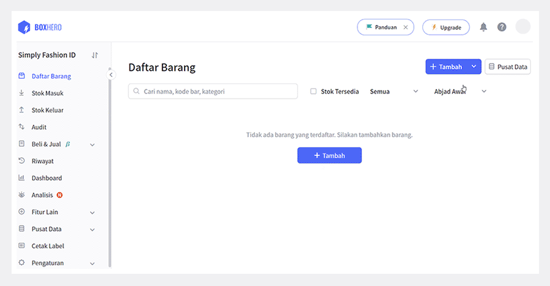
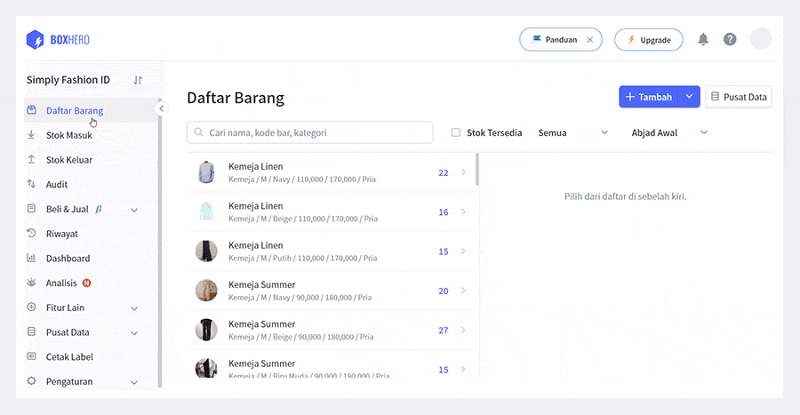
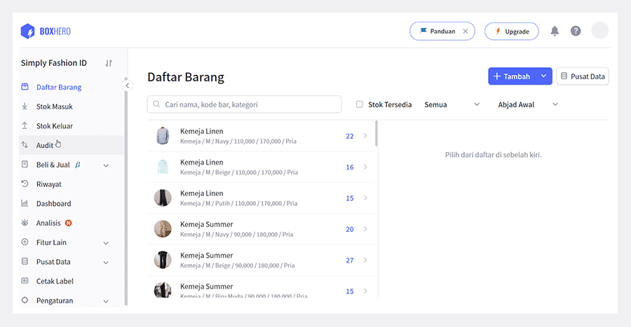
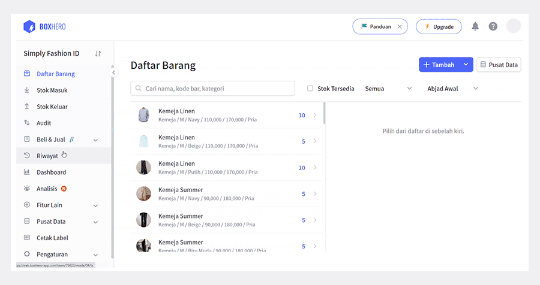
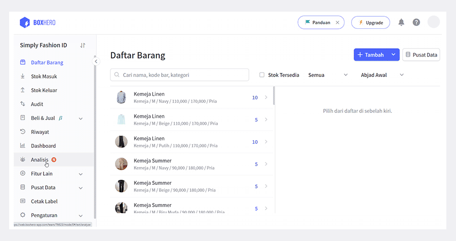
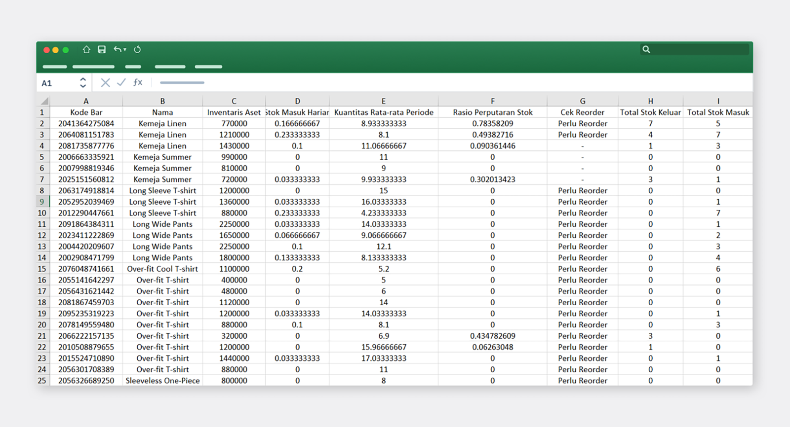
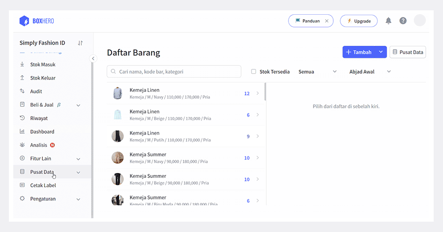
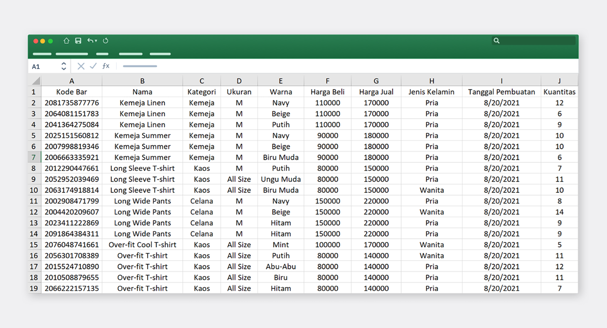

Selalu *update* tentang status inventaris tentunya harus jadi prioritas utama saat menjalankan bisnis. Tak hanya itu, Anda juga harus teliti dalam mencatat data mulai dari stok yang Anda miliki hingga laporan penjualan. Kebanyakan orang menggunakan Excel untuk mencatat semua data dan laporan tersebut. Namun, perlu diketahui bahwa penggunaan Excel sebenarnya belum dapat memenuhi kebutuhan manajemen inventaris secara optimal.

## Excel atau BoxHero?

Sebagai pemilik bisnis yang harus mengetahui inventaris dengan akurat, Anda memerlukan program khusus yang dapat membantu Anda mengelola secara optimal. Mengontrol stok, memeriksa penjualan, hingga menganalisis status inventaris, harus dapat Anda lakukan dengan cepat dan *real-time*. Oleh karena itu, penggunaan program manajemen inventaris berbasis cloud seperti BoxHero, sangat disarankan untuk mengoptimalkan pengelolaan inventaris Anda.

## Mengunggah File Excel

Jika sebelumnya Anda mengelola inventaris menggunakan Excel, Anda tetap dapat menggunakan data Excel tersebut di BoxHero. Berapa pun jumlah data yang Anda miliki, Anda dapat memindahkannya langsung dengan sekaligus. Mari kita lihat bagaimana cara memindahkan data inventaris Excel Anda, menggunakan fitur Import dan Export Excel dari BoxHero.

### 1. Mendaftarkan Barang via Excel

Masuk ke menu Daftar Barang, dan pilih Import dari file Excel. Setelah diunggah, data inventaris Excel yang Anda miliki mungkin saja tidak langsung terbaca. Ini terjadi jika Anda tidak memiliki kode bar produk di dalam file Excel Anda. Pilih Buat Otomatis pada kolom kode bar, dan semua data Anda akan langsung muncul. Klik Selesai dan data Excel Anda telah berhasil dipindahkan.

<tip-box>

Sebelum memindahkan file, buatlah kategori berdasarkan file Excel Anda di BoxHero. Caranya adalah melalui menu Pusat Data >Kategori.

</tip-box>

Atau, klik Simpan Format Excel untuk mengunduh format kategori yang Anda buat di BoxHero ke file Excel.

### 2. Stok Keluar/Masuk via Excel

Tidak hanya dapat mendaftarkan barang via Excel, BoxHero juga menyediakan Stok Keluar/Masuk via File Excel. Bagi Anda yang sebelumnya menggunakan Excel untuk mencatat stok keluar/masuk, Anda dapat langsung mengunggahnya dengan cepat dan mudah.

### 3. Audit via Excel

Untuk berjaga-jaga barang kali ada data yang tidak cocok, Anda juga dapat mengauditnya dengan mudah di BoxHero. Karena sebelumnya Anda terbiasa mengelola inventaris di Excel, Anda bisa saja lupa untuk memperbarui data di BoxHero. Untuk mengantisipasi kasus seperti ini, Anda dapat menggunakan fitur Audit via File Excel.

## Mengunduh File Excel

Ada kalanya Anda membutuhkan data Excel untuk keperluan laporan fisik dan semacamnya. Oleh karena itu, BoxHero memberikan kemudahan bagi Anda untuk mengunduh data inventaris Anda dengan cepat.

### 1. Unduh Riwayat Transaksi

Anda dapat mengunduh file Excel melalui Export Excel di menu Riwayat. Anda juga dapat mengatur tanggal riwayat transaksi sesuai kebutuhan Anda.

### 2. Unduh Data Analisis Inventaris

Fitur pintar Analisis BoxHero dapat membantu Anda memeriksa inventaris Anda dengan akurat. Terdapat berbagai macam formula analisis yang sangat bermanfaat dalam mengelola inventaris maupun penjualan Anda. Tentunya, data dari analisis ini juga dapat Anda unduh ke file Excel.

### 3. Unduh Seluruh Data Inventaris

Seperti halnya mendaftarkan barang dengan mengunggah file Excel, Anda juga dapat mengunduh semua inventaris Anda ke dalam file Excel. Masuk ke menu Pusat Data > Barang, dan klik Export Excel. Seluruh inventaris yang Anda miliki saat ini akan langsung terunduh dalam bentuk file Excel.

<caution-box>

Hanya data inventaris yang akan di*export*.

Foto produk tidak termasuk dalam pengunduhan file.

</caution-box>

