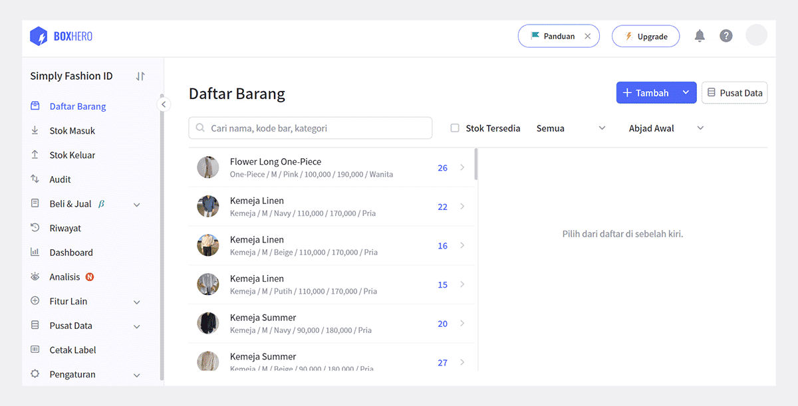
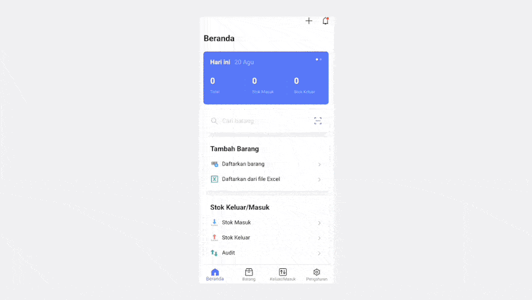
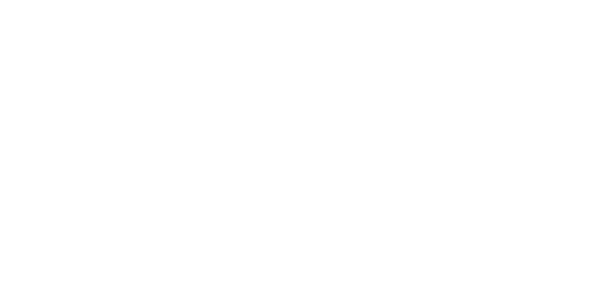
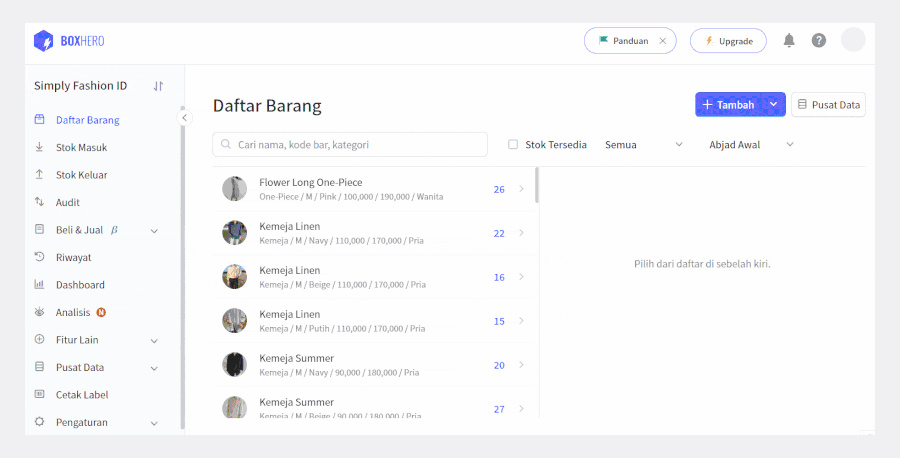

Dikutip dari wikipedia, kode bar atau *barcode* adalah suatu kumpulan data optik yang dibaca mesin. Kumpulan data ini berbentuk garis paralel hitam dengan spasi diantaranya. Biasanya, kode bar ditempelkan pada produk atau barang untuk keperluan pengecekan hingga penjualan. Untuk mengetahui fungsi dan pengertian kode bar lebih jauh, Anda dapat membacanya [di sini](/id/blog/posts/mengenal-fungsi-dan-cara-kerja-barcode).

## Mengapa Harus Menggunakan Kode Bar?

Bagi Anda yang menjalankan bisnis khususnya ritel, penggunaan kode bar sangatlah disarankan untuk mempermudah pekerjaan Anda. Misalnya, menghitung stok keluar/masuk, mengatur pemesanan, dan menghitung stok per produk. Ini jelas akan menghemat waktu Anda dan menghindari kesalahan saat proses bekerja.

## Cara Membuat Kode Bar di BoxHero

Membuat kode bar sendiri untuk bisnis Anda tidaklah sulit. Dengan menggunakan fitur desain dan cetak kode bar milik BoxHero, Anda dapat membuat kode bar unik sesuai keinginan Anda. Mari kita lihat bersama cara membuat dan mencetak kode bar bersama BoxHero!

### 1. Masukkan atau Buat Kode Bar Otomatis

Saat pertama kali mendaftarkan barang di BoxHero, Anda akan diminta untuk memasukkan kode bar. Jika barang yang ingin Anda daftarkan tidak memiliki kode bar, Anda dapat dengan mudah membuatnya secara otomatis dengan mengklik tombol `Buat`.

Selain di web PC, Anda juga dapat membuat kode bar melalui aplikasi *mobile* BoxHero. Tanpa melalui PC pun, Anda dapat membuat kode bar dengan mudah melalui *smartphone* Anda.

### 2. Desain Label

Setelah Anda mendaftarkan semua barang Anda, pilih menu `Cetak Label` di sebelah kiri, dan pilih template kode bar atau kode QR yang tersedia. BoxHero menyediakan lebih dari 10 template yang memudahkan Anda dalam membuat label.

<tip-box>

BoxHero juga menerima pengajuan desain baru! Hubungi layanan pelanggan BoxHero.

</tip-box>

Pilih template sesuai kebutuhan Anda, lalu tentukan jenis kertas yang Anda gunakan. Anda dapat menentukan ukuran margin, label, baris, dan kolom sesuai dengan kertas yang digunakan. Jika model kertas Anda telah terdaftar di BoxHero, Anda dapat langsung menggunakannya tanpa harus mengisi margin, label, baris, dan kolom.

Berdasarkan label template yang Anda gunakan, Anda dapat menyertakan kategori yang telah Anda buat sebelumnya. Klik kategori yang ingin Anda masukkan, lalu salin ke kotak yang disediakan. Kategori yang Anda salin akan muncul di dalam label kode bar Anda. Di tahap ini, Anda juga dapat mengedit ukuran font pada label Anda. Terakhir, klik `Simpan` untuk menyimpan desain label yang telah Anda buat.

### 3. Cetak Label

Untuk mencetak label di BoxHero, pilihlah barang yang ingin Anda cetak dan jangan lupa untuk memasukkan kuantitas label.

Sekarang Anda sudah berhasil membuat desain label kode bar Anda sendiri. Sangat cepat dan mudah kan? Itu karena BoxHero membantu menyederhanakan pengelolaan inventaris Anda. Tempelkan label-label tersebut ke inventaris Anda, dan kelola inventaris Anda secara efisien dengan BoxHero.

<tip-box>

**BoxHero dapat digunakan di semua lingkungan, PC dan ****Smartphone****.**

Tetaplah kelola inventaris Anda tanpa harus menggunakan PC.

BoxHero mendukung aplikasi mobile dengan baik, sehingga Anda dapat menggunakan BoxHero di *smartphone* Anda.

</tip-box>

