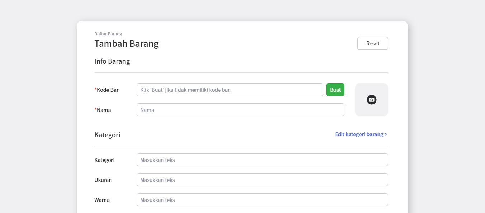
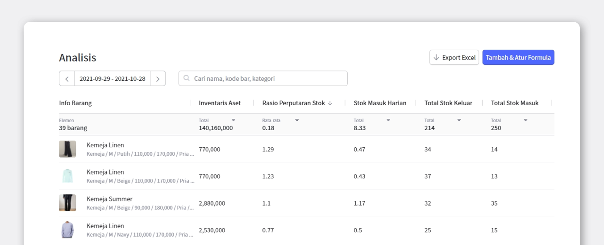

Rasio perputaran persediaan adalah salah satu indikator yang digunakan untuk mengetahui apakah bisnis Anda berada di jalur yang aman atau tidak. Sangatlah disarankan untuk memahami rasio perputaran dengan baik lalu mengaplikasikannya pada bisnis Anda. Dengan begitu Anda dapat mengetahui perputaran yang terjadi pada semua inventaris Anda, kemudian menentukan langkah berikutnya.

Untuk meningkatkan rasio perputaran persediaan Anda, klik link di bawah ini. 
[Baca juga: Cara Meningkatkan Rasio Perputaran](https://www.boxhero-app.com/id/blog/posts/hitung-and-tingkatkan-rasio-perputaran-persediaan)

## Apa Pentingnya Rasio Perputaran Persediaan?

Rasio perputaran sangat penting untuk memeriksa seberapa efektif inventaris yang Anda miliki secara keseluruhan. Dengan ini, Anda dapat mengetahui apakah kebutuhan pasar sebanding dengan stok yang Anda miliki, sehingga tidak terjadi kekurangan stok atau malah kelebihan stok yang memicu timbulnya stok mati.

BoxHero menyediakan fitur analisis yang akan membantu Anda menghitung rasio perputaran secara mudah dan akurat. Simak langkah-langkahnya berikut ini.

## Hitung Rasio Perputaran bersama BoxHero

Terdapat banyak analisis yang wajib Anda lakukan untuk menjaga bisnis Anda tetap dalam kondisi yang baik. Fitur analisis BoxHero membantu Anda melakukan semua analisis dengan cepat sehingga Anda tidak perlu menghitungnya secara manual lagi.

### 1. Daftarkan Barang

Pertama, daftarkan dan isi kategori barang Anda melalui menu `Daftar Barang`.

### 2. Lakukan Stok Keluar

<video src="images/img_3.mp4" style="width:100%" muted autoplay loop playsinline></video>
<invisible>Fitur stok keluar BoxHero</invisible>

Klik menu `Stok Keluar` kemudian pilih barang yang akan Anda kirim/terjual, berikut jumlahnya. Stok keluar juga berarti melakukan pengiriman barang kepada konsumen ataupun vendor.

### 3. Tambahkan Formula 'Rasio Perputaran'

<video src="images/img_4.mp4" style="width:100%" muted autoplay loop playsinline></video>
<invisible>Tambah formula analisis</invisible>

Klik menu `Analisis > Tambah & Atur Formula`. Kemudian klik `Tambahkan Praktis > Manajemen Inventaris > Rasio Perputaran Stok`. Formula tersebut akan langsung muncul di menu Analisis.

 

<tip-box>

Anda juga dapat menambahkan formula lain secara mudah sesuai kebutuhan Anda.

</tip-box>

### 4. Selesai!

Sangat mudah bukan? Hanya dengan beberapa kali klik saja, Anda sudah dapat menambahkan formula yang penting. Sekarang Anda dapat memeriksa rasio perputaran tiap inventaris dengan sekejap mata. Ingat! Semakin tinggi rasio yang ditunjukkan, semakin baik pula perputaran inventaris dari barang tersebut. Kini Anda sudah siap untuk mengelola inventaris secara optimal.

Apakah Anda mengalami kesulitan mengelola inventaris? Mulailah sekarang bersama BoxHero.

BoxHero adalah solusi terbaik untuk manajemen inventaris, yang dapat digunakan siapa saja dengan mudah.

Tersedia berbagai fitur manajemen inventaris yang dapat diaplikasikan ke semua industri.

**Kelola inventaris Anda secara mudah dan akurat dengan BoxHero.**

 

<tip-box>

**BoxHero dapat digunakan di semua lingkungan, PC dan *Smartphone*.**

Tetaplah kelola inventaris Anda tanpa harus menggunakan PC.

BoxHero mendukung aplikasi mobile dengan baik, sehingga Anda dapat menggunakan BoxHero di *smartphone* Anda.

</tip-box>

