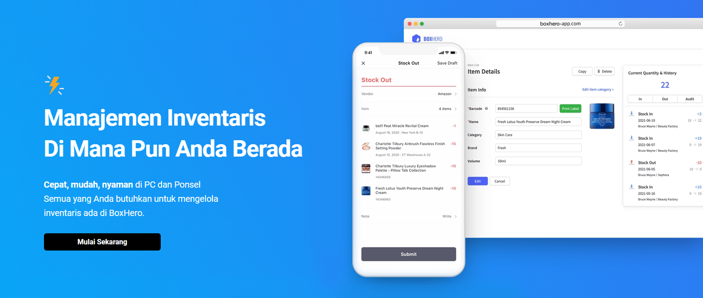

Menjalankan toko online adalah bisnis yang sangat populer terutama di era digital seperti sekarang ini. Siapa pun dapat memulai usaha ini dengan mudah, namun bukan berarti tanpa tantangan. Kita harus pandai memantau produk, mengetahui produk yang dibutuhkan pasar, dan produk mana yang dapat kita putar perlahan.

Rahasia untuk menjaga toko online Anda tetap hidup dan berkembang terletak pada seberapa efektif Anda mengelola inventaris Anda. Itulah sebabnya kami akan membagikan 5 tips untuk membantu Anda menuju bisnis yang berkembang pesat, dengan pelanggan yang puas, dan penjualan yang meningkat.

## 1. Lakukan Pengelompokan Kategori

Manajemen inventaris yang efektif bergantung pada keahlian dan teknik mengelompokkan produk. Salah satu caranya adalah dengan membuat grup dengan kategori tertentu. Anda dapat mencoba untuk mengategorikan produk berdasarkan jenis produk atau produk terlaris. Singkatnya, teknik organisasi yang tepat dapat membuat perbedaan besar sehingga menjaga gudang Anda tetap teratur.

## 2. Gunakan Program Manajemen Inventaris

Jika Anda baru memulai bisnis toko online yang masih relatif kecil, mengelola inventaris menggunakan Excel atau catatan mungkin adalah cara yang paling mudah dan hemat. Bagaimanapun, seiring kebutuhan barang dan penjualan yang meningkat, kebanyakan pemilik bisnis menyadari bahwa menggunakan Excel atau buku catatan bukanlah pilihan tepat untuk mengelola inventaris jangka panjang.

<internal-link to="/">Program manajemen inventaris</internal-link> dibuat khusus untuk memudahkan pengelolaan inventaris Anda. Sebagian besar program inventaris biasanya berbasis cloud atau web sehingga memungkinkan banyak pengguna, mengakses dan membuat perubahan dari mana saja, kapan saja. Sistem ini akan membantu memudahkan proses pelacakan inventaris dengan akurat, menyederhanakan penyimpanan catatan, mengurangi kesalahan, dan menghemat waktu secara keseluruhan.

## 3. Lakukan Audit Teratur

Pengauditan yang teratur adalah salah satu cara terbaik untuk mencocokkan antara inventaris dan data yang tercatat. Audit adalah cara untuk ‘double-check’ inventaris Anda untuk memastikan apa yang Anda catat mencerminkan apa yang terjadi di gudang dan bisnis Anda.

Saat mengoperasikan toko online, audit adalah faktor penting untuk menghindari ketidakcocokan terhadap stok yang Anda miliki. Jika terjadi ketidakcocokan inventaris, hal itu dapat menyebabkan salah perhitungan, kehilangan barang, bahkan uang yang salah tempat dan akan menyebabkan masalah dengan pelanggan serta partner Anda.

Untuk tips mengaudit, ada baiknya Anda melakukannya secara terus menerus. Misalnya, menghitung produk yang berbeda setiap hari, minggu, atau bulan sehingga semuanya terhitung dan tidak ada yang terlewat. Cara ini lebih efektif dibandingkan dengan mengaudit satu kali dalam satu waktu yang akan memakan banyak waktu.

## 4. Analisis Data untuk Keperluan Reorder

*Reorder* adalah salah satu tugas paling kritis dan menantang bagi setiap usaha *retail*. Anda ingin membuat pelanggan senang dengan menyediakan produk yang sesuai dengan permintaan mereka, sekaligus memenuhi target keuangan usaha Anda. Karena itu, ada dua pertanyaan besar yang biasanya dihadapi saat melakukan pembelian:

- Kapan Anda harus *reorder* lebih banyak stok?
- Berapa banyak jumlah yang harus Anda pesan?

Jika Anda menggunakan <internal-link to="/">program manajemen inventaris</internal-link>, Anda dapat dengan mudah menganalisis stok inventaris Anda secara keseluruhan. Perhatikan faktor-faktor berikut untuk keperluan *reorder*:

- Periksa stok minimum. Dengan menentukan stok minimum, Anda dapat dengan mudah mengetahui dan langsung memesan barang yang jumlahnya kurang dari stok minimum.
- Gunakan formula untuk pengecekan secara otomatis. Misalnya “Reorder” untuk barang yang jumlahnya kurang dari stok minimum.

<tip-box>

if({{"Stok Pengamean"}} >= $"Stok Saat Ini", Perlu Reorder", "-")

</tip-box>

- Terakhir, untuk menentukan berapa banyak barang yang harus Anda *reorder*, Anda dapat memperkirakannya menggunakan stok pengaman dan riwayat stok keluar.

## 5. Automasi Manajemen Inventaris dengan Memindai Kode Bar

Sebagai pemilik bisnis toko online, Anda mungkin bisa menerima puluhan atau bahkan ratusan pesanan per harinya. Mengerjakan pesanan sebanyak itu dalam waktu yang terbatas dapat meningkatkan risiko terjadinya kesalahan atau kekeliruan.

Untuk menghindari hal tersebut, Anda dapat menggunakan sistem kode bar yang akan sangat membantu Anda saat menerima pesanan. Penggunaan kode bar akan membantu mengatur barang-barang Anda lebih cepat dan tepat.

Dengan menggunakan tips-tips di atas, Anda dapat mengelola inventaris Anda dengan efektif dan akurat. Jika Anda kebingungan dalam memilih program manajemen inventaris yang mudah dan simpel, kami akan membantu mengontrol inventaris Anda dengan menyediakan fitur-fitur pintar termasuk Analisis Data, Import File Excel, Pindai Kode Bar, Penghitungan Stok, Formula, Manajemen Lokasi, dan masih banyak lagi.

<internal-link to="/">BoxHero</internal-link> adalah solusi manajemen inventaris termudah yang mendukung semua tipe perangkat. Dengan begitu, Anda dapat secara mudah memeriksa persediaan barang Anda di mana saja dalam waktu real-time! BoxHero memberikan demo gratis selama 30 hari bagi Anda yang baru bergabung.

---

<tip-box>

**BoxHero dapat digunakan di semua lingkungan, PC dan *Smartphone*.** 
Tetaplah kelola inventaris Anda tanpa harus menggunakan PC. 
BoxHero mendukung aplikasi mobile dengan baik, sehingga Anda dapat menggunakan BoxHero di *smartphone* Anda.

</tip-box>
