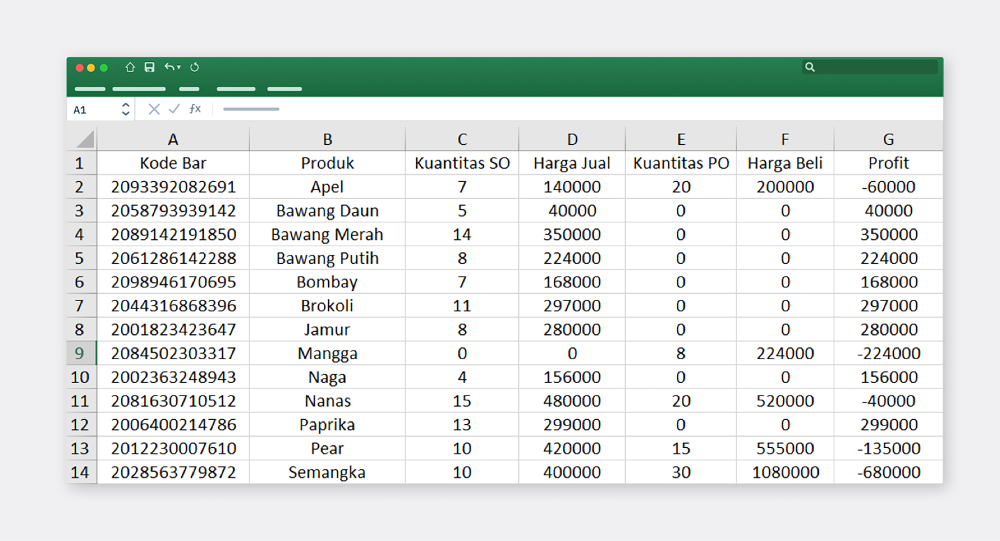

Manajemen inventaris yang baik adalah aspek penting dalam menjalankan setiap bisnis. Namun, jika Anda memiliki bisnis yang bersangkutan dengan jual beli, pengelolaan inventaris saja belum dapat dibilang lengkap. Anda juga harus mampu mengelola pemesanan dan penjualan dengan akurat. Oleh karena itu, BoxHero menyediakan fitur menarik untuk mempermudah pengelolaan bisnis Anda.

 

<video src="images/img_2.mp4" style="width:100%" muted autoplay loop playsinline></video>
<invisible>Cara mendaftarkan produk</invisible>

## Fitur Beli & Jual

BoxHero menyediakan fitur `Beli & Jual` untuk memudahkan Anda mengelola bisnis secara keseluruhan. Anda dapat menggunakan fitur ini saat membeli barang dari *supplier* atau menjual produk kepada vendor dan konsumen Anda. Dari mulai inventaris hingga penjualan, kini Anda dapat memantaunya dengan mudah dan cepat.

### 1. Ubah Barang ke Produk

BoxHero menetapkan barang sebagai suatu benda yang digunakan di bidang inventaris atau pergudangan, sedangkan produk adalah barang yang diperjualbelikan kepada vendor atau konsumen. Berdasarkan definisi tersebut, Anda harus mengubah barang Anda ke dalam produk terlebih dahulu sebelum menggunakan fitur `Beli & Jual` BoxHero.

Masuk ke menu `Beli & Jual` lalu klik `+Mulai` dan pilih simbol mata uang yang ingin Anda gunakan saat pembelian dan penjualan. Simbol mata uang dapat Anda ganti di menu `Pengaturan > Umum` kapan saja. Setelah itu, Anda tinggal memuat kategori harga jual dan harga beli yang telah Anda buat sebelumnya. Jika Anda belum membuatnya, Anda dapat memasukkan harganya satu per satu saat mendaftarkan produk.

 

<tip-box>

Anda dapat membuat kategori harga jual dan harga beli di menu `Pusat Data > Kategori`.

</tip-box>

### 2. Daftar Produk

<video src="images/img_3.mp4" style="width:100%" muted autoplay loop playsinline></video>
<invisible>Menu daftar produk</invisible>

Melalui menu `Daftar Produk`, Anda dapat menambah, mengedit, dan menghapus produk yang telah Anda daftarkan. Ketika Anda menghapus produk di menu ini, produk akan kembali menjadi barang dan Anda dapat memeriksanya di `Daftar Barang`. Anda juga dapat menambahkan produk dengan menekan `+Tambah Produk` setelah Anda mendaftarkan barang baru.

## Fitur Beli

Fitur ini berfungsi ketika Anda ingin memesan stok baru atau melakukan PO untuk mengisi produk Anda. Cara kerjanya adalah diawali dengan memesan produk, melakukan stok masuk, dan mendaftarkannya menjadi produk untuk dijual. Ini membantu Anda dalam mengelola barang dan produk Anda secara mudah, akurat, serta terperinci.

### 1. Pesanan Pembelian (PO)

<video src="images/img_4.mp4" style="width:100%" muted autoplay loop playsinline></video>
<invisible>Fitur pesanan pembelian BoxHero</invisible>

Pesanan pembelian dapat Anda lakukan melalui menu `Beli` dengan menekan `+Tulis PO` pada menu `Daftar Pesanan Pembelian`. Pertama, silakan pilih partner atau *supplier* tempat Anda memesan barang. Jika Anda belum memasukkan partner bisnis, Anda dapat menambahkannya langsung dengan menekan `+Tambah Partner`. Anda juga dapat menambahkan partner di menu `Pusat Data > Partner`. Setelah itu, masukkan tanggal pemesanan dan pilih barang yang ingin Anda pesan dengan memasukkan kuantitas. Klik `Simpan` dan pesanan pembelian pun selesai.

 

<tip-box>

Anda dapat melakukan pesanan pembelian dengan memindai kode bar produk Anda.

</tip-box>

### 2. Masukkan Stok

<video src="images/img_5.mp4" style="width:100%" muted autoplay loop playsinline></video>
<invisible>Memasukkan stok pesanan pembelian</invisible>

Di menu `Beli > Daftar Pesanan Pembelian`, Anda dapat memeriksa barang yang telah Anda pesan. Kemudian klik `Pesanan Dikirim` lalu lakukan `Stok Masuk` untuk memasukkannya ke dalam stok Anda. Pastikan Anda sudah menerima pesanan barang yang Anda pesan sebelum menyelesaikan stok masuk. Stok barang yang telah dimasukkan akan langsung mengisi stok produk Anda tanpa harus Anda tambahkan lagi.

 

<tip-box>

Anda dapat memeriksa stok masuk dari pesanan pembelian Anda melalui menu Riwayat.

</tip-box>

## Fitur Jual

Fitur ini berfungsi ketika Anda melakukan penjualan kepada konsumen atau vendor. Setelah Anda menerima pesanan penjualan atau SO, Anda dapat menulis SO tersebut lalu memprosesnya menjadi stok keluar dengan mudah. Dengan fitur ini, Anda dapat mengelola penjualan dengan cepat dan akurat.

### 1. Pesanan Penjualan (SO)

<video src="images/img_6.mp4" style="width:100%" muted autoplay loop playsinline></video>
<invisible>Fitur pesanan penjualan BoxHero</invisible>

Melakukan pesanan penjualan tidak jauh berbeda dengan saat melakukan pesanan pembelian. Tekan `+Tulis SO` di menu `Jual > Daftar Pesanan Penjualan`, lalu masukkan partner (vendor) atau masukkan nama toko Anda jika Anda menjual langsung kepada konsumen. Kemudian masukkan kuantitas dan klik `Simpan` setelah Anda memeriksanya.

 

<tip-box>

Anda juga dapat melakukan pesanan penjualan dengan memindai kode bar produk Anda.

</tip-box>

### 2. Kirimkan Stok

<video src="images/img_7.mp4" style="width:100%" muted autoplay loop playsinline></video>
<invisible>Mengirimkan stok pesanan penjualan</invisible>

Setelah Anda sudah mengirimkan produk yang terjual, lakukan stok keluar untuk menyelesaikan penjualan. Klik `Terjual` di menu `Jual > Daftar Pesanan Penjualan`, kemudian lakukan stok keluar dengan menekan `Stok Keluar` di sebelah bawah. Anda sudah menyelesaikan penjualan dengan praktis dan mudah. Jangan lupa memeriksa semua transaksi di menu `Riwayat`.

## Analisis Penjualan

<video src="images/img_8.mp4" style="width:100%" muted autoplay loop playsinline></video>
<invisible>Fitur analisis penjualan</invisible>

Fitur Beli & Jual BoxHero makin lengkap dengan adanya `Analisis Penjualan`. Di sini Anda dapat memeriksa profit Anda dengan mudah dan cepat tanpa harus repot-repot menghitungnya sendiri. Pilih periode tanggal yang Anda inginkan dan lihat profit hasil penjualan Anda dengan akurat.

 

Unduh hasil analisis penjualan Anda ke file Excel dengan mudah untuk keperluan laporan atau pembukuan bisnis Anda. Klik `Export Excel` di kanan atas, dan hasil analisis penjualan Anda akan langsung terunduh.

 

Sekarang Anda dapat mengelola inventaris hingga penjualan dengan mudah dan akurat bersama BoxHero. Selain itu, Anda juga dapat memantau semua stok yang masuk hingga produk yang Anda jual dengan transparan. Kelola inventaris Anda secara optimal dengan menggunakan fitur-fitur bermanfaat dari BoxHero.

<tip-box>

**BoxHero dapat digunakan di semua lingkungan, PC dan *Smartphone*.**

Tetaplah kelola inventaris Anda tanpa harus menggunakan PC.

BoxHero mendukung aplikasi mobile dengan baik, sehingga Anda dapat menggunakan BoxHero di *smartphone* Anda.

</tip-box>

