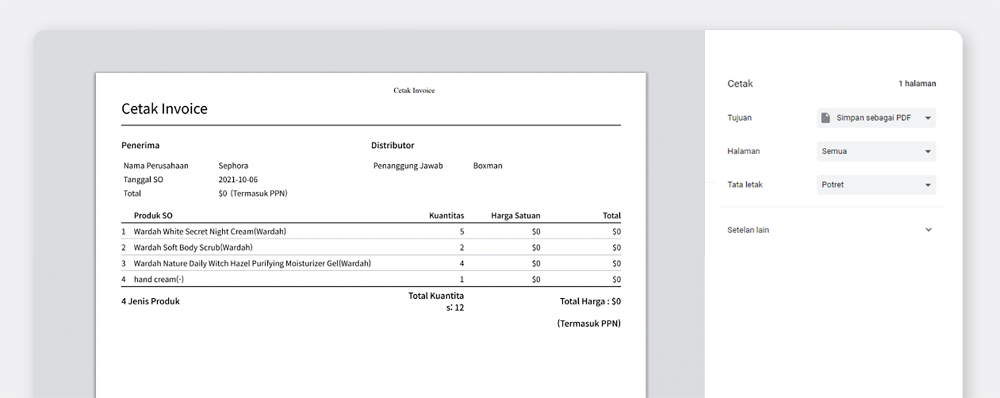

Mencatat semua bukti transaksi sangatlah penting untuk pengelolaan bisnis yang baik. Hasil transaksi pembelian dan penjualan, dapat memberikan informasi tentang kegiatan transaksi yang dilakukan, misalnya informasi rincian produk dan bukti pembayaran. Oleh karena itu, untuk mempermudah pekerjaan Anda, pilihlah program yang lengkap agar semuanya dapat dilakukan dengan mudah dan cepat.

## Fitur Cetak Invoice

BoxHero tidak hanya memudahkan Anda memeriksa semua riwayat transaksi, tapi juga menyediakan fitur pencetakan faktur atau *invoice* dengan mudah. Fitur ini tentunya akan membantu Anda untuk mengelola inventaris dengan lebih efisien. Anda dapat mencetak bukti transaksi hanya dengan beberapa kali klik saja.

### 1. Invoice Pesanan Pembelian

<video src="images/img_2.mp4" style="width:100%" muted autoplay loop playsinline></video>
<invisible>Fitur cetak invoice pesanan pembelian</invisible>

Untuk mencetak faktur, Anda dapat memulai dengan masuk ke menu Beli lalu klik daftar pesanan pembelian Anda. Setelah itu, cetak faktur dengan menekan Cetak PO, kemudian tulis informasi yang berkaitan dengan transaksi Anda.

<tip-box>

Tandai "Termasuk PPN" untuk menampilkan pajak pada bukti transaksi Anda.

</tip-box>

### 2. Invoice Pesanan Penjualan

<video src="images/img_3.mp4" style="width:100%" muted autoplay loop playsinline></video>
<invisible>Fitur cetak invoice pesanan penjualan</invisible>

Jika Anda ingin mencetak faktur penjualan, Anda tinggal masuk ke menu Jual, lalu pilih daftar pesanan penjualan yang ingin Anda cetak fakturnya. Kemudian klik Cetak Invoice untuk mencetak bukti transaksinya.

<video src="images/img_4.mp4" style="width:100%" muted autoplay loop playsinline></video>
<invisible>Cetak invoice pesanan penjualan</invisible>

Selain melalui menu Jual, Anda juga dapat mencetak faktur di menu Riwayat. Klik Lainnya lalu pilih Invoice untuk mengisi keterangan pada bukti transaksi Anda, seperti kategori dan harga jual. Terakhir, Anda tinggal mencetaknya dengan menekan Cetak di bagian kanan bawah layar.

Selain mencetak bukti dan rincian transaksi*, *Anda juga dapat menyimpannya ke dalam file PDF. Pilih Simpan sebagai PDF saat Anda akan mencetak bukti transaksi, kemudian klik simpan.

BoxHero membantu Anda mengelola inventaris dan penjualan Anda secara optimal. Dari mulai mendaftarkan barang, hingga mencetak bukti transaksi, Anda dapat melakukannya dengan mudah. Tingkatkan manajemen inventaris Anda dengan menggunakan BoxHero.

<tip-box>

**BoxHero dapat digunakan di semua lingkungan, PC dan ****Smartphone****.**

Tetaplah kelola inventaris Anda tanpa harus menggunakan PC.

BoxHero mendukung aplikasi mobile dengan baik, sehingga Anda dapat menggunakan BoxHero di *smartphone* Anda.

</tip-box>

