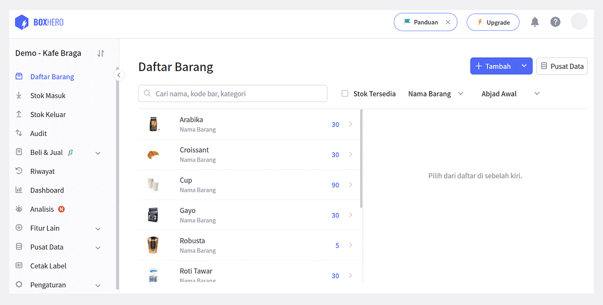

Menyimpan stok ekstra dapat membuat Anda tenang dalam menghadapi permintaan yang tiba-tiba meningkat. Semua perusahaan akan melakukannya untuk menghindari hal-hal yang tidak dapat diprediksi. Namun, tahukah Anda bahwa menyimpan stok barang berlebih juga dapat menguras kantung Anda? Anda ingin berjaga-jaga dan menyediakan permintaan konsumen dengan cepat, tapi jangan sampai ini merugikan perusahaan Anda.

Untuk mengurangi hal-hal yang dapat merugikan Anda ketika menyimpan persediaan, ada baiknya Anda memahami tentang biaya penyimpanan terlebih dahulu. Dengan memahami biaya penyimpanan beserta cara menghitungnya, Anda dapat mengetahui berapa banyak uang yang tertahan oleh inventaris yang Anda simpan. Pada akhirnya, ini membawa Anda untuk dapat mengelola inventaris dengan efektif dan efisien.

## Pengertian Biaya Penyimpanan Inventaris

Biaya penyimpanan adalah jumlah semua biaya yang menyangkut penyimpanan barang yang tidak terjual. Menurut wikipedia, biaya penyimpanan adalah total biaya penyimpanan inventaris yang meliputi pergudangan, biaya finansial, dan biaya inventaris. Biaya penyimpanan inventaris dapat mencapai hingga 20-30% dari total nilai inventaris perusahaan. Bagaimana dengan perusahaan Anda? Cobalah hitung biaya penyimpanan Anda dengan mengikuti formula di bawah ini.

## Cara Menghitung Biaya Penyimpanan Inventaris

Sebelum menghitung biaya penyimpanan, ada beberapa biaya yang harus Anda hitung terlebih dahulu. Di antaranya adalah:

- Biaya modal: Biaya yang termasuk dalam bunga dan biaya inventaris yang tidak terjual.

- Biaya layanan inventaris: Biaya pajak, asuransi, dan perangkat.

- Biaya ruang penyimpanan: Biaya sewa gudang dan transportasi.

- Biaya risiko: Biaya jika terjadi pencurian, kesalahan administrasi, atau penyusutan persediaan yang bukan karena penjualan.

Keempat poin di atas dapat digolongkan menjadi jumlah penyimpanan inventaris.

<tip-box>

Biaya penyimpanan (%) = (Jumlah penyimpanan inventaris / total nilai inventaris) x 100

</tip-box>

Anda dapat menentukan jumlah penyimpanan inventaris dengan menjumlahkan 4 poin di atas.

<tip-box>

Jumlah penyimpanan inventaris = Biaya modal + biaya layanan inventaris + biaya ruang penyimpanan + biaya risiko

</tip-box>

### Contoh

Anda memiliki perusahaan sepatu, kemudian Anda menyimpan persediaan yang tidak terjual di gudang. Total dari nilai inventaris perusahaan sepatu Anda adalah Rp50.000.00. Kemudian Anda mengeluarkan biaya modal, layanan inventaris, risiko, dan ruang penyimpanan inventaris sebesar Rp12.000.000. Maka, cara untuk menghitung biaya penyimpanan inventaris Anda adalah:

<tip-box>

Jumlah penyimpanan inventaris = Rp12.000.000 
Total nilai inventaris = Rp50.000.000 
(RP12.000.000 / Rp50.000.000) x 100 = 24%

</tip-box>

Biaya penyimpanan dari perusahaan sepatu Anda adalah 24% dari total nilai inventaris Anda.

## Pentingnya Menghitung Biaya Penyimpanan Inventaris

Perusahaan biasanya menggunakan biaya penyimpanan untuk menentukan berapa banyak keuntungan yang mereka hasilkan. Mereka juga menggunakannya untuk membantu menentukan apa yang harus mereka jual atau beli untuk mempertahankan tingkat stok yang ideal. Selain itu, biaya penyimpanan juga dapat membantu perusahaan dalam menentukan berapa lama mereka dapat menyimpan stok, sebelum stok itu kedaluwarsa atau ketinggalan zaman.

Tanpa disadari mungkin Anda mengeluarkan biaya yang banyak untuk menyimpan inventaris perusahaan Anda. Namun jangan khawatir, Anda masih memiliki opsi untuk menghemat biaya penyimpanan dengan cara membatasi jumlah inventaris yang Anda simpan. Selain itu, Anda juga dapat menentukan ruang penyimpanan yang tidak terlalu besar atau membatasi waktu penyimpanan inventaris Anda.

Untuk mempermudah pengontrolan semua inventaris, Anda juga dapat menggunakan program manajemen inventaris. Penggunaan program manajemen inventaris seperti [BoxHero](https://www.boxhero.io/id/), dapat menghemat biaya penyimpanan karena BoxHero membantu Anda melacak dan menganalisis inventaris Anda dengan akurat.

Dengan menggunakan fitur alarm stok rendah dari BoxHero, Anda dapat dengan mudah memeriksa kuantitas stok Anda, dan memutuskan untuk melakukan *reorder* atau tidak. Dengan begitu, tidak akan ada lagi barang yang tersimpan dan tidak terjual karena Anda dapat mengetahuinya dengan akurat.

Mengelola usaha tidak hanya tentang jual dan beli, tapi bagaimana Anda mampu mengelola inventaris Anda secara optimal. Dengan memahami berapa besar biaya penyimpanan yang Anda keluarkan, Anda dapat menentukan langkah berikutnya dengan cermat. Misalnya menggunakan program manajemen inventaris berbasis web, yang akan mempermudah Anda dalam mengelola, dan tentunya memangkas biaya penyimpanan inventaris Anda.

<tip-box>

**BoxHero dapat digunakan di semua lingkungan, PC dan ****Smartphone****.**

Tetaplah kelola inventaris Anda tanpa harus menggunakan PC.

BoxHero mendukung aplikasi mobile dengan baik, sehingga Anda dapat menggunakan BoxHero di *smartphone* Anda.

</tip-box>

