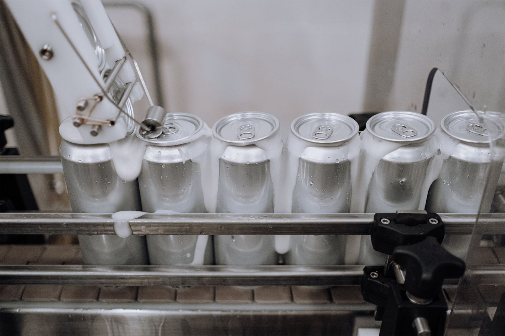
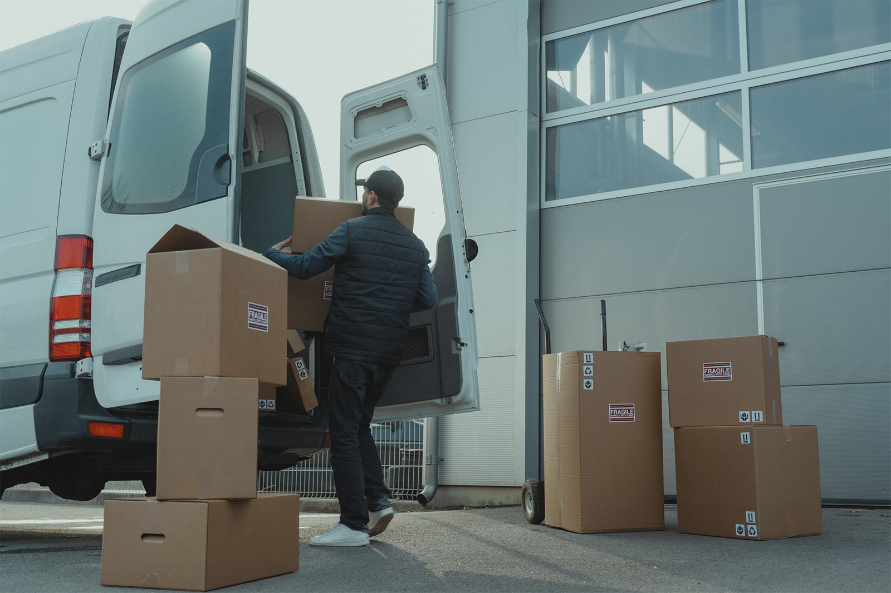

Kata inventaris atau *inventory* mungkin tidak terdengar asing bagi Anda. Namun, apa sebenarnya yang dimaksud dengan inventaris? Apa jenis-jenisnya? Barang apa yang termasuk dalam inventaris? Sebelum mengenal lebih dalam tentang inventaris, ada baiknya Anda memahami dengan jelas apa itu definisi dari inventaris.

Kata inventaris sering dihubungkan dengan barang yang dimiliki kantor atau suatu perusahaan. Padahal, inventaris dapat berhubungan dengan segala jenis bidang. Inventaris juga terdiri dari beberapa jenis yang memiliki maksud dan tujuan yang berbeda-beda. Oleh karena itu, mari kita bahas satu per satu agar Anda dapat memahaminya dengan jelas.

## Pengertian Inventaris

Inventaris secara umum dapat diartikan sebagai barang, persediaan, barang dagangan, dan material yang dimiliki suatu organisasi atau perusahaan, yang dijual untuk menghasilkan keuntungan. Pengertian dari inventaris dapat sedikit berubah berdasarkan bidang industri tertentu.

### Industri Manufaktur

Dalam bidang industri manufaktur, inventaris bukan hanya produk jadi yang sudah siap untuk dijual. Bahan baku dan setengah jadi yang disimpan di gudang pun termasuk ke dalam inventaris.

Contoh: Inventaris dari pabrik minuman kemasan terdiri dari produk yang sudah jadi yang siap dijual, produk setengah jadi seperti minuman yang belum dikemas, dan bahan baku seperti air, gula, buah, dan lainnya.

### Industri Jasa

Dalam bidang industri jasa, semua langkah yang menyangkut proses penjualan dan transaksi dapat diartikan sebagai inventaris. Itu karena, tidak adanya pertukaran inventaris secara fisik.

Contoh: Kamar-kamar hotel, penyewaan lapangan olahraga, dan industri jasa lainnya.

Berdasarkan pengertian dan contoh di atas, inventaris dapat juga di artikan sebagai:

- Aset yang berwujud atau tidak berwujud,
- Aset yang memiliki nilai tukar,
- Aset yang masih diproses untuk keperluan penjualan.

## Jenis-jenis Inventaris

Jika Anda sudah memahami definisi dari inventaris, ini saatnya Anda memahami jenis-jenis inventaris. Mari kita ambil pabrik minuman kemasan sebagai contoh.

### Bahan Baku

Bahan baku adalah semua partikel yang digunakan untuk membuat produk jadi. Seperti halnya dalam pabrik minuman kemasan tadi, bahan baku seperti air, gula, buah-buahan dan lainnya digunakan dalam tahap pembuatan produk. Bahan baku biasanya diperoleh melalui pemasok.

Konsep bahan baku biasanya hanya digunakan oleh industri manufaktur. Industri lain seperti perdagangan dan jasa, tidak melakukan proses produksi sehingga tidak menggunakan bahan baku.

### Bahan Setengah Jadi

Bahan setengah jadi adalah bahan yang sudah melewati proses produksi namun belum melewati tahap penyelesaian atau pengemasan. Di tahap ini, bahan setengah jadi misalnya buah yang sudah diproses menjadi minuman, akan di cek kualitasnya sebelum dikemas dan dijual. Singkatnya, bahan setengah jadi adalah bahan yang sudah diproses namun belum dapat dijual.

### Barang Jadi

Barang jadi adalah barang yang siap untuk dijual di pasaran karena telah melewati semua proses, termasuk pemeriksaan kualitas. Misalnya minuman kemasan yang kita temui di mini market.

Bahan baku, bahan setengah jadi, dan barang jadi adalah tiga jenis kategori utama yang biasanya dihitung oleh perusahaan. Ada juga beberapa jenis kategori yang digunakan untuk tujuan tertentu.

### Transit Inventory

*Transit inventory* merupakan barang inventaris yang dipindahkan dari satu tempat ke tempat lain. Ini mencakup bahan baku ataupun barang jadi. Misalnya, perusahaan mobil yang memindahkan mobilnya ke tempat lain.

### Cycle Inventory

*Cycle inventory* merupakan barang inventaris yang dipesan dalam batch atau ukuran lot. Oleh karena itu, *cycle inventory* terkadang juga disebut inventaris lot.

### MRO Inventory

*MRO inventory (Maintenance Repairing and Operating)* adalah inventaris yang digunakan untuk mendukung dan memelihara atau memperbaiki proses produksi. Barang-barang ini memang tidak terikat secara langsung dengan produk jadi, namun memiliki peran yang cukup penting. Contohnya seperti sarung tangan yang digunakan pekerja, minyak, alat kebersihan, dan banyak lagi.

### Buffer Inventory

*Buffer inventory* adalah inventaris yang digunakan untuk menghindari situasi penawaran dan permintaan yang tidak pasti. *Buffer inventory* atau biasa disebut stok pengaman dapat digunakan untuk meningkatkan layanan pelanggan. Dengan adanya stok pengaman, Anda tak perlu khawatir akan kehabisan stok jika permintaan pasar tiba-tiba meningkat.

### Decoupling Inventory

Decoupling inventory adalah inventaris yang digunakan untuk mempertahankan alur kerja, terutama yang berhubungan dengan mesin produksi. Misalnya proses produksi diawali dari mesin A ke mesin B, maka jika mesin A rusak, mesin B pun akan ikut terhenti karena tidak adanya bahan yang dapat diproses. Dalam kondisi seperti ini, decoupling inventory akan digunakan pada mesin B untuk menjaga alur produksi dapat terus berjalan, sambil menunggu mesin A diperbaiki.

Segala bentuk dan jenis inventaris adalah aset bagi perusahaan. Dengan memahami definisi dan jenis-jenis inventaris secara spesifik, Anda dapat mengetahui cara kerja masing-masing inventaris bagi perusahaan Anda. Lebih jauhnya, Anda dapat memaksimalkan dan menggunakannya dengan efektif dan efisien.

---

Untuk pengelolaan inventaris secara mudah, Anda dapat mengategorikan inventaris Anda, sesuai jenis dan keperluannya. Program manajemen inventaris <internal-link to="/">BoxHero</internal-link> dapat membantu Anda mengategorikan jenis inventaris Anda dengan mudah dan cepat. Anda dapat membuat kategori apa pun dan mengelompokkannya untuk kenyamanan pengelolaan.

<internal-link to="/">BoxHero</internal-link> adalah solusi manajemen inventaris termudah. Gunakan <internal-link to="/">BoxHero</internal-link> di web PC atau smartphone Anda dan dapatkan uji coba gratis selama 30 hari.

<tip-box>

**BoxHero dapat digunakan di semua lingkungan, PC dan *Smartphone*.** 
Tetaplah kelola inventaris Anda tanpa harus menggunakan PC. 
BoxHero mendukung aplikasi mobile dengan baik, sehingga Anda dapat menggunakan BoxHero di *smartphone* Anda.

</tip-box>
