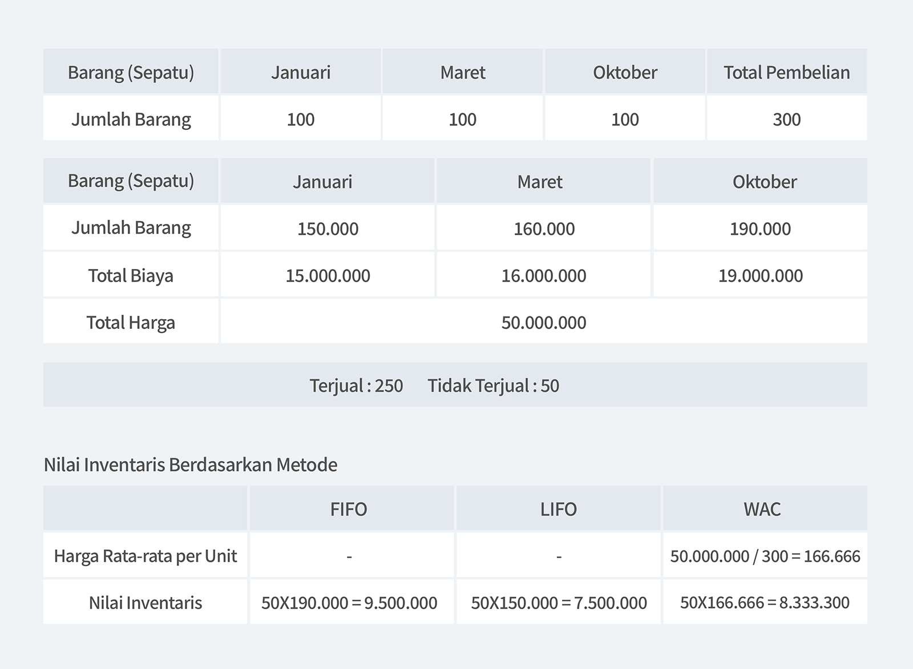

Manajemen inventaris bukanlah hal yang rumit jika Anda mengerti langkah-langkah efektif dalam mengelola dan mengontrol inventaris Anda. Berbicara tentang mengelola dan mengontrol inventaris, satu hal yang tidak boleh dilewatkan adalah penilaian inventaris atau *inventory valuation*. Apakah Anda pernah mendengar istilah FIFO atau LIFO? Keduanya adalah metode penilaian inventaris paling umum, yang digunakan untuk menilai HPP dan inventaris. Karena itu, pemilihan metode penilaian inventaris secara tepat adalah faktor penting yang dapat berpengaruh besar terhadap usaha yang sedang Anda jalankan.

## Apa itu Penilaian Inventaris?

Penilaian inventaris atau *inventory valuation* merupakan praktik akuntansi yang digunakan oleh perusahaan, untuk mengetahui nilai stok persediaan yang tidak terjual, pada saat mereka menyusun laporan keuangan. Inventaris merupakan aset bagi suatu perusahaan, dan diperlukan nilai finansial untuk mencatatnya di neraca. Nilai ini dapat membantu Anda menentukan <internal-link to="/blog/posts/Bagaimana-Cara-Menghitung-Meningkatkan-Rasio-Perputaran-Persediaan">rasio perputaran persediaan</internal-link>, yang juga akan membantu Anda merencanakan pembelian.

## Mengapa Penilaian Inventaris itu Penting?

Penilaian inventaris tentunya memiliki peran penting di dalam bisnis Anda. Karena, laporan jumlah penilaian inventaris Anda akan memengaruhi:

- Harga pokok penjualan (HPP), laba kotor, dan laba bersih
- Total aset, modal kerja, dan kepemilikan pemegang saham

## Metode Penilaian Inventaris

Mengidentifikasi barang yang tidak terjual, hanyalah langkah awal dari penilaian inventaris. Selanjutnya, Anda perlu menentukan harga pembelian dan mengalikannya dengan kuantitas barang untuk mendapatkan nilai akhir. Sepanjang tahun, Anda mungkin membeli barang dengan harga yang berbeda-beda bahkan untuk jenis barang yang sama. Karena itu, Anda harus menentukan metode untuk penilaian harga inventaris Anda secara umum.

### FIFO

FIFO ****atau *First In First Out*, yaitu asumsi bahwa barang pertama yang dibeli, adalah barang pertama yang meninggalkan gudang. Dengan kata lain, setiap kali Anda melakukan penjualan, barang yang dikurangi dari daftar adalah barang yang pertama kali masuk ke toko atau gudang Anda.

### LIFO

LIFO atau *Last In First Out*, adalah kebalikan dari FIFO. Barang yang terakhir masuk ke toko atau gudang, adalah yang pertama keluar.

### WAC

WAC atau *Weighted Average Cost* adalah metode yang menggunakan biaya rata-rata barang sepanjang tahun. Biaya rata-rata per unit dihitung dengan cara membagi total harga dengan total unit yang dibeli pada tahun tersebut.

## Penerapan Metode Penilaian Inventaris

Misalnya, Anda menjalankan bisnis sepatu dan Anda hanya memiliki 50 pasang sepatu di akhir tahun, maka Anda perlu menghitung nilai keuangannya dan mencatatnya di neraca Anda. Mari kita lihat bagaimana cara menghitung nilai tersebut menggunakan tiga metode di atas.

Pada akhir tahun, Anda memiliki 50 pasang sepatu yang tidak terjual, tetapi karena fluktuasi harga, Anda menghadapi dilema tentang harga mana yang harus Anda gunakan. Karena itu, Anda perlu memilih metode yang pas sesuai keperluan Anda.

<invisible>
Nilai Inventaris Berdasarkan Metode
</invisible>

Anda dapat melihat berapa nilai inventaris yang tidak terjual pada akhir tahun, berdasarkan metode yang diterapkan. Namun, ada satu hal yang perlu diingat.

Berdasarkan contoh di atas, nilai inventaris menggunakan metode FIFO lebih besar jumlahnya dari nilai LIFO. Ini dikarenakan harga barang yang semakin meningkat sepanjang tahun. Namun, hal ini tidak selalu terjadi. Jika harga pembelian Anda menurun sepanjang tahun, nilai FIFO akan lebih kecil dari nilai LIFO, dan nilai WAC pun akan ikut berubah.

## Apa Metode Penilaian Inventaris yang Sesuai Untuk Bisnis Anda?

Sebenarnya, tidak ada jawaban pasti dari pertanyaan ini. Metode penilaian inventaris Anda tergantung pada kondisi pasar dan tujuan finansial perusahaan Anda. Kami akan memberikan beberapa gambaran untuk membantu Anda menentukan metode yang sesuai.

### **Mengajukan Pinjaman untuk Ekspansi Bisnis**

Jika Anda berencana untuk mengajukan pinjaman, maka Anda harus menyimpan saham Anda sebagai jaminan. Nilai saham berasal dari nilai *closing stock* di neraca Anda. Ini adalah salah satu faktor yang digunakan oleh lembaga keuangan sebelum menyetujui peminjaman ke suatu perusahaan. Jika harga meningkat sepanjang tahun, metode FIFO akan memberikan nilai yang tinggi pada *closing stock* Anda. Sebaliknya, jika harga sedang turun, metode LIFO adalah pilihan Anda. Singkatnya, pilihlah metode yang dapat memberikan nilai tertinggi bagi inventaris Anda.

### **Menarik Investor**

Sebuah perusahaan dengan margin keuntungan yang tinggi bisa mendapatkan banyak perhatian dari calon investor. Maka dari itu, untuk meningkatkan margin keuntungan perusahaan Anda, metode FIFO akan bermanfaat dalam kondisi pasar yang mengalami inflasi. Demikian juga dengan metode LIFO, yang dapat Anda gunakan ketika harga pasar menurun.

### Menurunkan P**ajak**

Penilaian inventaris juga dapat membantu Anda dalam mencari cara dalam mengurangi pembayaran pajak. Metode LIFO akan menghemat uang Anda jika kondisi pasar sedang mengalami inflasi.

Terlepas dari Anda seorang pemilik bisnis besar atau pemula, Anda wajib memahami tentang konsep penilaian inventaris, karena inventaris berperan besar terhadap neraca aset Anda. Pemahaman tentang penilaian inventaris dan kepentingannya, dapat membantu pertumbuhan bisnis Anda dengan memanfaatkan kondisi pasar saat ini, dengan sebaik-baiknya.

Apakah Anda mengalami kesulitan mengelola inventaris? Mulailah sekarang bersama BoxHero.

BoxHero adalah solusi terbaik untuk manajemen inventaris, yang dapat digunakan siapa saja dengan mudah.

Tersedia berbagai fitur manajemen inventaris yang dapat diaplikasikan ke semua industri.

**Kelola inventaris Anda dengan mudah dan akurat bersama BoxHero.**

---

<tip-box>

**BoxHero dapat digunakan di semua lingkungan, PC dan *Smartphone*.** 
Tetaplah kelola inventaris Anda tanpa harus menggunakan PC. 
BoxHero mendukung aplikasi mobile dengan baik, sehingga Anda dapat menggunakan BoxHero di *smartphone* Anda.

</tip-box>
