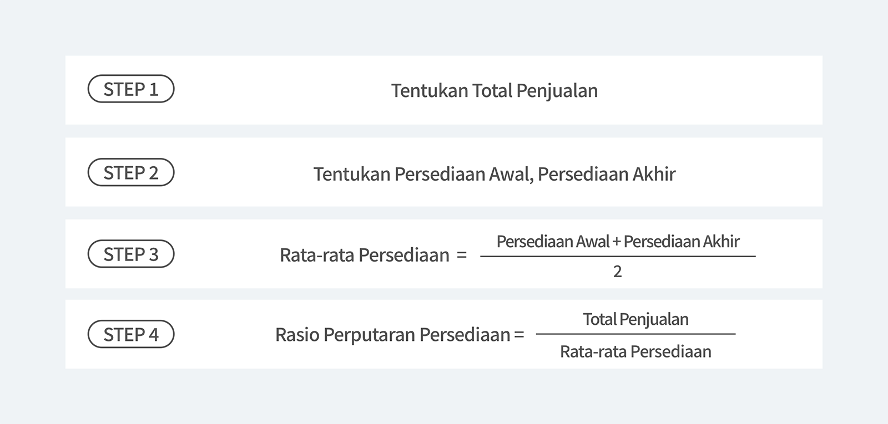
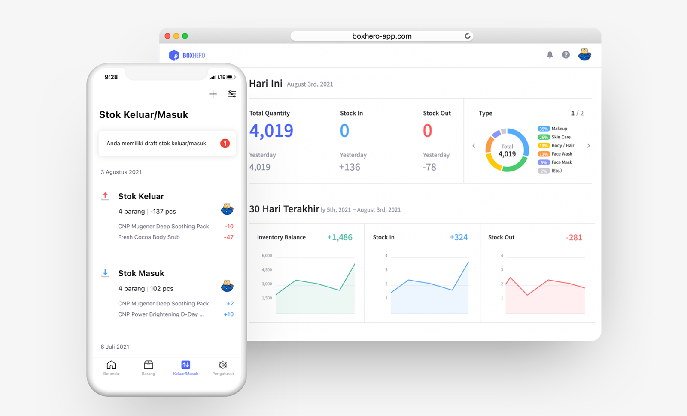
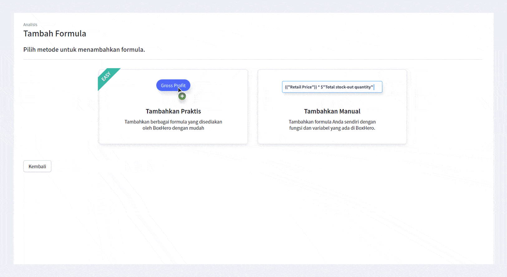

Seberapa baik pengoperasian perusahaan Anda adalah indikator terkuat dari kesuksesan di masa depan, terutama pengelolaan inventaris. Salah satu cara untuk mengukur bahwa bisnis Anda berjalan dengan sehat, adalah dengan menghitung rasio perputaran persediaan. Pemahaman yang kuat tentang rasio perputaran inventaris dapat mengubah ekspektasi bisnis Anda menjadi kenyataan. Rasio perputaran persediaan menunjukkan seberapa efisien perusahaan menangani persediaan yang masuk dari supplier hingga keluar menuju rantai pasokan (_supply chain_).

## Apa itu Rasio Perputaran Persediaan?

Rasio perputaran persediaan adalah ukuran yang menunjukkan berapa barang yang telah terjual dari inventaris Anda selama periode yang ditentukan. Melihat dari definisinya, jelas bahwa rasio perputaran persediaan adalah ukuran penting untuk memeriksa seberapa bagus bisnis Anda dalam menjual barang.

## Apa Fungsi Rasio Perputaran Persediaan?

Jika terlalu banyak stok yang disimpan di gudang terlalu lama, itu mungkin karena Anda terlalu banyak menimbunnya, yang berarti Anda memiliki lebih banyak stok daripada permintaan konsumen. Sebaliknya, jika Anda terus-menerus memesan ulang, itu mungkin merupakan tanda bahwa Anda kekurangan stok, yang berarti barang Anda terjual habis begitu cepat atau stok Anda terlalu sedikit untuk memenuhi permintaan konsumen. Rasio perputaran persediaan berfungsi untuk mengetahui seberapa efektif pengelolaan inventaris Anda dengan cara yang efisien.

## Cara Menghitung Rasio Perputaran Persediaan

<tip-box>

Rasio perputaran persediaan = total penjualan / rata-rata persediaan

</tip-box>

<invisible>
Tentukan Total Penjualan, Tentukan Persediaan Awal, Persediaan Akhir, Rata-rata Persediaan = Persediaan Awal + Persediaan Akhir, Rasio Perputaran Persediaan = Total penjualan / Rata-rata Persediaan
</invisible>

### Contoh

- Total Penjualan : 15.000.000
- Persediaan Awal : 13.000.000
- Persediaan Akhir : 7.000.000

Rata-rata Persediaan = (13.000.000+7.000.000)/2 = 10.000.000

**Rasio Perputaran Persediaan = 15.000.000/10.000.000 = 1.5**

Berdasarkan perhitungan di atas, dapat diketahui bahwa hasil dari rasio perputaran
persediaannya adalah 1.5

## Apa Artinya Jika Rasio Perputaran Persediaan Anda Tinggi?

Manakah yang lebih baik, rasio rendah atau tinggi? Rasio perputaran persediaan yang tinggi menunjukkan hubungan yang baik antara jumlah persediaan yang Anda beli dengan jumlah yang Anda jual. Ini berarti Anda mampu dengan cepat mengubah persediaan bahan mentah menjadi persediaan barang jadi dan menjualnya, serta menekan biaya penyimpanan. Selain itu, ini menunjukkan bahwa Anda dapat dengan cepat mengisi kembali uang tunai dan siap menempatkan diri Anda dalam posisi untuk bereaksi terhadap permintaan pasar.

Sebaliknya, rasio perputaran persediaan yang rendah menandakan pembelian, penjualan, dan strategi pemasaran yang buruk. Kelebihan persediaan meningkatkan biaya penyimpanan, serta uang tunai yang masih terikat dengan persediaan yang ada, mengakibatkan pukulan terhadap neraca.

## Bagaimana Cara Meningkatkan Rasio Perputaran Persediaan?

Jika sekiranya Anda menyadari bahwa rasio perputaran persediaan Anda rendah, tentu baiknya Anda berusaha untuk meningkatkannya. Apa faktor penting yang dapat meningkatkan rasio perputaran persediaan Anda? Berikut adalah beberapa tips untuk meningkatkan rasio perputaran persediaan dan neraca Anda:

### Berinvestasi di pemasaran / _marketing_

Pelajari dan analisis kembali strategi marketing Anda. Pelajari tentang pasar dan kenali target pasar Anda dengan jelas. Ada baiknya juga Anda berinventasi dengan cara mengambil kelas _marketing_ atau mempekerjakan seorang _marketer._

### Biasakan meninjau kembali strategi penetapan harga produk

Cobalah untuk meninjau dan menetapkan margin yang benar-benar ideal. Jika Anda dapat menemukannya, Anda akan mampu meningkatkan permintaan dan pendapatan secara bersamaan.

### Singkirkan produk yang tidak laku

Jangan membebani proses produksi dan biaya penyimpanan Anda dengan barang-barang yang memiliki rasio perputaran rendah. Fokus hanya pada produk yang memiliki banyak permintaan.

### Automasi pengelolaan inventaris Anda

Ada banyak program manajemen inventaris di luar sana yang akan mempermudah bisnis Anda. Salah satu fungsinya adalah untuk membantu Anda menganalisis dan memperkirakan produk yang memiliki banyak permintaan berdasarkan total penjualan bisnis Anda.

### Terapkan manajemen inventaris

Rasio perputaran yang rendah tidak selalu berasal dari _supply_ (penawaran) dan _demand_ (permintaan). Sering kali, ini berasal dari strategi <internal-link to="/">manajemen inventaris</internal-link> yang kurang tepat. Maka dari itu, sangat disarankan untuk memantapkan strategi manajemen inventaris Anda, dan pastikan proses produksi Anda mampu menahan penawaran dan permintaan.

<internal-link to="/">BoxHero</internal-link> hadir untuk membantu Anda mengautomasi manajemen inventaris Anda. Anda dapat menganalisis dan memeriksa inventaris dan penjualan Anda dengan mudah dan cepat. Selain itu, Anda juga dapat melihat rasio perputaran persediaan bisnis Anda tanpa perlu repot-repot menghitungnya sendiri.

<internal-link to="/">BoxHero</internal-link> adalah solusi manajemen inventaris termudah yang mendukung semua tipe perangkat. Dengan begitu, Anda dapat secara mudah memeriksa persediaan barang Anda di mana saja dalam waktu real-time! BoxHero memberikan demo gratis selama 30 hari bagi Anda yang baru bergabung.

---

<tip-box>

**BoxHero dapat digunakan di semua lingkungan, PC dan _Smartphone_.** 
Tetaplah kelola inventaris Anda tanpa harus menggunakan PC. 
BoxHero mendukung aplikasi mobile dengan baik, sehingga Anda dapat menggunakan BoxHero di _smartphone_ Anda.

</tip-box>
