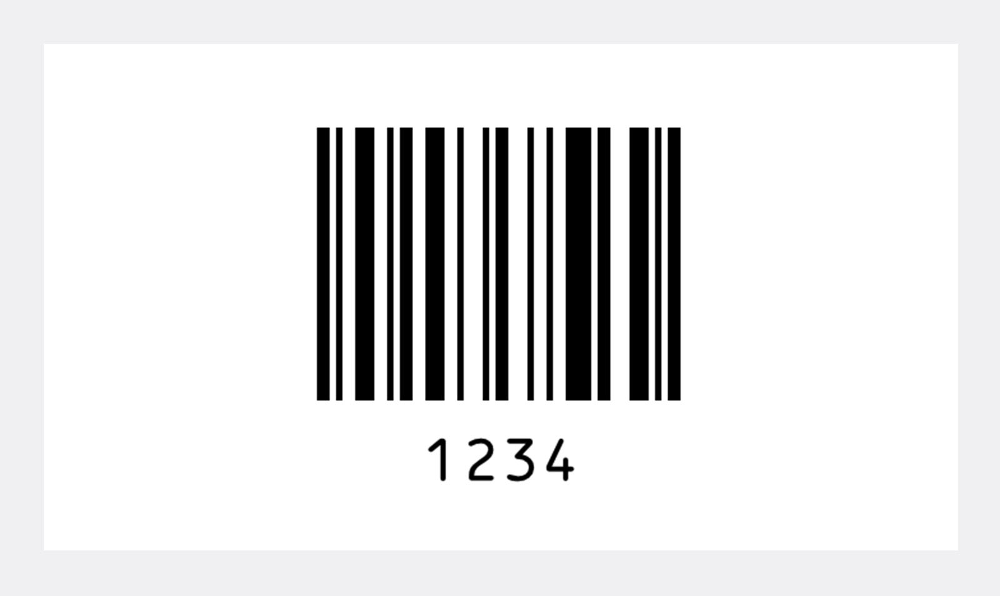
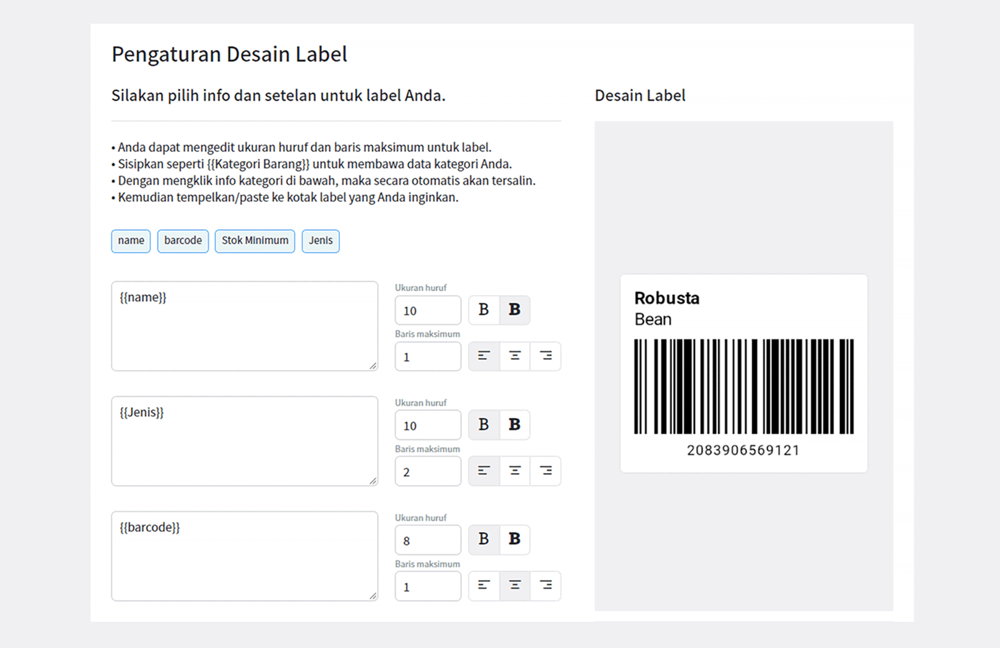
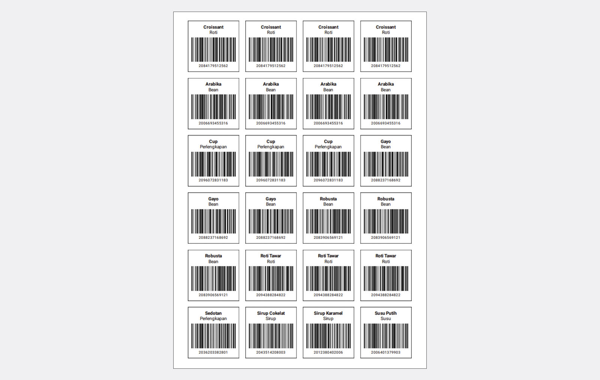

Kode bar, tanpa kita sadari adalah salah satu hal kecil yang sering kita jumpai ketika berbelanja di mini atau supermarket. Setelah memilih produk, kasir akan memindai kode bar yang tertera pada produk tersebut dan memberi tahu Anda berapa total harganya. Hampir setiap produk yang kita konsumsi sudah terpasang kode bar. Tapi, bagaimana sih cara kita membuat dan menempelkan kode bar pada produk kita sendiri?

## Apa Fungsi Kode Bar?

Kode bar atau kode batang, atau biasa juga disebut *barcode,* umunya digunakan toko ritel untuk menghitung pembayaran. Alasan utamanya adalah "efisiensi".

Jika Anda melayani pembayaran di kasir, Anda dituntut untuk menghitung seakurat dan secepat mungkin. Padahal terdapat ribuan produk yang tersedia, ditambah dengan produk yang terlihat sangat mirip. Sangatlah sulit bagi mata manusia untuk membedakannya tanpa bantuan kode bar. Oleh karena itu, kode bar digunakan agar memudahkan kita dalam menghitung dan membedakan produk secara cepat dan efisien.

## Kode Bar = Tanda Identifikasi

Jika Anda melihat kode bar suatu produk, terdapat 8 hingga 13-digit angka yang tidak dapat dipahami. Arti dari nomor kode bar ini hanyalah untuk tujuan identifikasi.

Misalnya, Anda memasukkan angka "1" di semua kaleng Coca-Cola 500ml, dan angka "2" di semua kaleng Sprite 500ml. Anda dapat menggunakan angka “3” untuk kaleng 350ml.

Kode bar bertujuan untuk mengklasifikasikan jenis produk. Sebuah kode bar dengan 13-digit angka dapat mewakili 10 triliun (10.000.000.000) jenis produk.

## Pengenalan Kode Bar

Terdapat angka dan garis hitam pada setiap kode bar produk. Ini ditujukan agar mesin dapat mengenalinya dengan cepat dan akurat. Manusia dapat membaca angka di bagian bawah kode bar, tetapi tidak dapat membaca "kode bar" dan memahami isinya. Sebaliknya, mesin tidak dapat membaca angka secara akurat, tetapi dapat membaca "kode bar" menggunakan sensor secara cepat dan akurat.

Angka "1234" di bagian bawah adalah angka yang ditulis untuk dibaca manusia, dan “kode bar” di atasnya adalah "1234" yang dibuat untuk dibaca oleh mesin.

## Contoh Penggunaan Kode Bar

Misalnya Anda bekerja sebagai pemilik usaha toko roti. Awalnya hanya ada sekitar 5 jenis roti, sehingga Anda dapat dengan mudah menghitung jumlah dan harganya di luar kepala. Namun, seiring usaha Anda terus berkembang, jenis roti Anda pun bertambah menjadi puluhan jenis. Sekarang, Anda tidak dapat lagi menghitung harga roti dengan bermacam jenis tersebut di luar kepala.

Oleh karena itu, jika Anda menempelkan stiker kode bar pada kemasan produk roti, Anda dapat menghitung jumlah totalnya hanya dengan memindai kode bar pada kemasan roti tersebut. Dengan begitu, Anda dapat menghitungnya jauh lebih cepat dan akurat. Ini adalah bagian dari pengautomasian pekerjaan.

## Cara Membuat Kode Bar

Seperti yang telah dijelaskan sebelumnya, kode bar hanyalah "angka" yang digunakan mesin untuk mengidentifikasi suatu produk. Kalau begitu, berapa nomor yang harus Anda buat untuk produk roti Anda? Misalnya, jika Anda memiliki 50 jenis roti, Anda dapat membuat angka dari 1 sampai 50, atau Anda juga dapat membuat nomor secara acak.

Karena kode bar hanyalah sarana bagi mesin untuk mengidentifikasi produk, Anda dapat membuat nomor sesuai keinginan Anda. Namun, jika Anda berencana untuk mengirim dan menjual produk Anda ke toko lain, Anda harus mengikuti aturan nomor kode bar yang digunakan di toko tersebut.

## Cara Mencetak Kode Bar

Cara tercepat dan termudah untuk mencetak kode bar adalah dengan menggunakan <internal-link to="/">BoxHero</internal-link>. Jika Anda menggunakan fitur cetak kode bar BoxHero, Anda dapat membuat, mendesain, dan mencetak kode bar sekaligus hanya dalam waktu 1 menit. BoxHero menyediakan lebih dari 10 template label kode bar yang dapat Anda sesuaikan menurut kebutuhan Anda.

Anda hanya perlu membeli kertas stiker label A4 yang tersedia di pasaran, lalu memasukkannya ke dalam printer, dan mencetaknya. Pencetakan label kode bar BoxHero dapat digunakan di printer umum maupun printer laser.

## Memperkenalkan Sistem Kode Bar

Sistem kode bar sudah teruji sangat efektif dan digunakan di hampir semua bidang termasuk ritel, medis, dan manufaktur. Peralatan yang diperlukan pun harganya tidak mahal, Anda hanya memerlukan pemindai kode bar, printer, dan kertas. Oleh karena itu, siapa saja dapat dengan mudah menggunakannya.

Anda hanya tinggal mencetak dan menempelkan kode bar pada produk Anda satu kali. Dengan begitu, Anda dapat mempersingkat waktu saat melakukan hitung stok. Ini juga dapat mempermudah pekerjaan Anda ketika harus mengirimkan pesanan ke konsumen Anda.

## Mulai dengan Manajemen Inventaris

Dengan <internal-link to="/">BoxHero</internal-link>, Anda dapat dengan cepat membuat dan mencetak kode bar, serta menerapkan sistemnya. Anda juga tidak perlu repot-repot membeli pemindai kode bar karena, Anda dapat memindai menggunakan *smartphone* Anda.

<internal-link to="/">BoxHero</internal-link> adalah solusi manajemen inventaris termudah yang mendukung semua tipe perangkat.

Periksa dan kelola inventaris Anda dengan mudah kapan saja, di mana saja secara *real time!*

---

<tip-box>

**BoxHero dapat digunakan di semua lingkungan, PC dan *Smartphone*.** 
Tetaplah kelola inventaris Anda tanpa harus menggunakan PC. 
BoxHero mendukung aplikasi mobile dengan baik, sehingga Anda dapat menggunakan BoxHero di *smartphone* Anda.

</tip-box>
