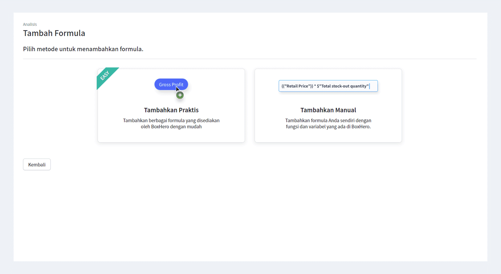

Analisis inventaris membantu Anda untuk lebih aktif lagi dalam mengelola aset yang paling berharga. Ini adalah cara sederhana sekaligus efektif untuk mengetahui mana barang yang paling banyak terjual, barang apa yang memiliki stok berlebih, memeriksa rasio perputaran, dan masih banyak lagi. Mengetahui data-data tersebut, tentunya dapat membantu Anda dalam menentukan langkah tepat untuk menjalankan bisnis Anda di masa depan.

## Pentingnya Bagi Usaha Anda

Lalu, sebenarnya apa yang harus Anda lakukan dengan data yang Anda peroleh dari analisis tersebut? Inilah poin penting dari analisis inventaris. Seperti yang telah dijelaskan di atas, Anda dapat meningkatkan produksi dan penjualan dengan mengoptimalkan persediaan barang yang Anda miliki. Selain itu, ada beberapa manfaat lain yang dapat Anda peroleh, di antaranya:

- Meningkatkan arus kas atau *cash flow.*
- Mengurangi pemborosan inventaris.
- Menghindari kehabisan stok dan penundaan proyek.
- Menentukan harga terbaik dari *supplier* dan vendor.
- Memuaskan konsumen.

Analisis yang tepat dapat meningkatkan kontrol terhadap inventaris Anda, yang berarti tidak ada lagi kehabisan stok, pemborosan stok, hingga secara keseluruhan dapat meningkatkan arus kas Anda. Itulah sebabnya, perusahaan besar harus fokus dalam menganalisis inventaris mereka, karena dengan itu, mereka dapat meningkatkan produk atau layanan yang mereka sediakan.

## Cara Menerapkan Analisis Inventaris

Setelah membahas definisi, tujuan, dan manfaat dari analisis inventaris, sekarang saatnya untuk menerapkannya dalam usaha Anda. Ada banyak hal yang harus Anda analisis secara akurat untuk dapat meraih manfaat yang optimal. Beberapa di antaranya adalah: profit, omzet harian, total penjualan, total stok keluar/masuk, inventaris aset, rasio perputaran, perkiraan stok habis, dan lainnya.

Anda dapat menghitungnya dengan membuat formula secara manual. Namun, sangatlah sulit untuk dapat menghitung dan mengingat semua formula yang Anda butuhkan saat menganalisis semua inventaris. Oleh karena itu, Anda dapat menggunakan <internal-link to="/">manajemen inventaris</internal-link> yang dapat mengerjakan semuanya untuk Anda.

<internal-link to="/">BoxHero</internal-link> adalah program manajemen inventaris berbasis *cloud*, yang dapat membantu Anda mengelola inventaris secara optimal. Anda tidak perlu melakukan penghitungan rumit yang memakan waktu untuk menganalisis inventaris Anda. Cukup dengan menambahkan berbagai formula yang sudah tersedia di <internal-link to="/">BoxHero</internal-link>, Anda langsung dapat menganalisis poin-poin penting secara cepat dan mudah. BoxHero menyediakan berbagai formula inventaris dan penjualan. Selain itu, Anda juga dapat membuat formula melalui fungsi seperti *if, round, string,* dan lainnya.

Semua konsumen pasti berharap pesanan mereka dikirimkan dengan cepat. Analisis inventaris yang efektif memungkinkan Anda untuk memenuhi harapan konsumen tanpa kerepotan. Dengan begitu, penjualan dan arus kas Anda akan meningkat, dan bisnis Anda pun akan semakin berkembang.

---

<tip-box>

**BoxHero dapat digunakan di semua lingkungan, PC dan *Smartphone*.** 
Tetaplah kelola inventaris Anda tanpa harus menggunakan PC. 
BoxHero mendukung aplikasi mobile dengan baik, sehingga Anda dapat menggunakan BoxHero di *smartphone* Anda.

</tip-box>
