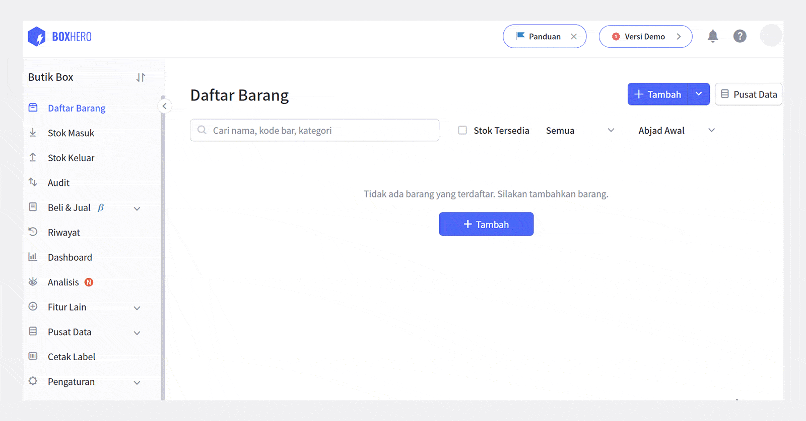
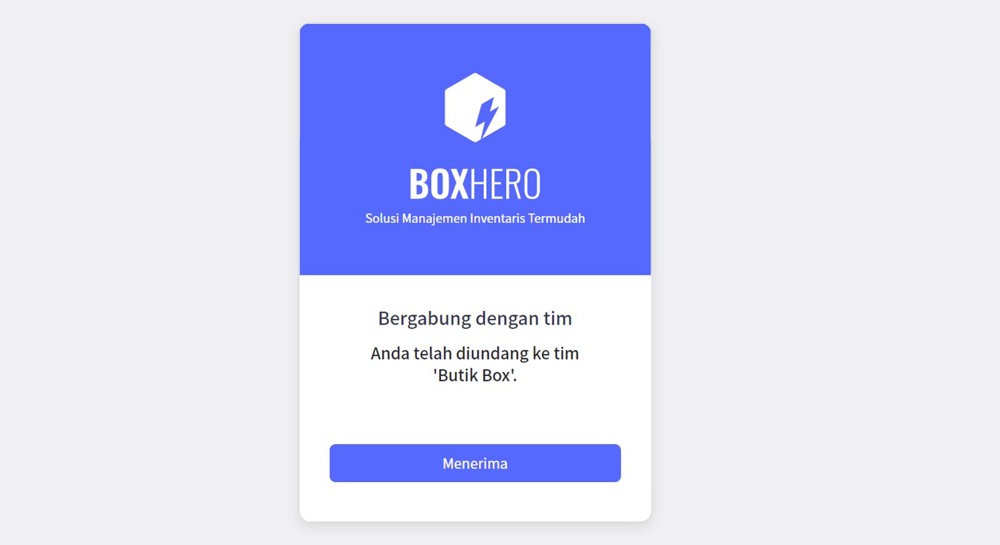
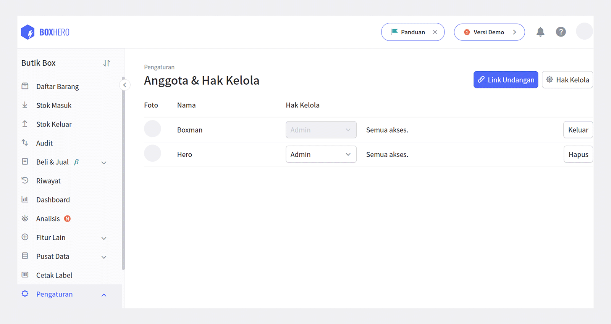
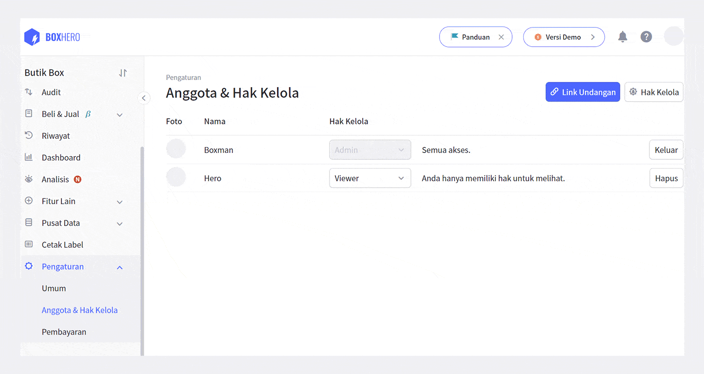
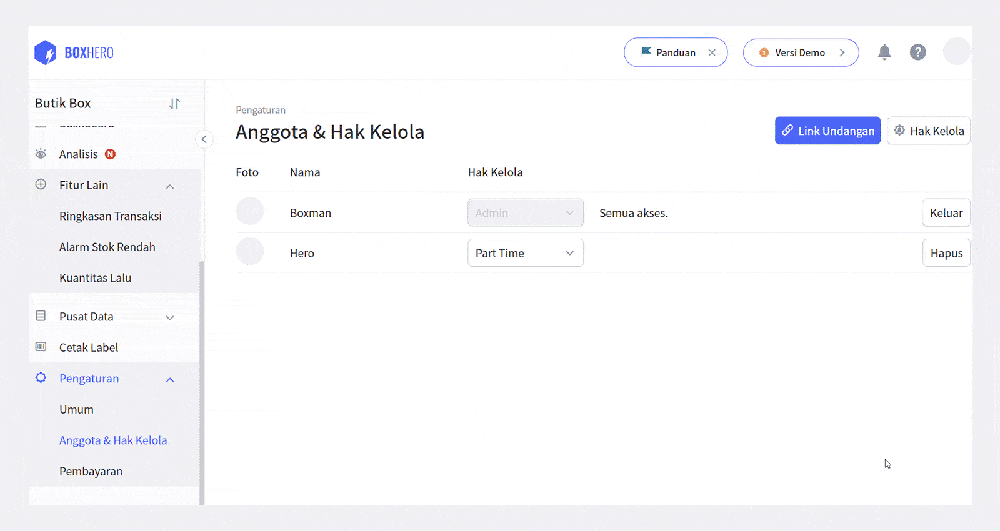

Menjalankan bisnis seorang diri bukanlah hal yang mudah, terutama jika Anda harus mengelola seluruh aspek. Memikirkan semua bagian seperti proses produksi, penjualan, pemasaran, persediaan, dan lainnya akan membuat Anda sulit untuk fokus. Di sinilah peran anggota dibutuhkan. Dengan membagi tugas dengan anggota, Anda dan anggota dapat fokus di bidang masing-masing sehingga pekerjaan pun akan lebih terkendali.

## Mengundang dan Mengelola Anggota

BoxHero memiliki fitur undang dan kelola anggota yang fleksibel sehingga Anda dapat menyesuaikan tugas dan peran dari anggota Anda. Ikuti langkah-langkah berikut untuk mengundang dan mengelola hak anggota tim Anda dengan optimal.

Anda dapat memulainya melalui menu `Pengaturan > Anggota & Hak Kelola`.

### 1. Mengundang Anggota

Mengundang anggota dapat Anda lakukan secara mudah dengan membagikan *link* undangan tim Anda, *link* undangan akan tersalin secara otomatis ketika Anda menekan `Link Undangan`. Anda tinggal membagikannya kepada anggota tim Anda.

Dengan menekan `Menerima` di *link* undangan yang Anda bagikan, anggota tim Anda dapat langsung bergabung ke tim Anda. Kode dan link undangan berlaku selama 24 jam.

<caution-box>

Single Plan hanya dapat digunakan oleh satu orang. Namun, jika Anda berlangganan Business Plan, Anda dapat mengundang anggota hingga 10 orang. Anda juga dapat menambah lebih dari 10 anggota dengan membayar $5 per anggota tambahan per bulannya.

</caution-box>

### 2. Mengatur Peran Anggota

Sebagai Admin dari tim, Andalah yang memegang kendali dan dapat mengatur peran anggota Anda sesuai kebutuhan. Ada tiga jenis peran sebagai aturan awal, yaitu:

- Admin: Memiliki hak atas semua akses.

- Anggota: Mengelola barang, stok keluar dan masuk.

- Viewer: Hanya dapat melihat saja.

### 3. Mengatur Hak Kelola Anggota

Jika Anda tidak menemukan peran yang cocok dari tiga pilihan di atas, Anda dapat membuat hak kelola sendiri khusus untuk anggota Anda. Misalnya jika Anda mempekerjakan pekerja paruh waktu, Anda dapat memberikan hak kelola yang sesuai untuk pekerja tersebut. Dengan begitu Anda dapat membagi data secara *real-time* namun tetap dalam porsi penggunaan yang pas.

### 4. Menambah Batas Kuota Anggota

Jika Anda melebihi batas 10 anggota yang tersedia di Business Plan, Anda harus menambah kuota dengan membayar $5 per anggota per bulan. Anda dapat menambahkan kuota di menu `Pengaturan > Pembayaran`. Kuota dapat ditambahkan hingga 100 anggota.

### 5. Menurunkan Batas Kuota Anggota

Anda dapat menurunkan kuota Anggota kapan saja di menu `Pengaturan > Pembayaran`.

Setelah Anda mengurangi kuota penggunaan, biaya kuota penggunaan sebelumnya akan dihitung hingga pembayaran selanjutnya dan akan diisikan sebagai kredit. Kredit tersebut akan dipakai untuk membayar tagihan setelahnya. Kemudian, pembayaran secara otomatis dijalankan sesuai kuota atau paket yang sudah Anda ganti tadi.

<caution-box>

Jika Anda melewati batas penggunaan, Anda tidak dapat menggunakan layanan secara normal. Anda harus menyesuaikan penggunaan dengan paket yang telah Anda pilih.

</caution-box>

BoxHero membantu Anda untuk mengelola inventaris dengan mudah dan efisien. Berapa pun banyak jumlah anggota Anda, Anda dapat mengaturnya dengan mudah dan menyesuaikan dengan perannya masing-masing. Gunakan BoxHero untuk mengelola inventaris bersama tim Anda dengan optimal.

<tip-box>

**BoxHero dapat digunakan di semua lingkungan, PC dan ****Smartphone****.**

Tetaplah kelola inventaris Anda tanpa harus menggunakan PC.

BoxHero mendukung aplikasi mobile dengan baik, sehingga Anda dapat menggunakan BoxHero di *smartphone* Anda.

</tip-box>

