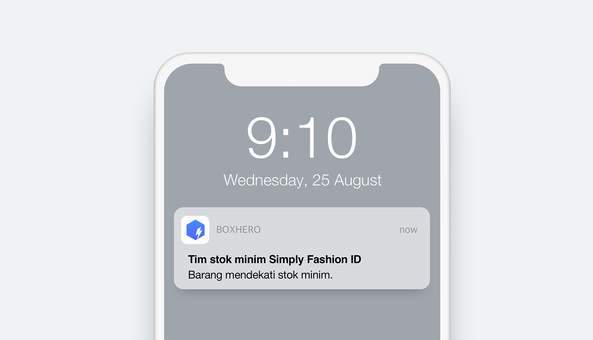
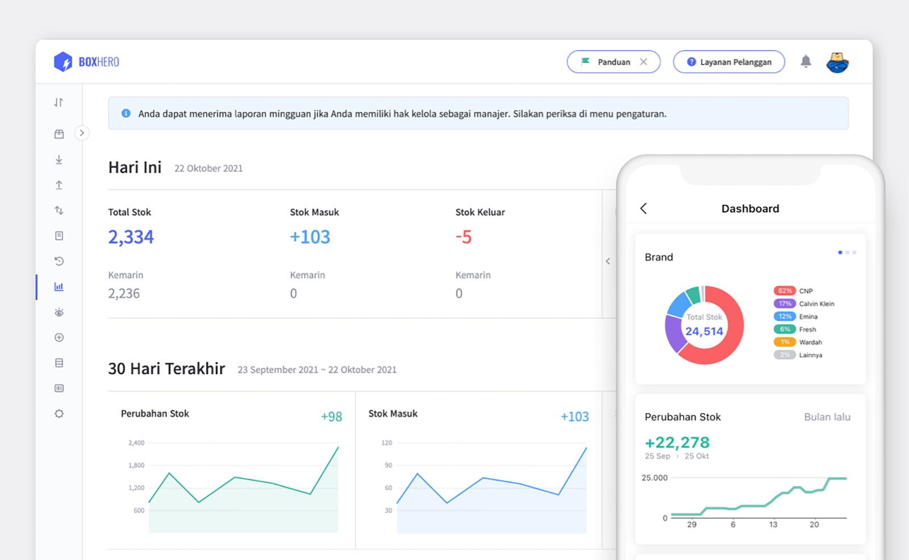

BoxHero memiliki beberapa fitur tambahan yang akan membantu mengelola inventaris Anda secara efektif dan efisien. Fitur utama manajemen inventaris BoxHero memang sudah sangat memudahkan pengelolaan inventaris, namun dengan fitur tambahan ini, Anda dapat membuat pengelolaan Anda makin praktis. Berikut ini adalah tiga fitur tambahan dari BoxHero, yang dapat meningkatkan level manajemen inventaris Anda.

## Ringkasan Transaksi

<video src="images/img_2.mp4" style="width:100%" muted autoplay loop playsinline></video>
<invisible>Fitur ringkasan transaksi</invisible>

Fitur ini akan memudahkan Anda dalam memeriksa seluruh riwayat transaksi Anda seperti riwayat audit, stok keluar, dan masuk. Klik menu `Fitur Lain > Ringkasan Transaksi`, lalu tulis nama barang, kode bar, atau kategori di kolom pencarian. Kemudian Anda dapat menentukan periode tanggal transaksi yang ingin Anda cari. Selain itu, Anda juga dapat mengunduh transaksi tersebut ke dalam file Excel dengan menekan `Export Excel`.

## Alarm Stok Rendah

<video src="images/img_3.mp4" style="width:100%" muted autoplay loop playsinline></video>
<invisible>Fitur alarm stok rendah</invisible>

Fitur tambahan berikutnya adalah `Alarm Stok Rendah`. Fitur ini bertujuan untuk membantu Anda menghindari kehabisan stok barang. Cukup dengan mengatur kuantitas minimum untuk setiap barang, Anda dapat mengetahui stok rendah maupun stok yang berlebih dengan mudah.

 

<tip-box>

Unduh BoxHero *mobile app* di *smartphone* Anda dan nyalakan notifikasi stok rendah.

Notifikasi akan muncul setiap jam 9 pagi.

</tip-box>

## Kuantitas Lalu

<video src="images/img_5.mp4" style="width:100%" muted autoplay loop playsinline></video>
<invisible>Fitur kuantitas lalu</invisible>

Fitur yang terakhir adalah fitur `Kuantitas Lalu`. Fitur ini memungkinkan Anda untuk memeriksa kuantitas barang Anda di masa lalu. Masukkan nama barang, kode bar, atau kategori, kemudian pilih tanggal yang inigin Anda periksa. Hasil dari pencarian juga dapat Anda unduh ke file Excel dengan menekan `Export Excel`.

## Dashboard

Anda dapat memeriksa status inventaris Anda hari ini, kemarin, dan 30 hari terakhir melalui menu `Dashboard`. Anda juga dapat memeriksa stok yang Anda miliki berdasarkan kategori yang telah Anda buat sebelumnya. Fitur ini dapat memberikan gambaran stok inventaris Anda secara menyeluruh dengan mudah.

 

<video src="images/img_7.mp4" style="width:100%" muted autoplay loop playsinline></video>
<invisible>Email laporan mingguan</invisible>

BoxHero menyediakan laporan mingguan via email Anda. Masuk ke menu `Pengaturan > Umum` dan aktifkan `Laporan Mingguan`. Setiap minggu, Anda akan mendapat email yang berisi laporan inventaris Anda seperti total stok, total stok keluar-masuk, dan lainnya.

 

<video src="images/img_8.mp4" style="width:100%" muted autoplay loop playsinline></video>
<invisible>Dashboard mobile</invisible>

Jika Anda menggunakan aplikasi *mobile* BoxHero, Anda dapat melihat menu `Dashboard` dengan menambahkannya terlebih dahulu. Setelah itu, Anda dapat dengan mudah memeriksa status inventaris Anda melalui *smartphone*.

Memiliki informasi dari semua inventaris Anda secara detail, dapat membantu Anda dalam menentukan langkah-langkah yang tepat di masa depan. Oleh karena itu, manfaatkan semua fitur dari BoxHero untuk mengoptimalkan manajemen inventaris usaha Anda.

<tip-box>

**BoxHero dapat digunakan di semua lingkungan, PC dan ****Smartphone****.**

Tetaplah kelola inventaris Anda tanpa harus menggunakan PC.

BoxHero mendukung aplikasi mobile dengan baik, sehingga Anda dapat menggunakan BoxHero di *smartphone* Anda.

</tip-box>

