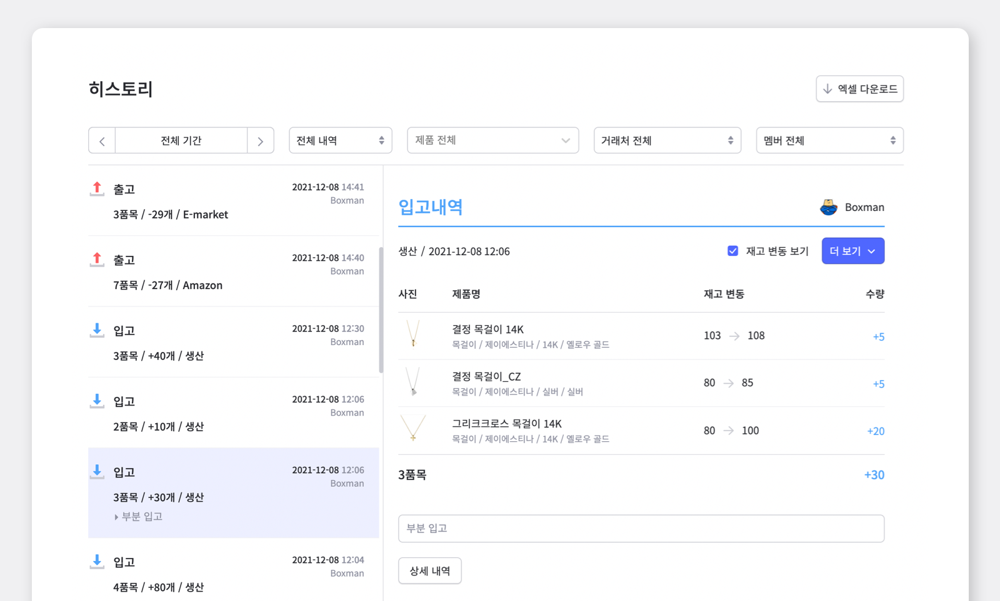
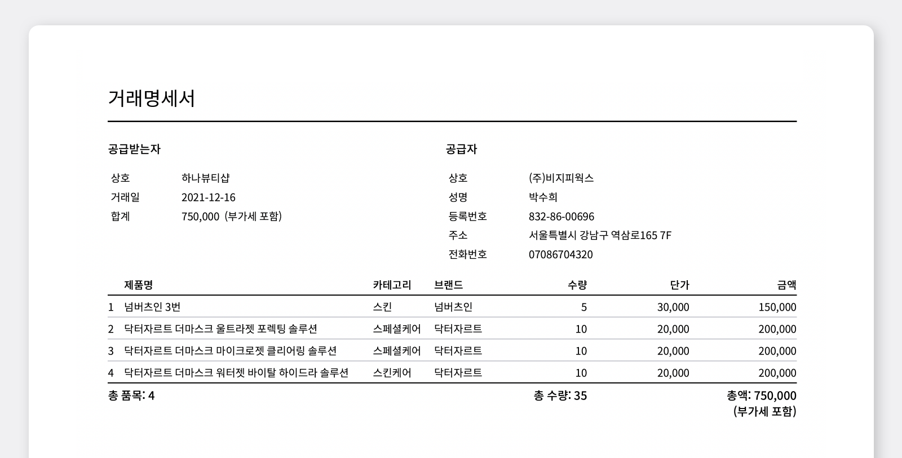

사업장의 재고관리에 있어서 제일 중요한 것은 무엇일까요?

바로 재고 상황을 신속하고 정확하게 파악하는 것입니다. 재고 규모가 커질수록 각 재고의 상황을 단번에 파악하기 어려워지는데요. 정확도가 떨어지는 수기 관리나, 복잡한 엑셀 데이터 관리를 하면서 재고 파악에 어려움을 겪으셨다면 이제 박스히어로를 사용하여 빠르고 정확한 재고관리에 도전해 보세요.

클라우드 서비스를 기반으로 한 박스히어로의 여러 기능 중, 이번 게시글에서는 <mark>재고 내역을 한번에 파악 할 수 있는 히스토리 기능</mark>에 대해 더 자세히 알아보겠습니다!

## 히스토리에서 내역 조회하기

히스토리 기능에서는 과거 기록된 입고, 출고, 조정 내역을 모두 조회할 수 있습니다. 또한 거래서 종류, 제품, 거래처, 멤버, 기간을 설정하여 필요한 내역을 필터링하여 확인해 보실 수 도 있습니다.

좌측 목록에서 내역을 선택하면 우측에서 자세하게 볼 수 있으며, 하단의 `상세 내역` 버튼을 눌러 전체 화면으로 확인해 보세요.

## 히스토리 메뉴에서 활용할 수 있는 다양한 기능들

**1. 거래명세서 작성하기 (제품 출고 시)**

히스토리에서는 조회된 출고 내역에 관한 거래명세서를 작성할 수 있습니다.

<video src="images/img_3.mp4" style="width:100%" muted autoplay loop playsinline></video>
<invisible></invisible>

 

작성된 거래명세서는 인쇄 또는 PDF 파일로 저장 가능합니다. 
<gray-text>더 알아보기 : </gray-text>[거래명세서, 쉽고 정확하게 작성하는 방법](https://www.boxhero-app.com/ko/blog/posts/%EA%B1%B0%EB%9E%98%EB%AA%85%EC%84%B8%EC%84%9C-%EC%89%BD%EA%B3%A0-%EC%A0%95%ED%99%95%ED%95%98%EA%B2%8C-%EC%9E%91%EC%84%B1%ED%95%98%EB%8A%94-%EB%B0%A9%EB%B2%95)

**2. 거래 내역 엑셀 다운로드**

만약 자료에 대한 외부 전달이 필요할 경우, 빠르게 엑셀 다운로드를 통한 자료 보관이 가능합니다.  
<gray-text>더 알아보기 : </gray-text>[박스히어로와 엑셀을 연동하여 활용해보기](https://www.boxhero-app.com/ko/blog/posts/박스히어로와-엑셀을-연동하기)

<video src="images/img_5.mp4" style="width:100%" muted autoplay loop playsinline></video>
<invisible></invisible>

 

**3. 거래 내역 수정하기**

히스토리에서 입고, 출고, 조정 내역을 수정할 수 있습니다. 수정 후에도 수정 이전의 내역을 확인 할 수 있어, 보다 투명한 재고관리가 가능합니다.

<video src="images/img_6.mp4" style="width:100%" muted autoplay loop playsinline></video>
<invisible></invisible>

 

내역을 수정할 때는 바코드 스캔 기능을 활용할 수 있습니다. `바코드 스캔` 버튼을 누른 뒤 바코드 스캐너로 각 제품의 바코드를 스캔해 기존 내역을 수정해 보세요.

<caution-box>

거래 내역을 수정 또는 삭제할 시, 재고 수량이 자동으로 계산되어 변경될 수 있습니다.

</caution-box>

 

박스히어로의 히스토리 기능은 완료된 거래 내역을 확인할 때 매우 효과적입니다. 특히 특정 거래의 상세 내역을 확인하고 싶을 때 매우 활용도가 높은 기능입니다. 최적의 결과를 위한 가장 쉬운 재고 관리 프로그램인 박스히어로를 활용하여 시간과 노력을 절약하세요!

<gray-text>더 알아보기 : [입출고 요약 기능과 함께 한 눈에 입출고 수량을 파악하세요!](https://www.boxhero-app.com/ko/blog/posts/입출고-요약-기능과-함께-한-눈에-입출고-수량을-파악하세요) </gray-text>

### 거래 내역을 한 눈에 확인하고 싶으신가요? 지금 바로 박스히어로를 시작해보세요.

박스히어로는 누구나 쉽게 사용할 수 있는 재고관리 특화 솔루션입니다.

박스히어로가 제공하는 히스토리 기능을 통해 완료된 거래서에 대한 수정/삭제 뿐만 아니라 거래 내역 인쇄, 엑셀파일로 다운로드 등 많은 기능을 활용하여 최적의 상태로 재고를 유지할 수 있습니다.

**이제 박스히어로와 함께 쉽고 정확하게 재고관리하세요.**

 

<tip-box>

**박스히어로는 PC와 모바일, 모든 환경에서 사용할 수 있습니다.**

PC가 없는 환경에서도 재고관리는 멈추지 않고 계속됩니다.

강력한 모바일 앱을 지원해 스마트폰에서도 박스히어로를 사용할 수 있습니다.

</tip-box>
