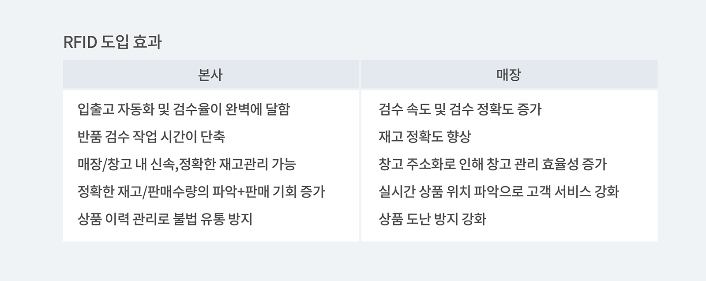
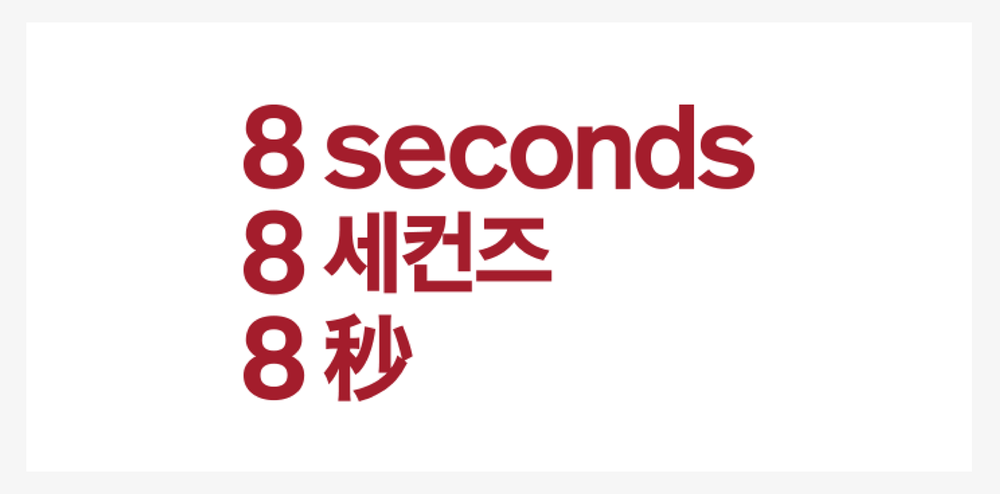
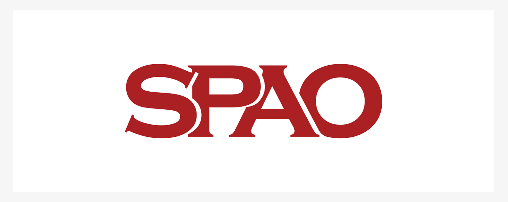

## RFID 태그를 효율적으로 사용한 ZARA가 패션 시장에서 살아남는 방법

새로운 상품들과 트렌드, 지금 현재 우리는 매일매일 새로운 트랜드가 생겨나는 FAST 패션 시대를 살아가고 있습니다. 이번 포스트에서는 RFID(Radio-Frequency Identification)를 이용해 빅데이터 수집을 활용해 패션 브랜드에서의 선두 주자가 된 ZARA에 대해 함께 알아볼까요?

먼저 RFID이란 어떤 시스템인지에 대해 알아보겠습니다!

<tip-box>

 **RFID시스템이란 무엇일까요?**

**'RFID'**는 무선 주파수를 인식하는 **R**adio** F**requency **ID**entification의 약자로 안테나와 칩으로 구성된 RFID 태그에 정보를 저장하여 적용 대상에 부착한 후, **RFID 리더기** 등을 통해 물건이나 사람 등과 같은 대상을식별(Identification) 할 수 있도록 해주는 기술을 말합니다!

</tip-box>

- [더 읽어보기: 무선 식별 시스템, RFID](/aedfc00624d3499cab211d627fc09e82?v=ea94dbd881fc4e3aa7a9337a32a60db5&p=21686ee590d44818b077d4ed19be141e)

자라는 연간 4억 5천만개의 제품을 생산하고 있습니다. 그 중 스타일 수는 셀 수 없이 많은데요! 그리고 ZARA라는 브랜드를 모르는 사람이 없을 정도로 전 세계에서 판매되고 있는 세계적 브랜드이기도 해요. 그럼 당연히 끝없이 많은 제품들을 효율적으로 생산하고 관리하려면 엄청난 인력과 그에 따른 비용 그리고 시간과 노력이 소요될 수 밖에 없겠죠?

자라는 이러한 불편함을 최소화하기 위해 RFID 기술을 이용한 실험을 약 14년 전인 2007년부터 해오고 있었습니다. 그리고 마침내 2014년, 각 매장에 본격적으로 RFID 시스템을 매장에 도입했고 현재까지 제품 디자인부터 재고관리, 배송 후 매장 관리까지 거의 모든 과정에서 RFID시스템을 사용하고 있다고 해도 과언이 아닐 정도가 되었습니다. 그 결과 ZARA는 다른 패션 경쟁사들보다 훨씬 앞선 시스템을 구축해서 많은 성과를 거두고 있습니다. 그리고 현재 ZARA의 모든 제품에는 RFID 태그가 부착되어 있으며 지금은 ZARA 뿐만 아니라 유니클로, 에잇세컨즈 등 많은 브랜드들이 이 시스템을 사용하고 있습니다. 패션브랜드에서는 매장 내의 재고 부족 문제를 어느정도 해결하는 것 만으로도 매출 상승으로 이어질 수 있습니다. 예를 들면 RFID시스템이 적용된 매장은 각 제품이 어디에 있는지 실시간으로 빠르게 확인이 가능하기 떄문에 직원이 직접 일일이 재고를 확인할 때보다 효율적으로 관리가 가능해졌습니다.

효율적인 재고관리에는 업무 생산성이 향상되는 것으로 이어집니다. RFID 태그로 40시간 이상 소요되었던 재고 조사/실사 시간을 단 4-5시간으로 줄일 수 잇게 되면서 직원들은 보다 많은 시간을 고객 응대에 할애할 수 있게 되었고 또 이는 고객 만족도를 높이고 업무 생산성을 높이는 효과를 불러일으켰습니다. 

## RFID 시스템의 도입 효과를 간단하게 알아볼까요?

일단, RFID 시스템의 도입 효과를 크게 두 가지 관점으로 매장 본사의 관점과 매장의 관점으로 나누어 볼 수 있습니다. 

그렇지만, 모든 브랜드가 RFID시스템을 도입할 수 있는 것은 아니에요. 

패셥 업계의 RFID 시스템의 도입율은 사실 매우 저조합니다. 왜냐하면 초기 도입 비용이 많이 들기 때문에 부담될 수 있고 RFID 시스템 도입의 성공사례가 아직까지는 적기 때문이라는 이유도 있습니다.  RFID시스템의 단점이라고 하면 가끔 라벨에 부착되는 칩의 불량과 이런 칩은 인식이 잘 되지 않게 되고 이런 제품이 한 개만 있어도 데이터에 오류가 생길 수 있습니다. 그리고 제품 자체가 작고 금속 부자재가 많은 경우에는 부착한 위치에 따라서도 인식율이 떨어질 수 있습니다. 

하지만 RFID시스템은 많은 데이터 수집을 위한 필수 단계라고 할 수 있습니다. 이 시스템의 도입으로 인한 직접적인 효과(물류에서부터 매장에 이르기까지 모든 제품의 정보가 데이터화 될 뿐 아니라 실시간으로 데이터가 쌓이게 되고 또 매장이 많은 브랜드는 어느 지역에서 어떤 고객이 어떤 제품을 구입했는지도 세세하게 기록되고 분석되는 것)도 있지만 궁극적으로는 RFID시스템으로 수집된 데이터가 ZARA 처럼 한 패션 브랜드의 자산이 되고 그것이 실적으로 이어질 수 있기 때문입니다.

### **한국 SPA 브랜드인 에잇세컨즈/스파오의 사례도 잠깐 함께 살펴볼게요!**

**에잇세컨즈**

현재 에잇세컨즈는 2020년 7월 1일자를 기준으로 시즌 상품부터 물류, 매장까지 전체 모든 시스템을 RIFD를 적용해 관리하고 있습니다. 에잇세컨즈에서는 이 시스템을 도입함으로써 물류창고와 매장에서의 재고 정확성, 판매율 증가와 로스율 감소 등 다양한 운영 상의 비용이 많이 절감하는 효과를 보았습니다. 

**SPAO**

SPAO 에서는 RFID 시스템을 마케팅 솔루션에도 도입을 하고 있는 상태입니다. 

예를 들어 SPAO에서 출시한 디즈니 캐릭터 티셔츠를 들고 거울 앞에 서면, 들고 있는 제품의 스타일링이 된 동영상 화보가 거울 속 화면에 나타나면서 이 제품을 활용한 스타일링에 대한 팁을 얻을 수 있는 마케팅 솔루션이라고 볼 수 있습니다. 이는 SPAO의 자회사인 유성소프트가 개발한 RFID기술을 활용한 미러 속 동영상 콘텐츠 마케팅 솔루션입니다. 오프라인 매장에서 고객이 제품을 구매할 때 재미와 또 팁을 한번에 얻을 수 있는 솔루션이면서 또한 장기적 도입이 가능한 마케팅이라고 볼 수 있습니다.

RFID 시스템 개발 초기에는 물류 프로세스에만 적용해 사용했다면 오늘날에는 RFID를 활용한 확장된 서비스가 개발되고 있습니다. 예를 들면 물류 프로세스 방면에서는 매장 내 재고 실사를 위해 20명의 직원들이 필요했다면 지금은 2명에서 1-2시간 내에 재고 실사가 가능해졌다고 합니다. 또한 필요에 따라 그때 그때 빠른 재고 실사가 가능해 매장 재고의 결품율을 훨씬 감소시킬 수 있습니다. 

**다양한 방면에서 RFID 태그의 빅데이터를 활용해서 패션 브랜드의 성장을 이뤄보세요.**

재고관리에 어려움을 겪고 계신가요? 지금 바로 박스히어로를 시작해보세요.

박스히어로는 누구나 쉽게 사용할 수 있는 재고관리 특화 솔루션입니다.

다양한 재고관리 기능을 통해 업종 구분없이 모든 비즈니스에서 도입이 가능합니다.

**이제 박스히어로와 함께 쉽고 정확하게 재고관리하세요.**

<tip-box>

**박스히어로는 PC와 모바일, 모든 환경에서 사용할 수 있습니다.**

PC가 없는 환경에서도 재고관리는 멈추지 않고 계속됩니다.

강력한 모바일 앱을 지원해 스마트폰에서도 박스히어로를 사용할 수 있습니다.

</tip-box>

