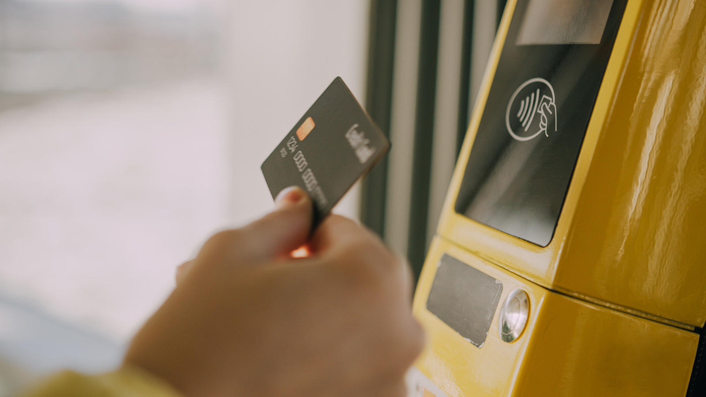
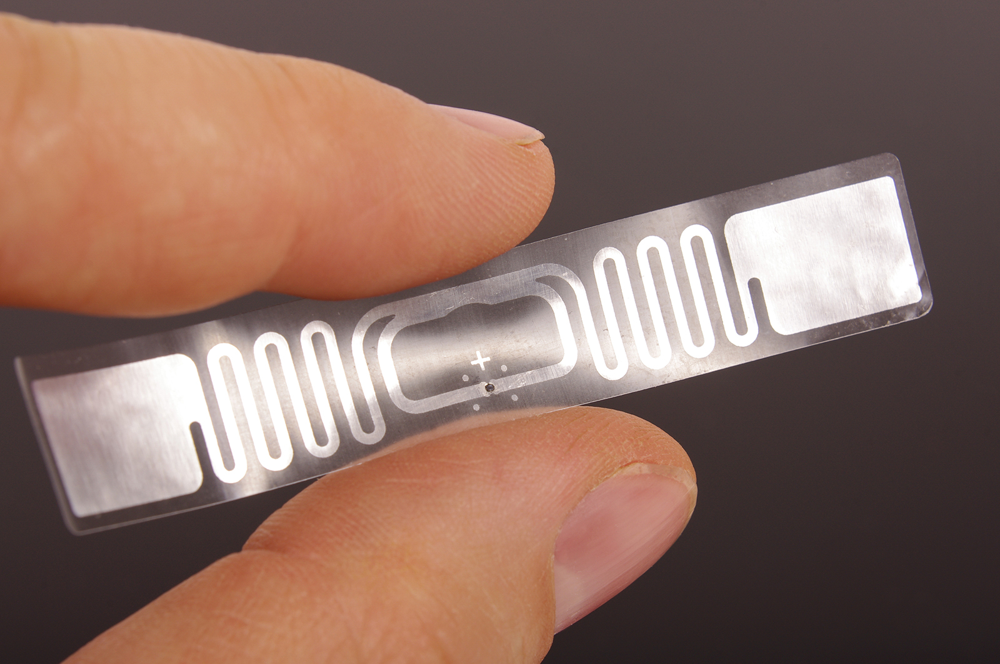
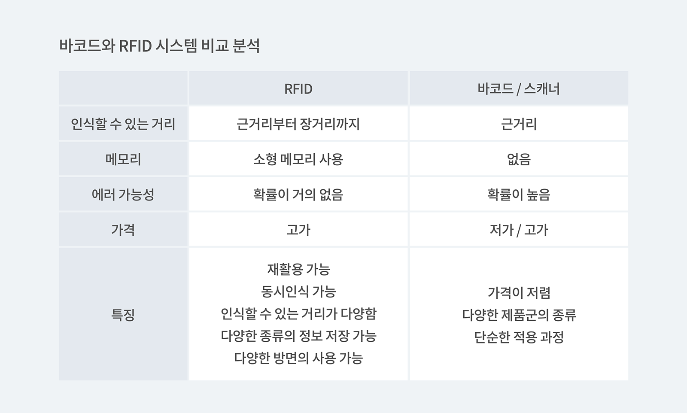
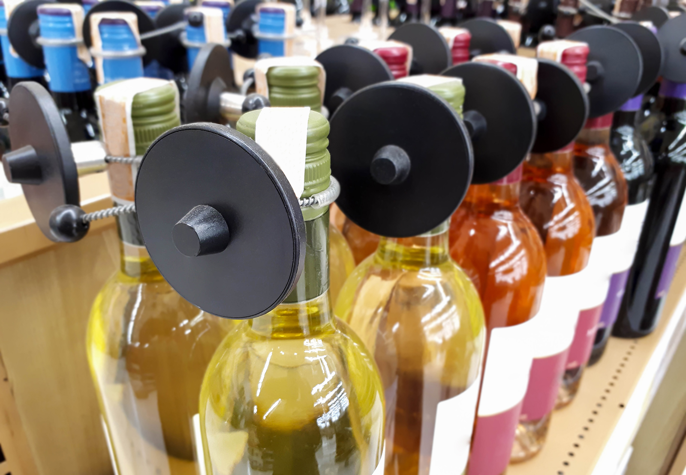

버스 탈 때 교통카드는 어떤 원리로 태그기에 카드를 대기만 해도 돈이 빠져나가고 들어오는지, 고속도로 톨게이트를 지날 때마다 하이패스에서는 어떤 원리로 지나가기만 해도 돈이 빠져나가는지, 핸드폰에서는 어떤 원리로 카드 대신 핸드폰을 태그하면 계산이 가능한지 아파트 음식물 쓰레기 카드는 어떤 원리로 작동하는지 궁금하셨던 적 있으신가요? RFID 라는 단어가 다소 낯설게 느껴질 수 있지만, 이미 우리 생활 속에서 깊이 자리잡고 있는 시스템입니다.

버스카드를 예로 들어 알아볼까요? 몇년 전과 다르게 요즘 시내버스를 이용할 때 현금을 사용하는 사람을 거의 찾아볼 수 없습니다. 체크카드/신용카드/티머니 카드를 카드 단말기에 태그하면 "삑" 소리와 함께 버스비가 자동으로 지불되는 시스템을 사용하고 있기 때문입니다.

이러한 시스템을 RFID 시스템이라고 합니다. **RFID는 Radio-Frequency IDentification** 의 약자로 전파를 이용해 먼 거리의 정보를 읽어오는 기술을 말합니다. 이 기술을 이용하려면 버스와 같이 RFID 판독기(버스를 예로 들면 교통카드 단말기) 가 꼭 필요합니다.

## RFID 시스템의 구성 요소

RFID 시스템의 구성 요소에는 4가지가 있습니다.

- RFID 태그 
각각의 고유 정보를 담고 있으며 정보를 기록하는 IC 칩과 리더에 데이터를 송신하는 안테나가 내장되어 있습니다. 전원의 유무에 따라 능동형과 수동형으로 나뉩니다.

- 안테나 
데이터를 송수신하는 역할을 합니다. 다양한 형태의 크기로 제작이 가능하며 태그의 모양을 결정하는 중요한 요소입니다.

- 리더 
태그의 정보를 읽고 불러옵니다. 용도에 따라 고정형, 이동형, 휴대형으로 구분합니다.

- 서버 
분산된 리더 시스템을 관리하는 역할을 합니다.

<tip-box>

RFID 태그와 리더가 안테나를 통해 데이터를 주고받고, 읽어들인 데이터는 서버에서 최종적으로 관리합니다.

</tip-box>

비슷한 기술인 바코드는 가시광선이나 적외선을 사용하는 반면 **RFID 시스템은 전파를 이용하는 기술**입니다.

현재 국제적으로는 RFID 호환성을 보장하기 위해서 몇몇 표준이 제정되어 있는데, 가장 대표적으로 TYPE A 와 TYPE B 이렇게 두 종류가 있고 두 종류 모두 주파수는 13.56 헤르츠로 동일합니다. 우리나라에서는 티머니 이후에 출시된 교통카드들은 모두 국제 표준 규격을 준수하고 있습니다. 그러므로 안 쓰는 선/후불 교통카드는 NFC 태그로 활용이 가능합니다.

## 그럼 RFID 시스템의 장점과 단점에는 어떤 점들이 있을까요?

RFID 시스템의 장점은 단순한 검은색/흰색의 음영으로 태그를 기록하는 바코드에 비해 더 다양하고 많은 정보를 기록할 수 있고, 상품에 부착할 경우 상품 하나하나마다 일련번호를 부여할 수 있다는 점에서 뛰어나다고 할 수 있습니다. 또한 반 영구적으로 사용이 가능하고 반복적으로 재사용이 가능합니다. 또한 데이터 신뢰도도 높다고 말할 수 있습니다.

하지만 단점으로는 일단 가격대가 높습니다. 또한 위에서 봤듯이 국가별 주파수가 달라 호환성 측면에서 떨어지며 전파를 이용해 멀리서도 정보를 읽을 수 있기 때문에 보안성 면에서도 떨어집니다. 그러므로 사생활 침해의 우려가 크고, 안테나를 통해 멀리 있는 신분증 등에 부착된 태그를 읽어들이는 방식으로 위치가 추적이 가능하기 때문에 더욱 조심하여 사용해야하는 시스템입니다. 또한 적용 대상이 매우 한정적이기 때문에 사용할 수 있는 장소가 많지 않습니다.

<invisible>

RFID: 인식할수 있는 거리: 근거리부터 장거리까지, 메모리: 소형 메모리 사용, 에러 가능성: 확률이 거의 없음, 가격: 고가, 특징: 재활용가능, 동시인식 가능, 인식할수 있는거리가 다양함, 다양한종류의 정보 저장 가능, 다양한 방면의 사용 가능. 바코드, 스캐너, 근거리, 없음, 확률이 높음, 저가/고가, 가격이 저렴, 다양한 제품군의 종류, 단순한 적용 과정

</invisible>

## **그럼 앞으로 RFID 시스템은 어떻게 더 많이 활용할 수 있을까요?**

글의 앞부분에서 언급했듯이 현재 RFID 기술은 굉장히 다양한 분야에서 사용되고 있습니다. 교통카드, 하이패스, 음식물 쓰레기 카드 뿐만 아니라 여권/신분증 태그를 부착해서 개인정보를 수록하고 인식하는 데까지 널리 쓰이고 있는 기술입니다. 또한 우리나라에서는 2010년부터 양주병에 RFID칩을 부착하여 스마트폰으로 가짜 양주 단속을 실시하고 있습니다. 당시 RFID를 활용해 소비자가 직접 가짜 양주 여부를 확인할 수 있는 시스템을 갖춘 것은 전 세계적으로 한국이 처음이었습니다. 또 이웃나라인 일본 오사카에서는 초등학생의 가방과 옷 등에 태그를 부착하고 있으며 이것을 신분증처럼 사용하여 건물의 출입을 통제하는 시스템에도 사용되고 있습니다. 특히 오늘날 RFID 시스템은 바코드의 대체품으로 많은 주목을 받고 있습니다.

다음 글에서는 RFID 태그 기술을 활용해 패션 브랜드의 선두주자가 된 ZARA의 이야기를 들어볼까요?

- [더 읽어보기: 패션브랜드의 선두주자가 되는 방법, RFID](/aedfc00624d3499cab211d627fc09e82?v=ea94dbd881fc4e3aa7a9337a32a60db5&p=0c1d6fa4f3834a74bf60d12d5f5f498a)

## 재고관리에 어려움을 겪고 계신가요? 지금 바로 박스히어로를 시작해보세요.

박스히어로는 누구나 쉽게 사용할 수 있는 재고관리 특화 솔루션입니다.

다양한 재고관리 기능을 통해 업종 구분없이 모든 비즈니스에서 도입이 가능합니다.

**이제 박스히어로와 함께 쉽고 정확하게 재고관리하세요.**

<tip-box>

**박스히어로는 PC와 모바일, 모든 환경에서 사용할 수 있습니다.**

PC가 없는 환경에서도 재고관리는 멈추지 않고 계속됩니다.

강력한 모바일 앱을 지원해 스마트폰에서도 박스히어로를 사용할 수 있습니다.

</tip-box>

