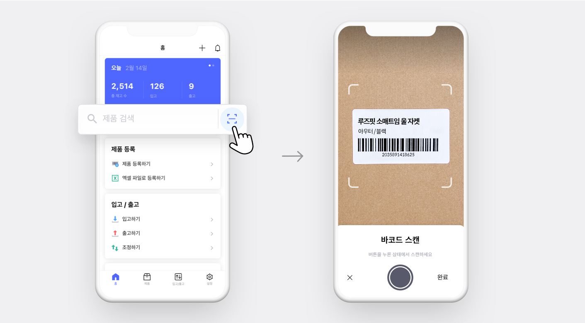
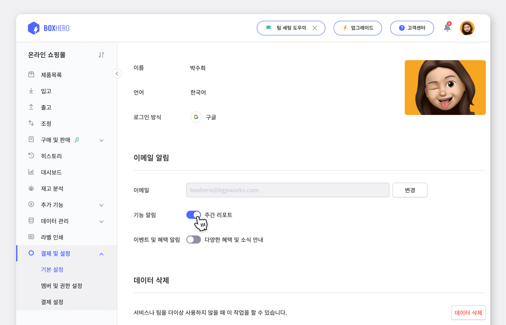

매년 성장하는 이커머스 시장, 그 중에서 의류 쇼핑몰의 비중은 빼놓을 수가 없습니다. 더군다나 의류 쇼핑몰이라 해도 여성부터 아동, 스포츠웨어부터 캐주얼웨어까지 분야는 다양합니다. 하지만 모든 의류 쇼핑몰에서 효율적으로 물류를 관리하기 위해 필요한 공통적인 기능들이 있는데요, 오늘은 **쇼핑몰을 위한 든든한 박스히어로의 맞춤 기능들을 소개합니다.**

## 1. 프린터만 있으면 돼요, 라벨 출력 기능!

> “엑셀로 바코드를 생성해서.. 따로 출력기를 구매해서.. 그럼 라벨지는 또 어디서 사지?”

수많은 의류를 관리할 땐 역시 바코드만한 게 없죠. 하지만 바코드를 어디서 생성하고, 또 어떻게 부착해야 할지에 대한 고민을 맞닥뜨리게 되면 한숨 먼저 나옵니다.

 

박스히어로에서는 어떤 사이즈의 라벨지가 필요할지만 생각해주시면 됩니다.

 

제품을 박스히어로에 등록하면 바코드 생성은 자동으로 완료됩니다. ‘라벨 인쇄’ 메뉴에서 내가 사용하는 라벨지를 선택한 뒤 바코드와 함께 출력하고 싶은 내용을 불러와서 출력하면 바코드 생성부터 라벨지 출력까지 완료됩니다!

## 2. 일일이 찾지 마세요. 바코드 스캔으로 한 큐에 조회!

출고 시킬 때나, 제품의 위치를 확인해야 할 때, 또는 반품 처리가 필요할 때 부착한 바코드를 바로 스캔해서 진행할 수 있다면.. 얼마나 일이 쉬워질까요? 그 쉬운 걸 박스히어로가 해냈습니다!

바코드를 박스히어로 앱이나 바코드 스캐너를 연결해 바코드를 스캔하면 바로 제품에 대한 정보부터 내역까지 모두 확인할 수 있습니다.

 

1. 박스히어로 앱 메인 화면의 바코드 아이콘을 누르면 바로 스캔할 수 있습니다.

2. 스캔 시 아래와 같이 제품 정보부터 입출고 내역까지 빠르게 확인이 가능합니다.

<video src="images/img_4.mp4" style="width:100%" muted autoplay loop playsinline></video>
<invisible></invisible>

## 3. 지난 주 유독 안 팔린 제품? 주간 리포트로 받기!

가장 많이 나간 제품부터 급격하게 출고량이 증가한 제품, 회전율이 낮아 주의가 필요한 제품까지, 누군가 착착 정리해 보고해준다면 다음 주 목표 설정에 큰 도움이 될 텐데요.

그 도움을 박스히어로의 주간 리포트가 드릴게요!

주간 리포트를 확인하는 방법은 어렵지 않습니다. 박스히어로 웹 설정에서 ‘주간 리포트’ 기능 알림만 활성화하고 일주일동안 열심히 입고, 출고를 진행해두면 월요일에 메일함에 도착해요.

 

1. 설정에서 기능 알림의 **‘주간 리포트’ 버튼을 아래와 같이 활성화**하면

   

2. **월요일마다 메일함으로** 가장 많이 출고된 제품부터 발송해드려요.

   

실제 박스히어로에서 주간보고서를 유용하게 사용 중인 의류 쇼핑몰이 궁금하다면? 박스히어로에서 [실제로 쇼핑몰 재고를 관리하고 있는 베르띠의 인터뷰](https://www.boxhero-app.com/ko/blog/posts/%EC%98%A4%ED%94%84%EB%9D%BC%EC%9D%B8%EA%B3%BC-%EC%98%A8%EB%9D%BC%EC%9D%B8-%EC%9E%AC%EA%B3%A0%EA%B4%80%EB%A6%AC-%EB%B0%95%EC%8A%A4%ED%9E%88%EC%96%B4%EB%A1%9C-%ED%95%98%EB%82%98%EB%A1%9C-%EB%81%9D%EB%83%88%EC%96%B4%EC%9A%94)를 확인해주세요!

### 재고관리, 박스히어로와 함께 해보세요.

박스히어로에서는 다양한 품목을 손쉽게 관리할 수 있으며, 재고부터 매출 관리까지 제공됩니다.

실시간으로 공유하고, 효율적으로 관리하세요.

재고관리 프로그램, 더이상 미루지 말고 도입하세요!
