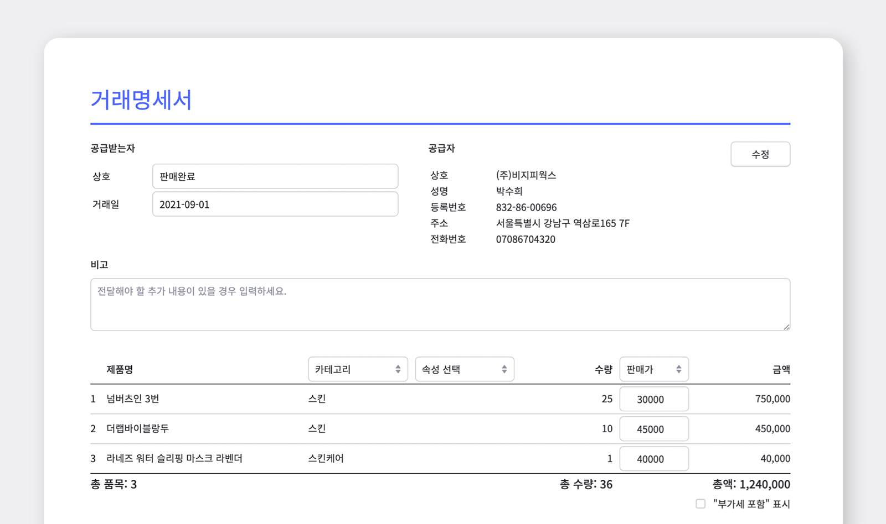
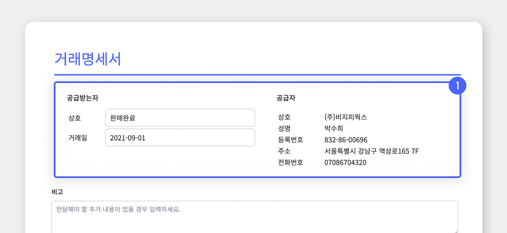
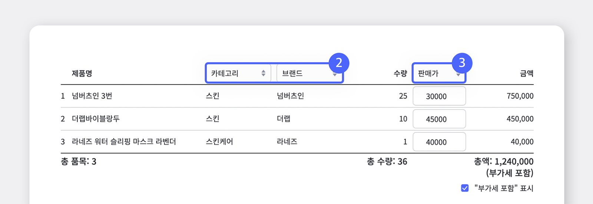
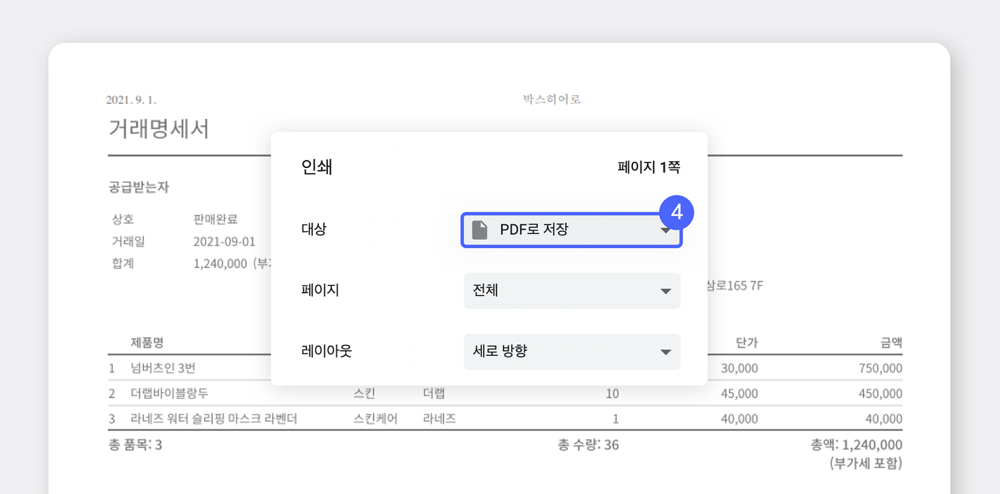
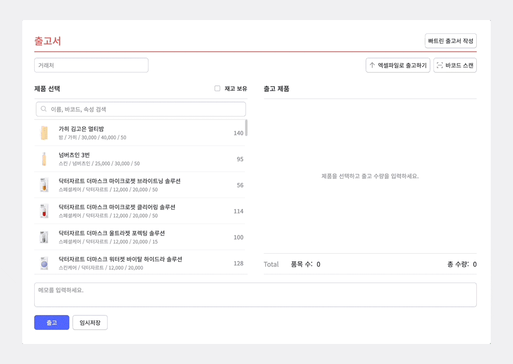

<gray-box>

출고 뒤에 거래처에 보낼 거래명세서는 어떻게 만들까?  
엑셀이나 다른 프로그램으로 따로 만들어야하나?

</gray-box>

****

**거래명세서**란 거래가 발생된 내역을 인수자와 인도한 자가 확인하고 제품의 수량, 단가, 거래 시기 등을  기록하는 서류입니다. 보통, 다른 업체와 거래를 하게 되면 세금계산서 또는 계산서나 영수증이 오고가나 일반적인 상거래에 있어서는 서로간의 거래증빙으로 거래명세서가 주로 활용됩니다.

거래명세서는 공급자용과 공급받는자용으로 작성하여 공급자용은 본사가 거래물품의 수령여부를 확인한 후 보관하고 공급받는자용은 상대방에게 교부하여 주게 됩니다.

박스히어로에서 출고 처리한 내역을 바탕으로 쉽고 빠르게 거래명세서를 만들 수 있습니다. 
거래명세서에 필요한 정보만 추가로 입력하기만 하면 직관적인 거래명세서가 생성됩니다. 
이제 박스히어로로 출고부터 거래명세서 저장까지 한 번에 처리하세요!

박스히어로를 통해 거래명세서를 생성하는 방법에는 두 가지가 있습니다!

- `출고 완료시 뜨는 확인 팝업`>`거래내역서 인쇄 버튼`

- `히스토리` > `출고서 선택` > `더보기` > `거래내역서 인쇄`

### 자, 그럼 거래명세서에 대해 더 자세하게 알아볼까요?

1) 공급받는자와 공급자 정보에 필요한 정보를 입력합니다. 입력한 공급자 정보는 다음 거래명세서 작성시 자동으로 불러올 수 있습니다. 
<gray-text>전달해야 할 추가 내용이 있을 경우 비고란을 활용할 수 있습니다.</gray-text>

2) 거래명세서에 넣고 싶은 속성을 최대 2개까지 선택할 수 있습니다.

3) 단가로 입력할 속성을 선택합니다. 선택 후 단가를 수정할 수 있습니다. ‘부가세 포함 표시’를 체크할 경우 해당 문구가 거래명세서에 함께 나타납니다. 입력이 완료되었으면 인쇄 버튼을 누릅니다. 
<gray-text>단가로 사용하는 속성이 없을 경우 데이터 관리>속성에 추가 후 사용할 수 있습니다.</gray-text>

4) 거래명세서를 인쇄하는 대신, 파일로 저장하고싶으시다면 인쇄 창에서 'PDF로 저장'을 클릭해주세요.

이제 박스히어로 하나로 출고부터 거래명세서 저장까지 한 번에 빠르게 처리하세요!

### 빠른 이해를 위해 **'동영상으로 알아보는 거래명세서 생성하기'**

- `출고 완료시 뜨는 확인 팝업`>`거래내역서 인쇄 버튼`

- `히스토리` > `출고서 선택` > `더보기`> `거래내역서 인쇄`

## 박스히어로와 함께 거래명세서를 쉽고 빠르게 작성하세요!

박스히어로에서는 두 가지 방법으로 거래명세서 작성이 가능합니다.

- `출고 완료시 뜨는 확인 팝업`>`거래내역서 인쇄 버튼`

- `히스토리` > `출고서 선택` > `더보기` > `거래내역서 인쇄`

<tip-box>

**박스히어로는 PC와 모바일, 모든 환경에서 사용할 수 있습니다.**

PC가 없는 환경에서도 재고관리는 멈추지 않고 계속됩니다.

강력한 모바일 앱을 지원해 스마트폰에서도 박스히어로를 사용할 수 있습니다.

</tip-box>

