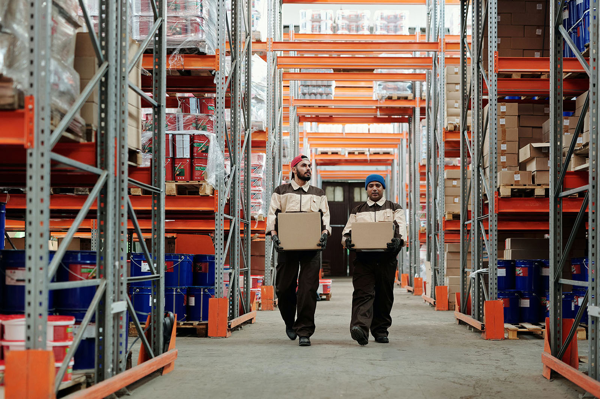

효과적이고 효율적인 재고 관리는 비즈니스를 운영하는 데 필수적입니다. 재고를 효과적이고 효율적으로 관리하는 데 도움이 되는 다양한 유형의 재고 관리 방법이 있습니다. 이 기사에서는 세계에서 가장 큰 여러 회사에서도 적용되는 재고 관리의 세 가지 중요한 방법에 대해서 알아봅시다!

## 재고 관리란?

재고 관리는 판매 준비가 된 제품의 관리와 함께 재고 품목의 사용 및 보관을 추적, 제어, 제어하는 활동입니다. 부적절한 재고 관리는 보관 비용 증가, 노동 자원 낭비, 유휴 시간 증가 등으로 이어질 수 있습니다. 이 모든 것이 매출 감소와 고객 불만족으로 이어지므로 재고 관리는 비즈니스에서 소홀히 해서는 안 되는 중요한 작업입니다!

### 1. ABC 분석

ABC 분석은 재고 품목을 값에 따라 A, B, C의 세 가지 범주로 분류하는 방법입니다.

- 카테고리 A에는 매우 고가의 상품이 소량 포함되어 있습니다. 따라서 카테고리 A의 상품 재고는 엄격하게 관리됩니다.
- 카테고리 B는 카테고리 A보다 상대적으로 저렴한 상품의 재고를 포함하지만 상품의 수는 더 많습니다. 카테고리 B의 상품 재고는 덜 엄격하게 관리됩니다.
- 카테고리 C는 많은 양의 상품으로 구성되어 있지만 투자 가치가 낮습니다. 통제 수준은 제일 낮습니다.

ABC 분석의 목적은 비즈니스 소유자가 회사의 재정적 성공에 가장 중요한 제품을 이해하도록 돕는 것입니다. 이 방법은 일반적으로 소매, 자동차, 창고 및 제조 비즈니스에서 사용됩니다.

### 2. 저스트 인 타임(JIT)

Just in Time 방식에서는 회사가 생산 과정에서 필요한 만큼만 재고를 유지합니다. 이는 초과 재고가 없기 때문에 보험 및 보관 비용을 절약할 수 있습니다. 새로운 회사는 구매자로부터 주문이 있을 때 생산을 위해 재고를 주문할 것입니다.

이 방법의 주요 목적은 재주문 전에 재고를 가장 낮은 수준으로 유지하는 것이며 궁극적으로 생산 비용을 가능한 한 낮게 유지하는 것을 목표로 합니다. 이 방법은 Toyota 및 Dell과 같은 우리에게도 잘 알려진 회사에서도 사용합니다.

### 3. VED 분석

VED Analysis 또는 Vital Essential and Desirable Analysis는 기능적 중요성에 따라 상품을 분류하는 재고 관리 방법입니다. 상품 재고는 생산 프로세스의 관심과 필요에 따라 세 가지 범주로 나뉩니다.

- **바이탈 카테고리** 이름에서 알 수 있듯이 필수 범주에는 회사 내 생산 또는 기타 프로세스에 필요한 재고가 포함됩니다. 필수 상품의 재고 부족은 생산 프로세스 및 회사 운영을 방해하거나 방해할 수 있습니다. 경영진은 이러한 필수 재고의 가용성을 보장하기 위해 적절한 점검을 수행해야 합니다.
- **필수 카테고리** 필수 범주에는 필수가 될 재고가 포함됩니다. 이 재고 부족으로 인해 생산이 중단되거나 다른 프로세스가 방해받을 수 있기 때문에 이는 또한 매우 중요합니다. 그러나 필수 품목의 재고 부족으로 인한 손실은 일시적일 수 있습니다. 경영진은 또한 필수 범주에서 최적의 재고 가용성 및 유지 관리를 보장해야 합니다.
- **원하는 카테고리** 바람직한 범주는 다른 범주보다 덜 중요하며, 사용할 수 없는 경우 생산 또는 기타 프로세스에서 약간의 중단만 발생합니다. 또한 이 카테고리의 재고 보충은 짧은 시간안에 완료될 수 있습니다.

## 4. 투 빈 시스템 (Two bin system)

많은 사람들이 사용하고 있는 재고 관리 시스템입니다. 즉 부품 또는 상품이 두 개의 상자에 담겨 있으면, 첫 상자의 부품이 판매나 사용으로 인해 모두 없어지면 첫 번째 상자의 부품을 다시 재주문하고 그동안 두 번째 상자에 있는 부품들로 첫 번째 상자에 있던 부품들을 대체하는 방식입니다. 이 방법은 단순하고 쉬운 방법이라서 주로 저가인 품목들에 사용하는 방식이며 재고 수준을 계속 실시할 필요가 없다는 장점이 있습니다.

**적절한 재고 관리 방법을 결정하고 사용하는 것은 비즈니스 지속의 중요한 부분입니다.**

자원의 가용성, 노동력 및 시장 요구 사항은 어떤 방법을 사용하는 것이 좋은지 결정하는 데 중요한 참고 자료가 될 수 있습니다. 재고를 효과적이고 효율적으로 관리하려면 재고 관리에 대해 더 많이 이해할 수 있도록 새로운 방법을 터득해야 합니다.

- [더 읽어보기: 재고 자산의 수량 결정과 단가 결정 방법](https://www.notion.so/10b44cc43f8449a2ae32b5f37b5215fd)
- [더 읽어보기 : 효율적인 재고관리를 위한 데이터 분석에는 어떤 방법들이 있을까?](https://www.notion.so/854f002c1d48420288a373d7bb9d4043)

---

## 재고관리에 어려움을 겪고 계신가요? 지금 바로 박스히어로를 시작해보세요.

박스히어로는 누구나 쉽게 사용할 수 있는 재고관리 특화 솔루션입니다. 
다양한 재고관리 기능을 통해 업종 구분없이 모든 비즈니스에서 도입이 가능합니다. 
**이제 박스히어로와 함께 쉽고 정확하게 재고관리하세요.**

<tip-box>

**박스히어로는 PC와 모바일, 모든 환경에서 사용할 수 있습니다.** 
PC가 없는 환경에서도 재고관리는 멈추지 않고 계속됩니다. 
강력한 모바일 앱을 지원해 스마트폰에서도 박스히어로를 사용할 수 있습니다.

</tip-box>
