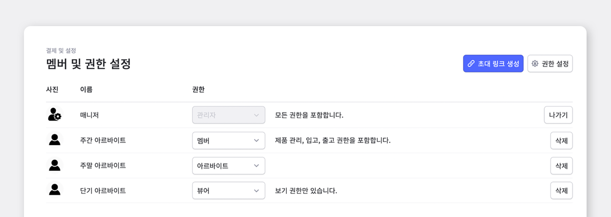
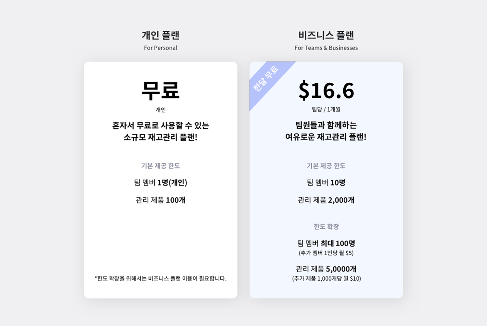

혼자가 아닌 여러명이 함께하는 회사에서 재고관리를 하게 되면 가장 큰 불편한 점은 무엇일까요? 바로 재고관리 현황을 실시간으로 동료들과 함께 공유가 불가능하다는 점입니다. 입고, 출고, 조정에 대한 정보를 팀원들과 함께 실시간으로 나눌 수 있으면 업무의 효율이 좀 더 높아질거에요. 이번 게시물에서는 박스히어로와 함께 어떻게 팀원들과 재고에 대한 공유를 할 수 있을지 알아봅시다! 

### 1. **멤버 초대하기**

박스히어로에서 팀을 구성하려면 먼저 팀원을 멤버로 초대해야겠죠?

<video src="images/img_2.mp4" style="width:100%" muted autoplay loop playsinline></video>
<invisible></invisible>

박스히어로 로그인을 마친 후 왼쪽 메뉴 '결제 및 권한 설정'에서 초대 링크 생성 버튼을 누르면 초대 링크가 자동으로 복사됩니다. 복사한 링크를 초대하고 싶은 팀원에게 전송한 후 그 팀원이 그 링크를 눌러 접속하게 되면 자동으로 팀 합류가 완료됩니다. 

- **모바일 어플**

<video src="images/img_3.mp4" style="width:100%" muted autoplay loop playsinline></video>
<invisible></invisible>

### 2. **멤버 추가하기**

<video src="images/img_4.mp4" style="width:100%" muted autoplay loop playsinline></video>
<invisible></invisible>

이렇게 초대 링크를 받고 링크를 클릭하여 접속을 해서 본인 계정으로 로그인을 하면 자동으로 팀 멤버 추가가 완료됩니다.

<caution-box>

초대링크는 24시간 유효하며 시간이 지나면 다시 링크를 생성하여 팀원을 초대할 수 있습니다.

</caution-box>

### 3. **멤버별로 사용할 수 있는 기능을 세부적으로 설정하기**

멤버별 기능 사용 권한 부여는 권한 설정을 통해 가능합니다. 설정 메뉴를 클릭한 뒤 멤버 설정 탭에서 권한 버튼을 누르면 멤버 별로 권한을 지정할 수 있습니다. 권한 관리 버튼을 누르면 권한 별로 사용할 수 있는 기능을 세부적으로 설정할 수 있어 필요한 만큼만 권한을 부여할 수 있습니다. 자세한 내용은 아래를 참조하세요.

<tip-box>

멤버 권한은 관리자만 변경이 가능합니다.

</tip-box>

<video src="images/img_6.mp4" style="width:100%" muted autoplay loop playsinline></video>
<invisible></invisible>

<gray-box title="권한 관리 예시">

관리자는 멤버에게 권한을 지정할 수 있습니다. (권한은 언제든지 추가 가능합니다.)

- 관리자: 모든 권한 보유

- 멤버: 제품 관리, 입고, 출고만 가능

- 뷰어: 조회만 가능

</gray-box>

<video src="images/img_7.mp4" style="width:100%" muted autoplay loop playsinline></video>
<invisible></invisible>

권한의 수정과 삭제, 기능 권한과 제품 속성 접근 권한은 권한 설정 탭에서 가능합니다.

### Q. **멤버가 여러 명이면 추가 비용이 드나요?**

소규모 재고관리 플랜으로는 본인(팀 멤버가 1명만 허용)만 사용 가능합니다. 

대신 비즈니스 플랜에서는 팀 멤버 10명까지 추가할 수 있습니다. (한도를 확장하게 되면 최대 100명까지 추가 가능하며 추가 비용을 지불하셔야 합니다!)

또한 박스히어로는 팀 단위로 결제가 이루어지므로 팀 안에 속한 멤버는 결제가 따로 필요하지 않습니다. 만약 플랜에서 제공하는 기본 한도를 초과하게 되면 서비스를 정상적으로 사용할 수 없습니다. 사용량을 기본 한도 이내로 조정하거나 개인 플랜을 사용할 경우 비즈니스 플랜으로 업그레이드가 필요하며 비즈니스 플랜을 사용할 경우 한도를 확장시켜야 합니다!

### Q. **플랜에서 제공하는 사용한도 확장은 어떻게 할까요?**

사용한도는 결제 및 설정 메뉴에 들어가 결제설정 페이지의 사용량에서 언제든지 확장이 가능합니다.

사용한도 확장 시 확장 요금에 대해 다음 결제일까지 남은 기간만큼 계산되어 기존에 등록되어 있는 카드로 즉시 결제됩니다. 이후 플랜 한도 확장에 대한 요금은 결제일에 맞춰 결제 주기에 따라 플랜 요금과 함께 자동 결제됩니다!

### Q. **플랜에서 제공하는 사용한도를 확장한 후 다시 축소할 수 있나요?**

확장한 사용한도는 결제 및 설정 메뉴에 들어가 결제 설정 페이지의 사용량에서 언제든지 축소가 가능합니다.

사용한도 축소 시 기존에 결제한 요금에서 다음 결제일까지 남은 기간만큼 계산되어 크레딧으로 충전됩니다. 이후 결제일에 보유하고 있는 크레딧만큼 자동으로 요금이 차감됩니다. 이후 변경된 플랜 한도에 대한 요금은 결제일에 맞춰 결제 주기에 따라 플랜 요금과 함께 자동 결제됩니다!

### 팀 멤버들을 박스히어로로 초대해 실시간으로 재고관리현황을 공유해보세요!

- 설정의 멤버 및 권한 설정에서 팀 멤버를 추가할 수 있습니다.

- 수많은 입고/출고/조정의 과정 현황을 팀 멤버들과의 실시간 공유가 가능합니다.

- 멤버가 여러명이라면, 사용한도를 쉽고 빠르게 확장하면 더 많은 멤버들과 정보 공유가 가능해집니다.

<tip-box>

**박스히어로는 PC와 모바일, 모든 환경에서 사용할 수 있습니다.**

PC가 없는 환경에서도 재고관리는 멈추지 않고 계속됩니다.

강력한 모바일 앱을 지원해 스마트폰에서도 박스히어로를 사용할 수 있습니다.

</tip-box>

