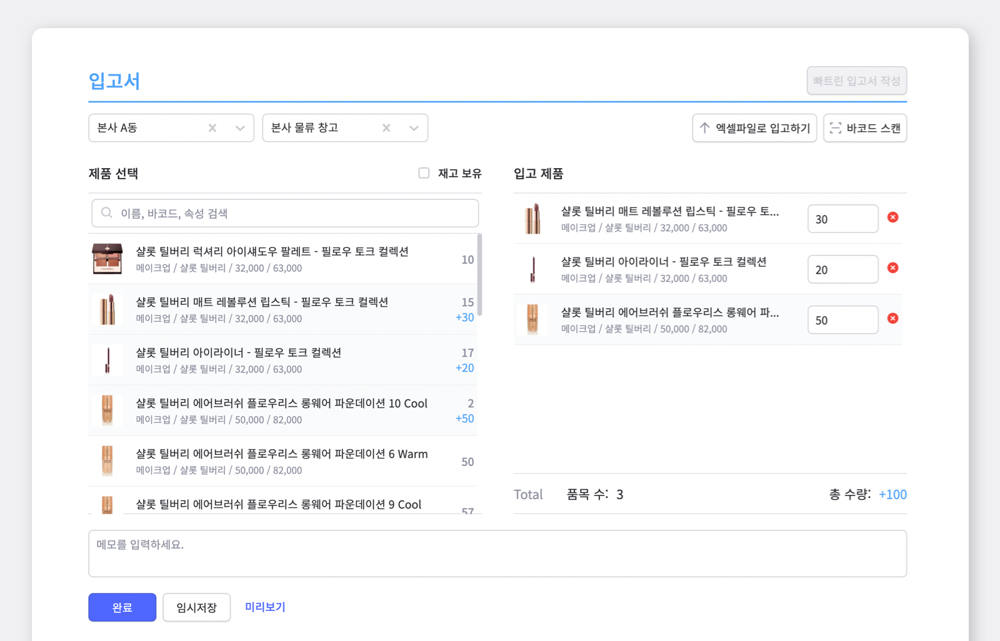
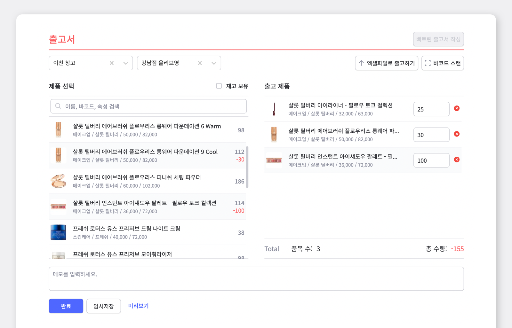
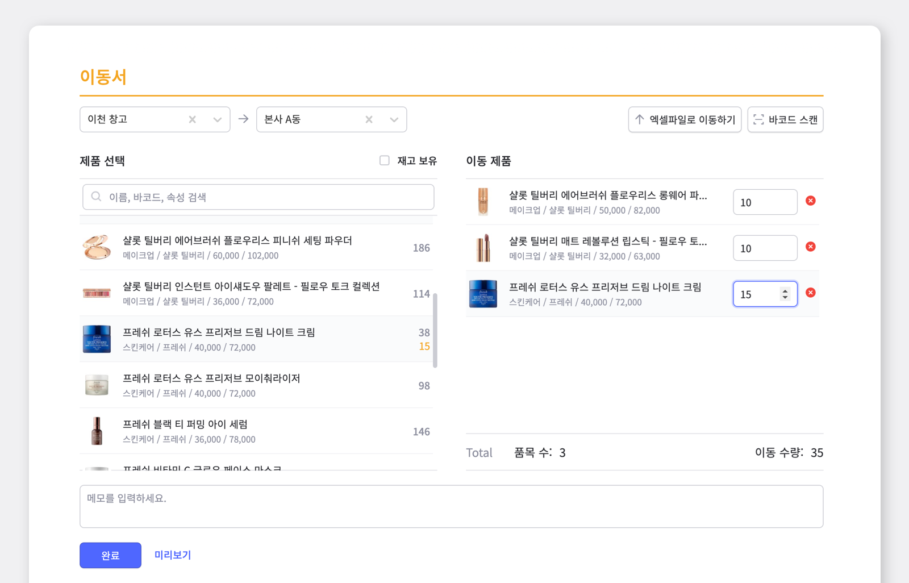
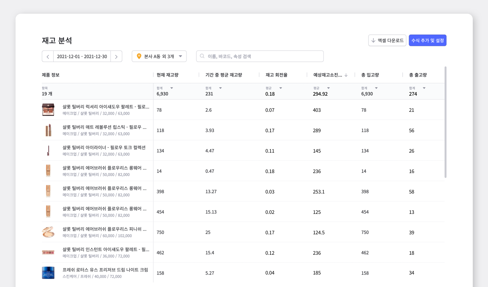
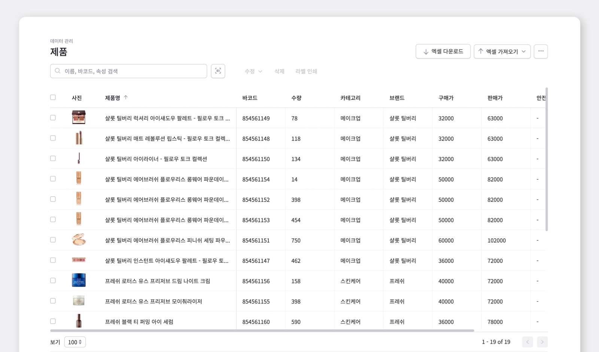
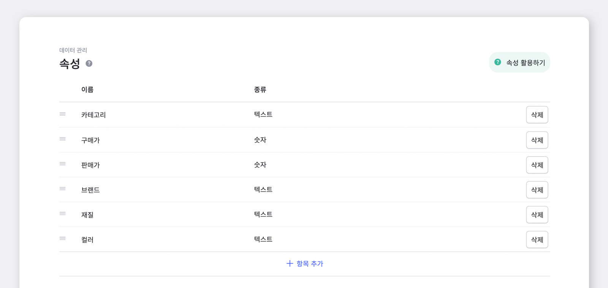
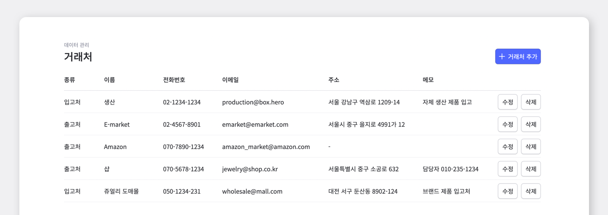
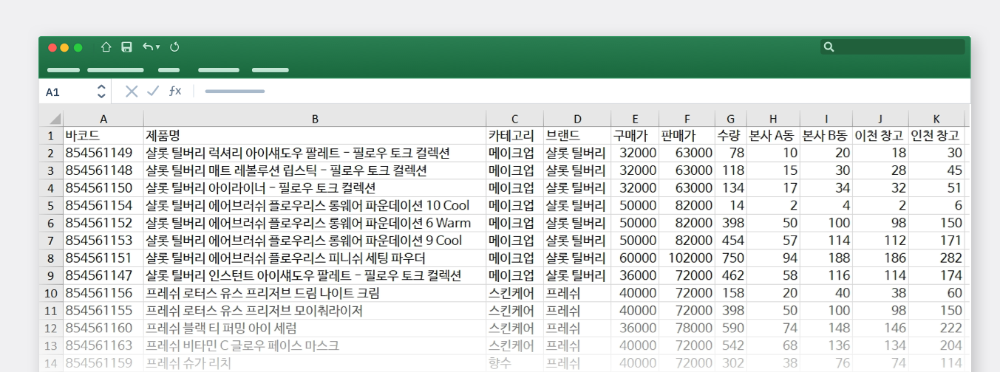

다양한 화장품 재고들을 여러 장소에 나눠서 관리하면 당연히 힘들 수 밖에 없겠죠? 대형 창고에서는 여러 선반이나 칸으로 위치를 나눠서 재고 파악 및 관리 하는 것이 매우 중요한데, 이처럼 화장품도 현재 재고가 어디에 몇 개 있는지가 신속하게 파악되어야 원활하게 재고관리를 할 수 있습니다.

**박스히어로는 화장품 매장/창고 재고관리를 쉽고 편리하게 도와주는 프로그램입니다.** 
현재의 제품위치, 재고량, 입출고, 과거내역 등 여러가지 기능을 어디서든 한눈에 찾아볼 수 있게 디자인되어 있습니다.

## 위치별로 화장품 재고관리를 시작해요.

동일한 제품이 여러 위치에 나뉘어져 있을 경우, 위치를 기반으로 재고관리가 필요할 때의 예시와 함께 알아볼까요? <gray-text>(위치가 여러군데가 아닐 경우 위치를 별도로 입력하지 않아도 사용이 가능합니다.)</gray-text>

 

**등록한 제품의 위치를 기준으로 입/출고하기**

입/출고하실 제품의 위치를 선택하면, 그 위치에 어떤 제품이 몇개 보관 되어있는지 조회할 수 있습니다. 해당 재고를 어떤 곳으로, 몇 개를 입고할 것인지 입력만 하면 빠르게 입고처리가 완료됩니다.

 

- **입고**

- **출고**

<tip-box>

각각의 제품의 입/출고서를 작성하는 대신에, 엑셀 파일을 활용하여 한 번에 입/출고를 할 수 있습니다. 또한 제품에 대한 세부 정보를 함께 저장하고 싶을 시에는 하단의 **메모** 칸을 활용해주세요!

</tip-box>

## 창고에 보관하는 많은 재고를 쉽게 옮길 수 있는 방법

`이동` 메뉴를 통해 **제품의 위치 변경이 가능**합니다.

 

- **위치 변경**

제품을 ‘가져올 위치’와 ‘이동할 위치’를 정하고 나면, 제품 선택을 하여 이동 수량을 입력하면 위치를 쉽고 빠르게 옮길 수 있습니다.

## 재고 분석은 믿고 맡겨주세요

`재고 분석` 메뉴에서 위치와 날짜를 선택하여 정확한 재고 정보를 한꺼번에 조회할 수 있어요.

<tip-box>

**원하시는 위치만 선택해서 조회할 수도 있어요!** 
만약 재고 분석을 엑셀파일로 저장하고 싶으면 우측 상단에 '**엑셀 다운로드**'가 있습니다. 기본적으로 설정되어 있는 수식을 수정 및 삭제를 하고 싶을 시 '**수식 추가 및 설정**'에서 찾을 수 있습니다.

</tip-box>

 

## 중요한 데이터와 원하는 정보를 쉽게 관리해요

중복되는 수많은 데이터, 원하는 정보까지 찾기 어려우니 당연히 데이터 관리도 복잡하겠죠? 박스히어를 활용하면 데이터 관리도 쉽게 하실 수 있습니다.

 

- **제품**

제품의 바코드, 제품명, 수량, 브랜드 등 확인할 수 있습니다.  찾고 있는 제품을 쉽고 빠르게 확인해 보고 싶으면, 검색 기능을 활용해주세요. 선택된 제품을 한꺼번에 수정, 삭제 또는 라벨인쇄를 할 수 있어요.

- **속성**

제품 속성은 브랜드, 매입가, 판매가, 분류 등 화장품의 여러가지 정보를 효율적으로 분류, 검색할 수 있으며 제품 속성을 저장하면 제품 목록, 입출고, 대시보드 등에서 제품 속성 별로 재고를 효율적으로 관리할 수 있습니다. `속성`에서 직접 필요한 항목을 **추가** 또는 **삭제**를 통해 맞춤형 데이터 관리를 해보세요!

- **거래처 관리**

거래처를 추가 하시면 입/출고 시 거래처를 직접 선택하실 수 있습니다. 
데이터 관리의 `거래처` 메뉴에서 추가를 하지 않으셔도, 입고나 출고시 기입하게 되면 거래처로 자동 추가 됩니다.

## 엑셀을 활용하여 데이터 관리 하기

- **엑셀 가져오기**

엑셀을 활용하여 제품들을 대량으로 추가하거나 제품에 대한 세부 정보를 한 번에 수정할 수 있습니다.

<caution-box>

**엑셀 업로드 시 주의점**

1. 파일의 첫 번째 행은 속성으로 인식되므로 바코드, 제품명, 브랜드, 수량 등 각 분류에 맞춰야 합니다. 
2. 제품 각각의 속성은 데이터 관리의 속성 메뉴에서 미리 추가해두어야 합니다. 
3. 제품 바코드가 없는 경우, 바코드 열을 비워두면 후에 자동 생성할 수 있습니다.

</caution-box>

 

더 알아보기 : [엑셀과 박스히어로를 연동하여 사용해보기](https://www.boxhero-app.com/ko/blog/posts/%EB%B0%95%EC%8A%A4%ED%9E%88%EC%96%B4%EB%A1%9C%EC%99%80-%EC%97%91%EC%85%80%EC%9D%84-%EC%97%B0%EB%8F%99%ED%95%98%EA%B8%B0)

### 이제 박스히어로와 함께 쉽고 정확하게 재고관리하세요.

재고관리에 어려움을 겪고 계신가요? 지금 바로 박스히어로를 시작해보세요.

박스히어로는 누구나 쉽게 사용할 수 있는 재고관리 특화 솔루션입니다.

다양한 재고관리 기능을 통해 업종 구분없이 모든 비즈니스에서 도입이 가능합니다.

 

<tip-box>

**박스히어로는 PC와 모바일, 모든 환경에서 사용할 수 있습니다.**

PC가 없는 환경에서도 재고관리는 멈추지 않고 계속됩니다.

강력한 모바일 앱을 지원해 스마트폰에서도 박스히어로를 사용할 수 있습니다.

</tip-box>
