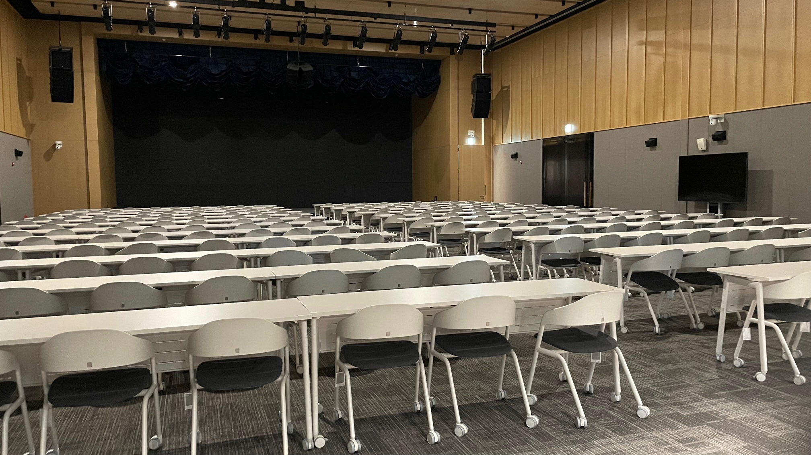
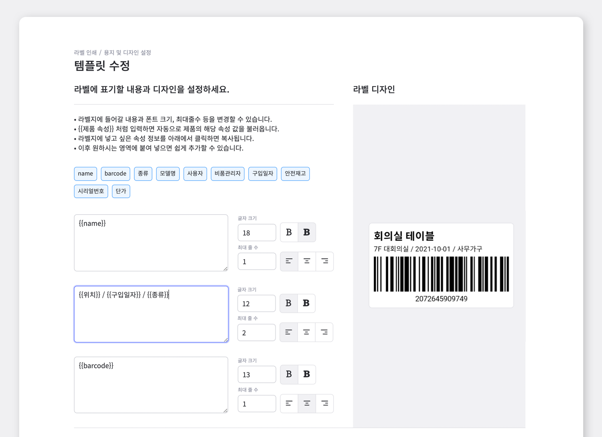
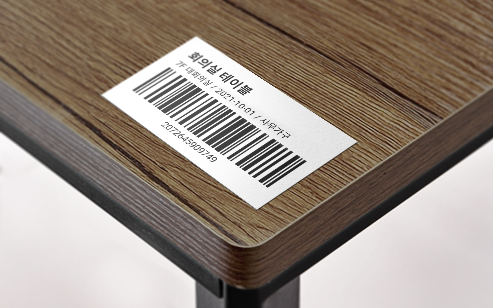
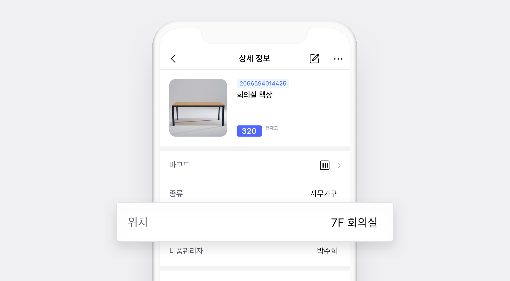
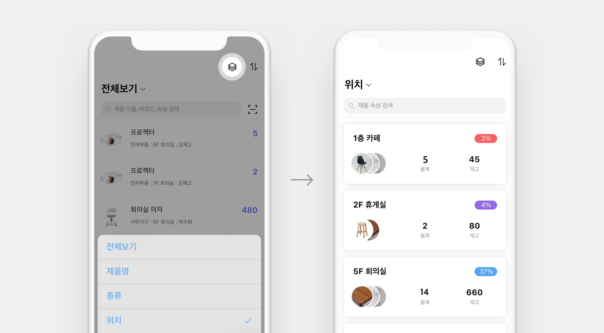

<gray-box title="[박스히어로 인터뷰 vol.01] (주)두산 큐벡스">

여러 층에 분산된 자산들을 관리 중이신 ㈜두산 계열사의 ㈜두산 큐벡스에서 자산관리를 담당하고 계시는 김세권 담당자님과의 인터뷰를 소개합니다!

</gray-box>

 

안녕하세요, 두산 계열사인 두산 큐벡스에서 시설 관리부터 총무, 급여, 복리후생 등을 관리하고 있는 경영지원팀의 김세권 과장이라고 합니다. 건물 내의 피트니스 기구부터 부대시설에서 사용되는 가구까지 다양한 품목을 관리하고 있습니다.

 

## 박스히어로는 별도의 견적서 없이 바로 시작해볼 수 있어 부담이 없었습니다.

<gray-text>**Chapter 1. 박스히어로 도입 이전**</gray-text>

 

### Q. 박스히어로 도입 이전에는 어떻게 재고관리를 하고 계셨나요?

사실 저희가 건물에 새로 입주를 하면서 관리하는 가구나 품목들도 함께 들어왔기 때문에 별도의 재고관리나 프로그램을 쓰고 있지는 않았습니다. 입주 후 적응 기간이 지나고 나니 슬슬 재고관리 프로그램이 필요하다는 생각이 들어 다양한 프로그램들을 알아보기 시작했습니다.

### Q. 구체적으로 어떤 부분 때문에 재고관리 프로그램을 찾아보게 되셨나요?

관리하는 재고가 4천 개가 넘는데, 모두 엑셀로 관리하고 있었습니다. 품목 정리를 엑셀로 하는 것까진 괜찮았지만 다른 직원들과도 함께 공유를 해야하기도 하고, 언제 어디서든 확인하기 어렵다는 점 때문에 찾아보게 됐습니다.

### Q. 재고관리 프로그램을 찾아보실 때 어떤 점을 중점에 두고 알아보셨나요?

사실 본격적인 재고관리와 함께 프로그램 도입까지 같이 하게 된 거라 구체적인 것보단 열린 마음으로 찾아봤어요. 하지만 여러 프로그램으로부터 견적서도 받고 미팅도 진행해봤지만 결론적으로 부담스럽다는 생각이 들었습니다.

이제 막 재고관리를 시작하기도 하고, 별도의 서버 구축이나 장비도 딱히 필요하지 않았거든요. 하지만 대부분 고정 비용에 추가 비용까지 계속 더해져 아직 초기 단계에 있는 저희에겐 큰 비용이 부담스러워 결정을 내리기가 어려웠습니다. 결국 몇 달 동안 여러 미팅을 진행하다 모두 보류하게 되었죠.

 

### Q. 그렇다면 박스히어로를 선택하게 된 결정적 이유는 무엇이었나요?

프로그램을 알아보면서 느꼈던 부담스러운 점들이나, 단점들을 박스히어로는 모두 보완하고 있었습니다. 거의 마지막에 박스히어로를 알게 되었는데 사용해보니 우선 매우 간편하다는 생각이 들었어요. **프로그램 도입을 하려면 미팅 일정을 먼저 잡아야 했는데, 박스히어로는 별도의 견적서 없이도 바로 시작해볼 수 있어 부담이 없었습니다.** 또 실제로 사용해보니 제가 찾고있는 기능들이 모두 있어 바로 테스트해보게 되었고, 무료 체험이 30일 주어져서 그 기간동안 이것저것 많이 사용해보았습니다.

박스히어로를 처음 알게 된 건 박스히어로 웹이 먼저였고, 확인해보니 모바일 앱도 있다는 걸 알게 돼 바로 다운로드 해봤습니다. **웹만큼이나 앱도 성능이 좋다는 생각이 들었고, 상황에 맞춰 웹과 앱을 번갈아 사용할 수 있겠다 싶더라고요.**

 

## 기존에 관리하던 엑셀로 바로 등록이 가능해 쉽게 세팅 할 수 있었습니다.

<gray-text>**Chapter 2. 박스히어로 도입 이후**</gray-text>

### Q. 품목 수가 많아 혼자 세팅을 진행하느라 힘드셨을 것 같은데, 초반 세팅이 어렵진 않으셨나요?

**사실 초반에 저희 자산을 박스히어로에 등록하는 게 관건이었는데, 다행히도 제가 기존에 관리하던 엑셀로 바로 등록이 가능해 쉽게 세팅할 수 있었습니다.**

자산 등록 다음에 필요했던 건 기존 자산에 바코드 라벨을 부착해 모든 자산이 박스히어로와 연동될 수 있고, 다른 직원이 바코드 스캔했을 경우 바로 확인할 수 있도록 라벨링 작업이 필요했습니다. 처음엔 조금 막막했는데, 찾아보니 박스히어로에 ‘라벨 인쇄’가 있더라고요. 라벨지만 골라서 출력한 뒤 부착하면 되니, 라벨 제작은 쉽게 해결 되었어요. 사실 어려운 건 몇천 개의 물품에 부착하는 일이었죠. 하하

 

- **목적에 맞는 맞춤형 라벨 제작**

- **라벨 프린트 기능으로 모든 자산에 꼼꼼한 라벨링**

### Q. 그렇다면 세팅 이후 박스히어로 사용은 어떻게 하고 계신가요?

아마 판매를 하시는 분들이라면 입출고가 자주 일어날 것 같은데, 저희는 자산이 들어오거나 밖으로 나가는 경우보단 층간 이동이 많아 입출고보다는 재고조사를 주로 진행하고 있습니다. 회의실이나 구내식당, 피트니스 센터에 자리한 가구들이나 비품들은 이동하는 경우가 거의 없지만, 가끔 내부 행사가 있으면 의자나 테이블을 잠시 이동시키기도 해요. **이때 부착된 바코드에 원위치가 모두 명시 되어 있어 사용 이후 원래 있던 곳으로 이동시키죠.** 아무래도 여러 인원이 옮기고 정리하기 때문에 주기적으로 재고조사를 진행해 각 위치에 제대로 이동 되었는지, 혹시 파손은 없는지 가끔씩 확인하고 있습니다.

아무래도 저희는 자산 관리라서 박스히어로에 등록된 위치나 재고 수 등을 필요할 때마다 확인하면 되니 초반에만 등록해두고 나니 그 외엔 크게 할 일은 없는 것 같습니다.

 

- **자산 이동시, 바코드 라벨을 이용해 손쉽게 원위치 확인**

- **속성에 각 제품의 정보를 입력한 뒤 제품 목록 필터링을 통해 확인**

### 정확한 자산관리, 박스히어로와 함께 하세요.

수많은 품목 관리, 막막하신가요? 지금 박스히어로에서 시작해보세요.

혼자서도 쉽게 시작할 수 있고, 팀원들과 실시간으로 공유할 수 있습니다.

위치부터 제품 특징까지 세부 정보 입력으로 어디에 무엇이 있는지 한 눈에 파악할 수 있습니다.
