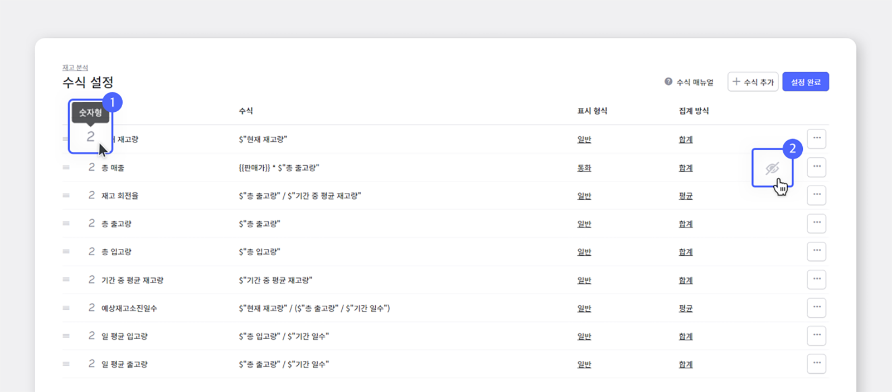
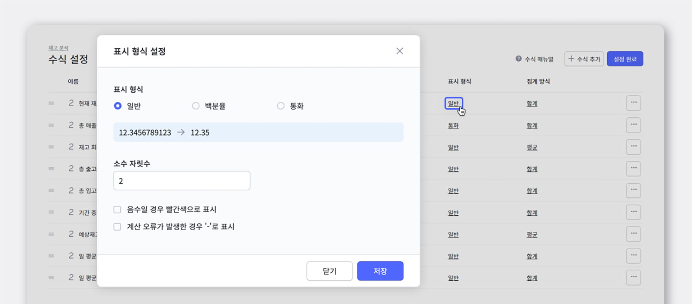
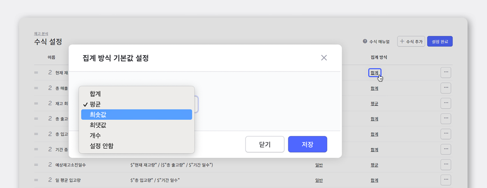
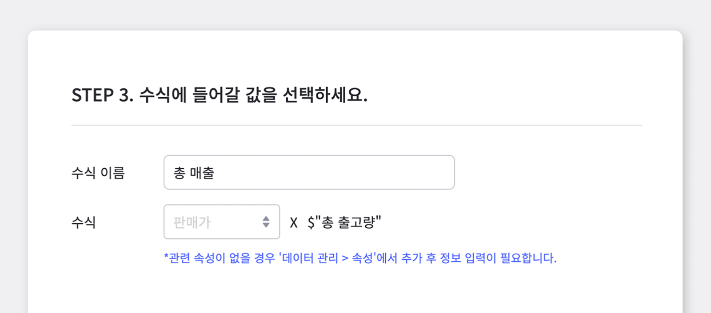
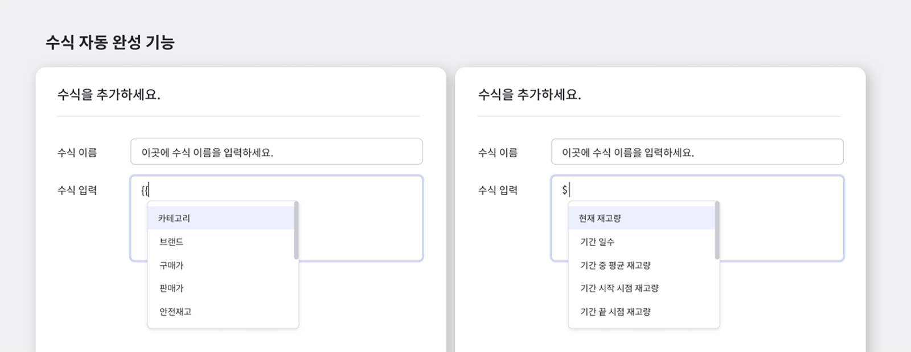

효과적인 재고관리를 위해서는 관리하고 있는 재고에 대해 명확하게 파악하는 것이 매우 중요해요! 재고에 대해 알아야 그 재고에 맞게 관리가 가능하겠죠? 그러므로 **'재고분석'** 기능이 꼭 필요합니다.

복잡한 수식 필요없이 보고 싶은 분석 정보를 클릭만 하세요. 박스히어로는 재고 관리하면서 쌓인 데이터를 바탕으로 다양한 재고 분석 정보를 제공합니다.

원하는 분석 정보가 없어도 직접 수식을 입력해 분석 항목을 추가할 수 있습니다.

이제 재고 분석 기능을 통해 계산하기 어려웠던 평균재고, 재고회전율 뿐만 아니라 매출액, 이익률 등 매출 정보와 함께 재고를 관리하세요. 박스히어로가 모두 계산해드립니다!

## 재고분석

<video src="images/img_2.mp4" style="width:100%" muted autoplay loop playsinline></video>
<invisible></invisible>

'재고분석' 기능에서는 기간에 따른 현재 재고량, 총 매출, 재고 회전율, 총 출고량 등을 자동으로 계산하여 한 눈에 보기 쉽게 표로 제공하고 있습니다. 물론 이 모든 정보들은 엑셀로 다운받아 보관이 가능합니다. 기본적으로 박스히어로가 제공하는 정보를 제외한 다른 정보를 원하신다면, 직접 수식을 추가하거나 저희가 제공하고 있는 기본 수식을 이용하실 수도 있습니다!

단, 매출 관리를 하기 위해서는 원가, 판매가 등을 속성으로 관리하고 있어야 합니다. 관련 항목이 없다면 데이터 관리>속성에서 항목을 추가 후 제품 별로 정보 입력이 필요합니다.

## 수식 설정

재고분석>수식 추가 및 설정에서 저장되어 있는 수식을 확인, 수정 및 삭제할 수 있습니다.

1. 각 이름 옆 아이콘에 마우스를 오버하면 수식 타입을 알 수 있습니다.  
2. 숨김 이모티콘을 이용해 재고 속성 표에서 원하시는 데이터를 안 보이게 가릴 수 있습니다.  

- **표시 형식 설정**

수식 표시 형식 설정에는 일반 / 백분율 / 통화로 구분할 수 있습니다.

<notice-box>

1. 현재 숫자 수식 타입만 표시 형식을 변경할 수 있습니다.

1. 소수 자릿수 설정, 백분율, 통화 설정이 가능합니다

1. 음수일 경우 빨간색으로 표시, 계산 오류가 발생한 경우 '-'로 표시 등 스타일 지정이 가능합니다.

</notice-box>

- **집계 방식 기본값 설정**

집계 방식 기본값도 따로 설정이 가능합니다!

<notice-box>

현재 숫자 수식 타입만 집계 방식을 변경할 수 있습니다.  
<gray-text>* 지원하는 숫자 집계 방식 : 합계, 평균, 최소값, 최대값, 개수</gray-text>

</notice-box>

## 수식 추가

- **간편 추가**

<video src="images/img_7.mp4" style="width:100%" muted autoplay loop playsinline></video>
<invisible></invisible>

간편 추가 메뉴에서 기본 속성, 매출 관리, 재고 관리 중 하나를 선택해주세요!

1. **기본 속성** : 원하는 수식 이름을 입력 후 보고 싶은 속성을 선택하고 저장 버튼을 누르면 바로 수식이 추가됩니다.

1. **매출 관리, 재고 관리** : 수식을 추가할 수 있는 다양한 항목이 나타납니다. 
각 항목을 누르면 해당 수식을 저장하기 위해 필요한 값을 입력할 수 있는 영역이 나타납니다. 
수식 이름을 입력하고 수식에 선택해야 할 값이 있을 경우 입력 상자를 눌러 알맞은 값을 선택한 후 마지막으로 저장 버튼을 누르면 수식이 추가됩니다!

<tip-box>

선택이 필요한 항목이 있을 경우 입력 상자에 파란색 글씨로 추천 항목이 나타납니다. 이를 참조해서 선택해주세요. 관련 속성이 없을 경우 데이터 관리 > 속성에서 추가 후 정보 입력이 필요합니다. 입력 후 다시 한 번 수식을 추가해주세요!

</tip-box>

- **직접 입력**

<video src="images/img_9.mp4" style="width:100%" muted autoplay loop playsinline></video>
<invisible></invisible>

원하시는 수식이 박스히어로 기본 수식에 포함이 되어있지 않다면, 직접 수식을 추가하여 원하는 데이터를 얻으실 수 있습니다. 자동 완성 기능과 사용 가능 함수 / 예시 를 참고하여 수식을 만들어주세요!

수식 직접 입력에서는 자동완성기능을 제공합니다.

- {{를 입력할 경우 저장된 속성 및 수식 결과값을 불러옵니다.

- $를 입력할 경우 재고 관련 데이터를 활용할 수 있는 변수를 불러옵니다.

<caution-box>

1. 수식 수정으로 다른 수식에 오류를 발생시킬 경우 수정사항이 저장되지 않습니다.

1. 수정사항은 임시 저장 되며 오류가 발생하지 않도록 관련된 수식을 모두 수정하거나 삭제하면 임시 저장 내역이 한 번에 자동 저장됩니다.

1. 오류 메세지를 통해 수식에 발생한 오류 내용을 자세하게 확인할 수 있습니다.

</caution-box>

## 재고 분석 기능으로 박스히어로와 함께 완벽하게 재고관리하세요!

박스히어로에는 다음과 같이 재고 분석에 꼭 맞는 유용한 기능들이 포함되어 있습니다.

- 박스히어로가 제공하는 여러 수식들을 활용하여 원하시는 데이터를 얻을 수 있습니다.

- 수식을 직접 입력하여 박스히어로에 포함되어있지 않은 데이터들도 수집이 가능합니다.

<tip-box>

**박스히어로는 PC와 모바일, 모든 환경에서 사용할 수 있습니다.**

PC가 없는 환경에서도 재고관리는 멈추지 않고 계속됩니다.

강력한 모바일 앱을 지원해 스마트폰에서도 박스히어로를 사용할 수 있습니다.

</tip-box>

