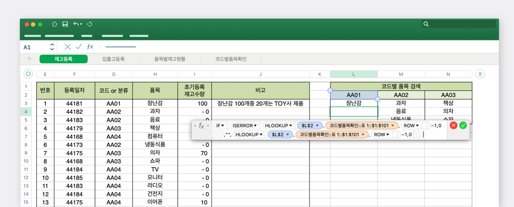
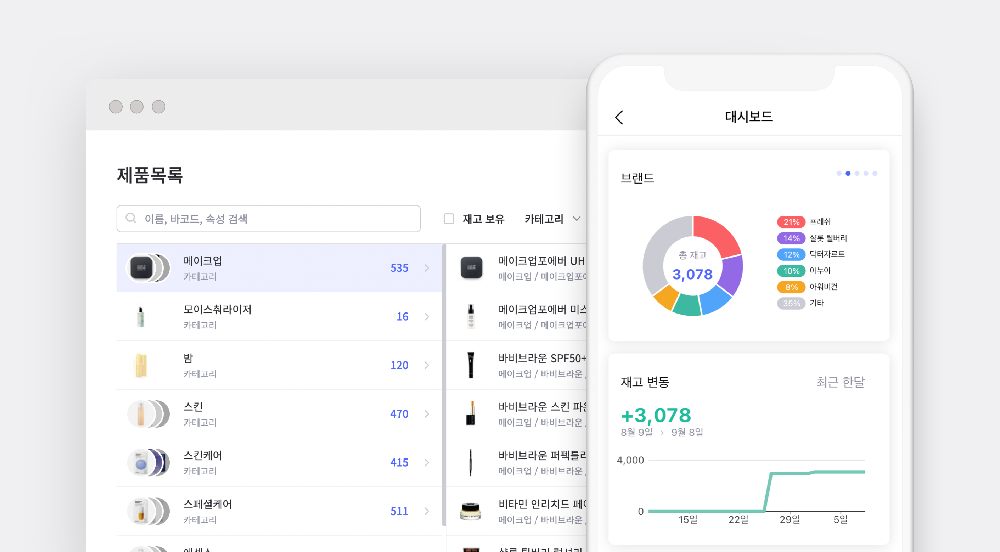
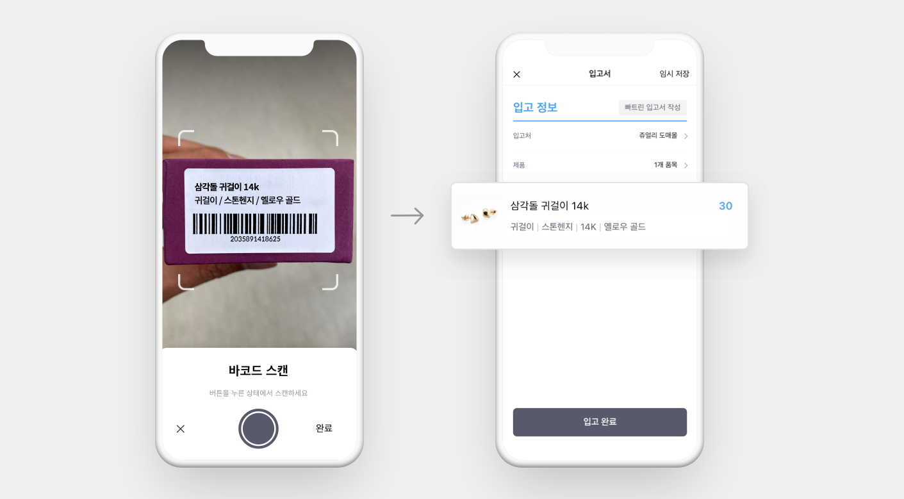
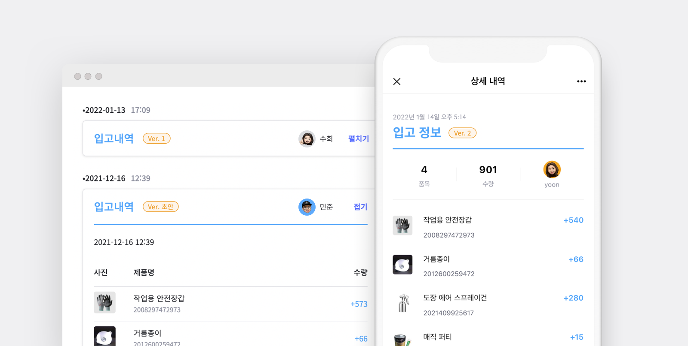
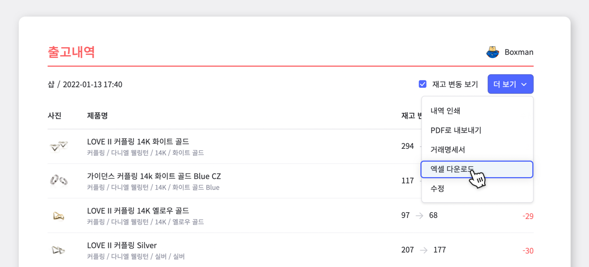

사업장에서 물건을 들여오고 내보내는 것을 관리하는 일은 매우 중요합니다. 예를 들어 회사 운영팀에서 관리하는 상품, 자산 비품 혹은 사찰, 봉사활동 모임 등과 같은 비영리 단체에서 공공으로 사용하는 비품이나 자산의 재고를 관리해야 하는 경우도 있습니다. 더 나아가서는 병원이나 요양원, 피트니스 센터 등과 같이 고객 개개인의 것들을 관리해야 하는 경우도 생깁니다.

이와 같이 많은 분야에서 재고관리를 필요로 하고있고, 그런 만큼 많은 솔루션들이 출시되었지만 여전히 많은 사람들이 재고관리에 어려움을 토로하고 있습니다.

 

재고관리를 처음 시작하시는 분들이 가볍게 시작하는 것으로 많이 사용하시는 방법은 **엑셀을 활용한 재고관리**입니다.

인터넷에는 아주 많고 다양한 업무용 엑셀 서식들이 제공되고 있는데, 그 중에서도 재고관리를 위한 엑셀 서식도 손쉽게 구할 수 있습니다. 또는 기본적인 엑셀 기능에 차트와 통계 기능을 추가해 함께 제공하는 서비스도 출시되고 있습니다. 하지만 이러한 방법은 이미 **엑셀이라는 프로그램에 어느정도는 익숙해져있고, 다룰 줄 아시는 분들에게만 한정적인 방법**입니다.

 

- **인터넷에서 제공하고 있는 엑셀 재고관리 예시**

하지만 엑셀로 재고관리를 하게 될 경우, 다음과 같은 **단점**도 있습니다.

1. 재고에 대한 오류가 생겼을 때 엑셀은 함수를 활용한 계산법을 주로 사용하기 때문에 엑셀에 익숙해져 있지 않으면 수정하기가 어렵습니다.

2. PC web에서만 사용이 가능하기 때문에 실시간으로 팀원들과 재고 상황을 공유할 수 없을 뿐더러 입/출고 할 상황이 생겼을 때 바로 입력할 수가 없습니다.

3. 만약 파일이 분실될 때를 대비하여 주기적인 백업으로 파일 관리를 해야합니다.

 

## 이러한 단점을 보완하기 위해서는 나에게 맞는 재고관리 솔루션을 선택해야 합니다!

재고관리는 꾸준히 관리되어야 하므로 무엇보다 **지속가능한 솔루션**을 선택하셔야 합니다. 어떤 솔루션이 자신에게 적합할지는 자신의 목적과 상황에 따라 달라지겠지만, 보편적으로 아래 항목들을 사전에 고려해보셔야 합니다.

<gray-box>

- **첫째, 기록이 쉬워야 합니다.**  기록 과정이 번거로우면 기록을 미루게 되고, 빠지는 기록이 늘어나 상시로 실재 재고와 시스템에 기록된 재고 사이에 오차가 발생하게 됩니다. 그 결과 실제 업무에서 기록된 재고를 믿을 수 없어 시스템을 사용하지 않게 되는 악순환이 발생합니다.

- **둘째, 현황을 언제 어디서든 간편하게 조회할 수 있어야 합니다.**  열심히 기록했지만, 정작 필요할 때 원하는 정보들을 바로 볼 수 없다면 시스템의 효용이 떨어지게됩니다. 효용을 느낄 수가 없다면 수고스러운 기록 작업을 지속하기도 힘들어집니다.

- **셋째, 누구도 기록을 조작할 수 없어야 합니다.**  내가 입력한 기록을 후에 누군가가 위조하여 수량을 변경하거나 삭제해도 이를 확인할 방법이 없다면 시스템의 신뢰도가 떨어지게 됩니다.

</gray-box>

 

## 그럼, 왜 박스히어로를 사용해야 할까요?

박스히어로는 재고관리에 특화된 솔루션 프로그램입니다.

 

재고에 대한 입/출고 명세에 대해서만 기록하시면 나머지 작업에 대해서는 박스히어로가 도와드려요. 번거롭고 지겨운 작업을 최소화하고 중요한 업무에 집중할 수 있을거에요.

### 1. 빠르고 편리한 입/출고 및 거래서 작성

박스히어로의 입/출고 기능을 활용하면 빠르고 정확하게 제품을 골라서 상세 정보를 입력할 수 있습니다. 사용 전, 각 제품의 사진과 추가 상세 정보를 입력해서 각 상품들을 빠르게 구분할 수 있고, 이러한 정보들을 기준으로 검색이 가능하기 때문에 목록에 제품이 많아져도 원하시는 제품을 빠르게 골라 처리가 가능합니다.

 

또한 선택해야 할 제품이 많을 경우에는 **바코드**를 활용하여 더욱 정확하고 빠르게 제품을 선택할 수 있습니다. 박스히어로 모바일 어플을 활용하면 스마트폰 카메라를 바코드 스캐너로 활용을 할 수 있기 때문에 별도의 기기를 필요로 하지 않습니다. 만약 제품에 바코드가 부착되어있지 않다면 직접 바코드를 생성하거나 박스히어로를 통한 자동생성이 가능합니다.

### 2. 효율적인 팀플레이에 의한 생산성 향상

박스히어로는 동료들과 실시간으로 재고 상황을 공유할 수 있는 시스템을 제공하기 때문에 팀 전체의 생산성을 향상시킬 수 있도록 도와드립니다. 누가, 언제, 어떠한 과정으로 재고를 처리했는지 확인할 수 있기 때문에 팀원들간의 소통이 원활하게 이루어질 수 있습니다. 또한 사용 방법이 아주 쉽고 간단하기 때문에 혹시 모를 인수인계 상황에도 어렵지 않게 활용할 수 있습니다.

### 3. 오류를 최대한 줄이고, 정확성을 높이는 믿을 수 있는 정보

앞서 말한 것처럼 입/출고에 대한 명세만 정확히 기록하면 재고 수량은 박스히어로에서 자동으로 계산됩니다. 필요 시 제품 별로 상세 현황을 조회하여 어떻게 재고량이 변화되어 현재의 재고량이 되었는지 추적하여 빠르게 검증이 가능합니다.

 

또한 한 번 변경된 입/출고 정보는 수동으로 변경하지 않는 이상 변경되지 않습니다. 만약 입력에 실수가 있었다면 쉽게 수정할 수 있지만 혹시 모를 상황에 대비해 수정 이력과 더불어 원본도 그대로 유지됩니다. 누군가가 임의로 변경해도 복구가 가능하기 때문에 마음 놓고 활용하세요!

### 4. 기존의 엑셀 시스템과의 신속하고 정확한 연동 기능

박스히어로는 엑셀 형식의 파일을 활용하여 대량으로 데이터 가져오기 또는 내보내기 서비스를 지원하고 있습니다. 쉬운 예로 쇼핑몰 주문 시, 주문 목록을 엑셀로 내려받아 출고서 작성을 한 번에 끝낼 수 있습니다.

 

### 5. 언제 어디서든 사용이 가능한 프로그램

박스히어로는 모바일 어플과 PC web앱을 모두 제공하여 어떠한 작업 환경에서도 사용할 수 있습니다. 먼저 모바일 앱을 활용하여 현장에서도 손쉽게 재고 현황을 파악할 수 있고 특히 재고 조사를 실시할 때 수기로 일일이 적어 사무실에서 따로 작업하지 않아도 실시간으로 수량을 파악하면서 재고조사를 실시할 수 있습니다.

모바일로 입력된 자료는 사무실에 있는 동료들과 공유할 수 있고 각각의 자료를 내려받을 수도 있기 때문에 보고서 작성이나 판매 분석 등 여러가지 목적으로 활용이 가능합니다.

박스히어로와 함께 언제 어디서든 정확하고 신속한 재고관리에 도전하세요!

**더 읽어보기 :** [엑셀을 연동하여 박스히어로에 적용해보세요!](https://www.boxhero-app.com/ko/blog/posts/%EB%B0%95%EC%8A%A4%ED%9E%88%EC%96%B4%EB%A1%9C%EC%99%80-%EC%97%91%EC%85%80%EC%9D%84-%EC%97%B0%EB%8F%99%ED%95%98%EA%B8%B0)

### 이제 박스히어로와 함께 쉽고 정확하게 재고관리하세요.

재고관리에 어려움을 겪고 계신가요? 지금 바로 박스히어로를 시작해보세요.

박스히어로는 누구나 쉽게 사용할 수 있는 재고관리 특화 솔루션입니다.

다양한 재고관리 기능을 통해 업종 구분없이 모든 비즈니스에서 도입이 가능합니다.

 

<tip-box>

**박스히어로는 PC와 모바일, 모든 환경에서 사용할 수 있습니다.**

PC가 없는 환경에서도 재고관리는 멈추지 않고 계속됩니다.

강력한 모바일 앱을 지원해 스마트폰에서도 박스히어로를 사용할 수 있습니다.

</tip-box>
