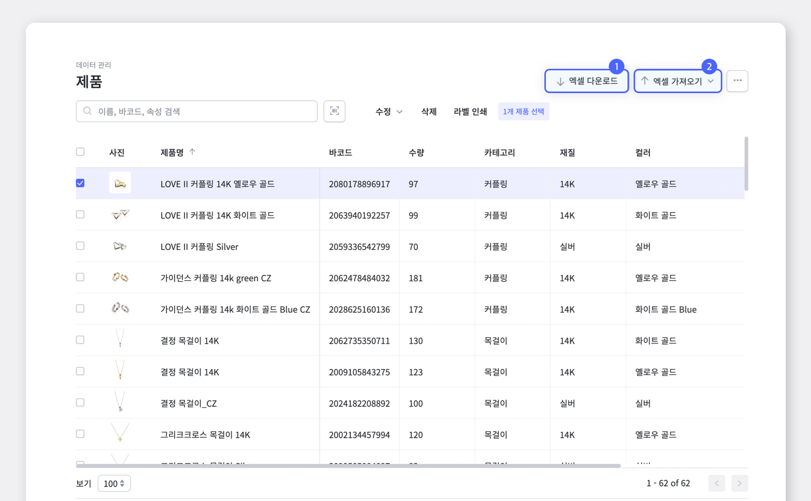
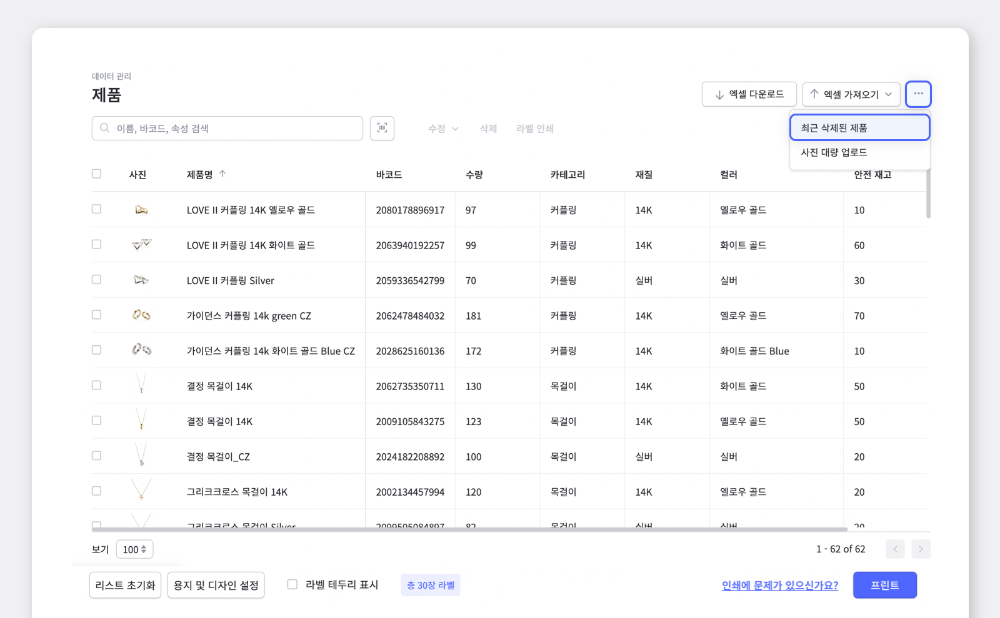
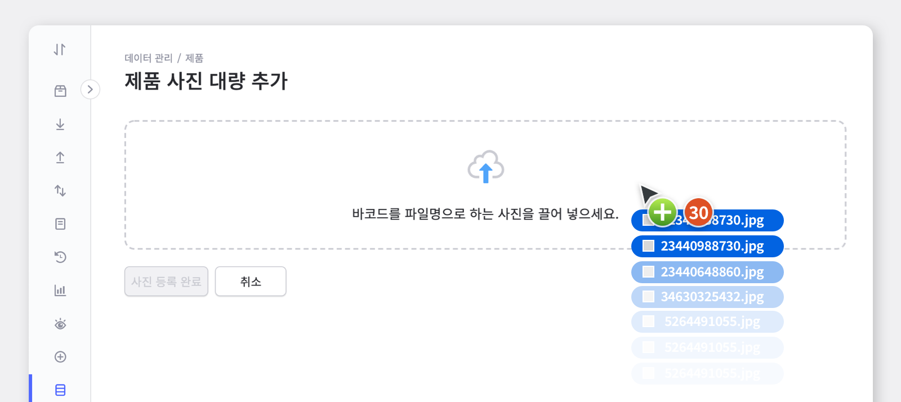
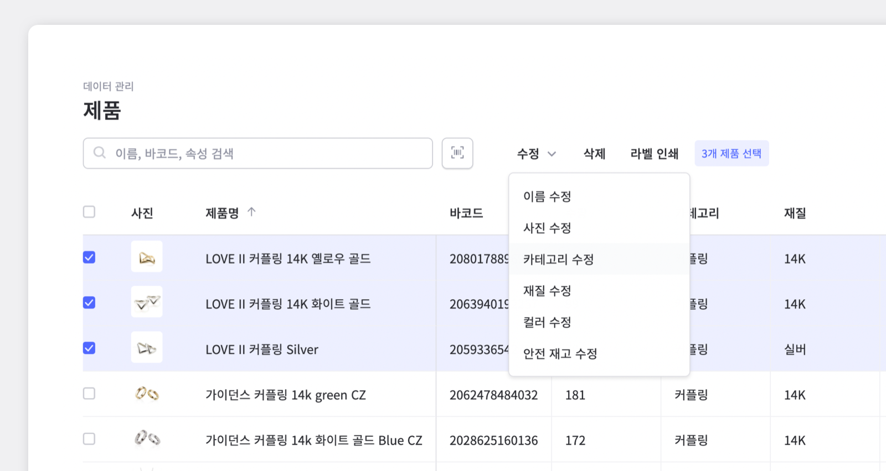
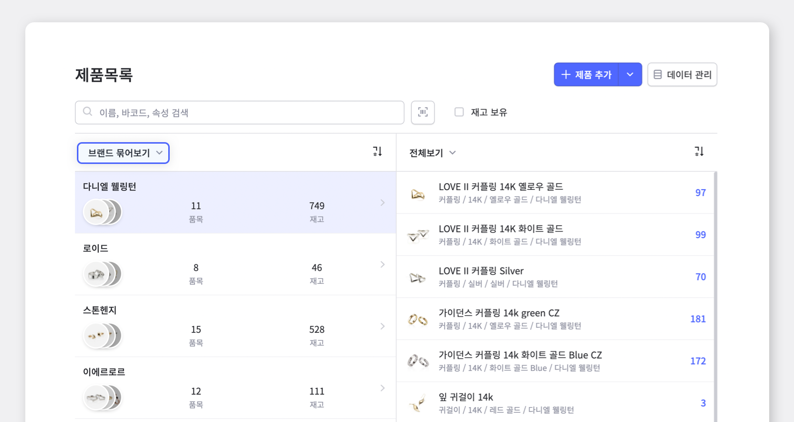
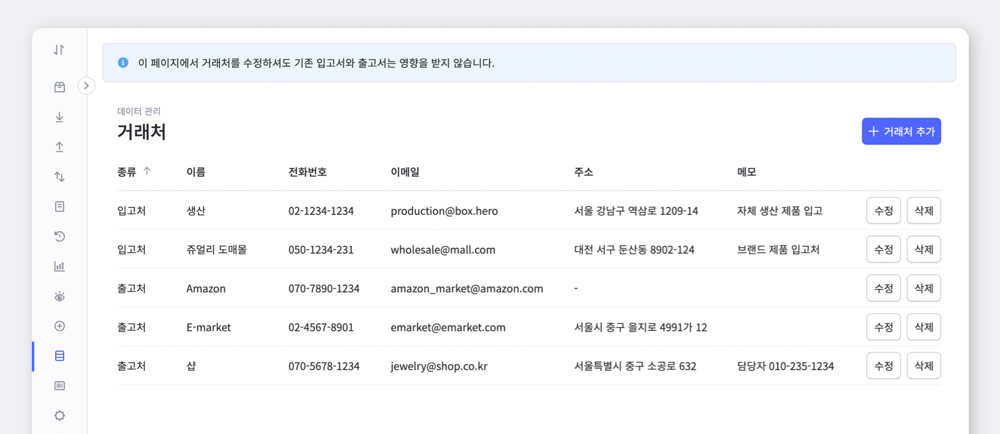

많고 다양한 종류의 재고들을 한 번에 관리하기란 정말 쉽지 않죠. 많은 제품들의 데이터를 정리하는 일도 많은 노력과 시간을 투자해야 하는 작업입니다.

제품, 속성, 거래처 별로 데이터를 관리하면 좀 더 쉽게 재고관리를 할 수 있지 않을까요? 
박스히어로와 함께, 보다 빠르고 정확하게 재고 데이터를 관리해봅시다.

 

## 박스히어로와 데이터 관리하기 | 제품

`데이터 관리` > `제품 메뉴`에서 활용할 수 있는 다양한 기능들을 소개해드립니다.

### 1. 엑셀 연동

박스히어로에서는 엑셀을 이용하여 효율적인 데이터 관리가 가능합니다.

**① 엑셀로 제품 등록하기** 
기존에 엑셀로 재고관리하던 파일을 사용해 박스히어로에 적용이 가능합니다.

**② 제품 정보 데이터 엑셀 다운로드** 
바코드, 제품에 따른 속성들을 그대로 엑셀 파일로 다운받아 보관이 가능합니다. 화면 오른쪽 위 **엑셀 다운로드** 메뉴를 이용해주세요!

<gray-box>

박스히어로와 엑셀 연동에 대해 좀 더 자세히 알아보고 싶으시다면,  [더 알아보기 : 박스히어로와 엑셀을 연동하기](https://www.boxhero-app.com/ko/blog/posts/%EB%B0%95%EC%8A%A4%ED%9E%88%EC%96%B4%EB%A1%9C%EC%99%80-%EC%97%91%EC%85%80%EC%9D%84-%EC%97%B0%EB%8F%99%ED%95%98%EA%B8%B0)를 참고해주세요!

</gray-box>

### 2. 선택한 제품 라벨 생성/인쇄

라벨이 필요한 제품만 선택하여 라벨 인쇄가 가능합니다. 필요한 경우, 하단의 디자인 설정 버튼을 눌러 라벨 디자인을 변경 할 수도 있습니다.

<video src="images/img_3.mp4" style="width:100%" muted autoplay loop playsinline></video>
<invisible></invisible>

### 3. 최근 삭제된 제품

최근 삭제된 제품 메뉴에서는 팀 생성후 삭제한 모든 제품이 리스트업 되어있고, 실수로 삭제 했을 경우 복구도 가능한 유용한 기능입니다.

<caution-box>

단, 데이터는 삭제 후 30일간만 저장됩니다.

</caution-box>

### 4. 사진 대량 업로드

제품 등록 시 사진을 하나하나 업로드하기에는 시간과 노력이 너무 많이 소요됩니다. 이럴 때에는 사진 대량 업로드 기능을 이용하여 한번에 해결해 보세요. 기존 팀에서 새로운 팀으로 제품 정보 이동이 필요한 경우에도, 매우 유용하게 활용 하실 수 있는 기능입니다.

<caution-box>

단, 사진 파일명을 꼭 제품 바코드로 저장해주셔야 사진 업로드가 가능합니다.

</caution-box>

### 5. 제품 수정 또는 삭제

제품을 관리하다보면, 불필요해진 제품이나 수정이 필요한 제품이 생기기 마련입니다. 박스히어로에서는 수정 또는 삭제가 필요한 제품만을 골라 작업을 진행 할 수 있습니다. <gray-text>(* 수정 기능에서는 제품에 적용된 속성을 골라 필요한 부분만 부분 수정이 가능합니다.)</gray-text>

 

## 박스히어로와 데이터 관리하기 | 속성

박스히어로에서는 사이즈, 컬러, 품번 등 필요한 속성을 추가하여 제품 정보를 관리 할 수 있습니다. 속성을 추가하는 방법부터, 속성 묶어보기를 통한 제품 조회 방법까지 함께 알아볼까요?

### 1. 속성 추가

기존 속성을 제외한 추가하고 싶은 제품의 속성이 있을 경우 직접 추가 또는 수정할 수 있습니다

<video src="images/img_7.mp4" style="width:100%" muted autoplay loop playsinline></video>
<invisible></invisible>

### 2. 속성 묶어보기

제품을 속성으로 묶어 관리하게 되면, 원하는 정보대로 묶인 제품들만 선택하여 관리가 가능해지므로 다양한 분석이 가능해집니다.

 

## 박스히어로와 데이터 관리하기 | 거래처

입/출고할 때마다 수많은 거래처 정보를 새로 입력하고 관리하기 귀찮으신가요? 박스히어로에서는 별도의 주소록이 필요 없습니다. 거래처 정보를 미리 등록해 입/출고시 등록된 데이터로 간단하게 작성해 보세요.

박스히어로 하나로 `데이터 관리` 메뉴의 `거래처` 탭에 들어가 전화번호, 이메일 등 필요한 거래처 정보를 등록하여 효율적으로 거래처를 관리 할 수 있습니다.

<caution-box>

단, `데이터관리` > `거래처`에서 거래처를 수정하셔도 기존 입고서와 출고서는 영향을 받지 않습니다.

</caution-box>

## 박스히어로와 함께 데이터 관리 + 재고관리까지 한 번에 해결하세요!

- 기존에 재고관리하시던 엑셀 파일을 박스히어로에 쉽게 적용하실 수 있습니다.

- 제품을 속성별로 묶어 복잡하지 않은 재고관리가 가능합니다.

- 거래처 정보를 미리 등록하고 원하는 거래처를 선택해 입출고할 수 있습니다.

 

<tip-box>

**박스히어로는 PC와 모바일, 모든 환경에서 사용할 수 있습니다.**

PC가 없는 환경에서도 재고관리는 멈추지 않고 계속됩니다.

강력한 모바일 앱을 지원해 스마트폰에서도 박스히어로를 사용할 수 있습니다.

</tip-box>
