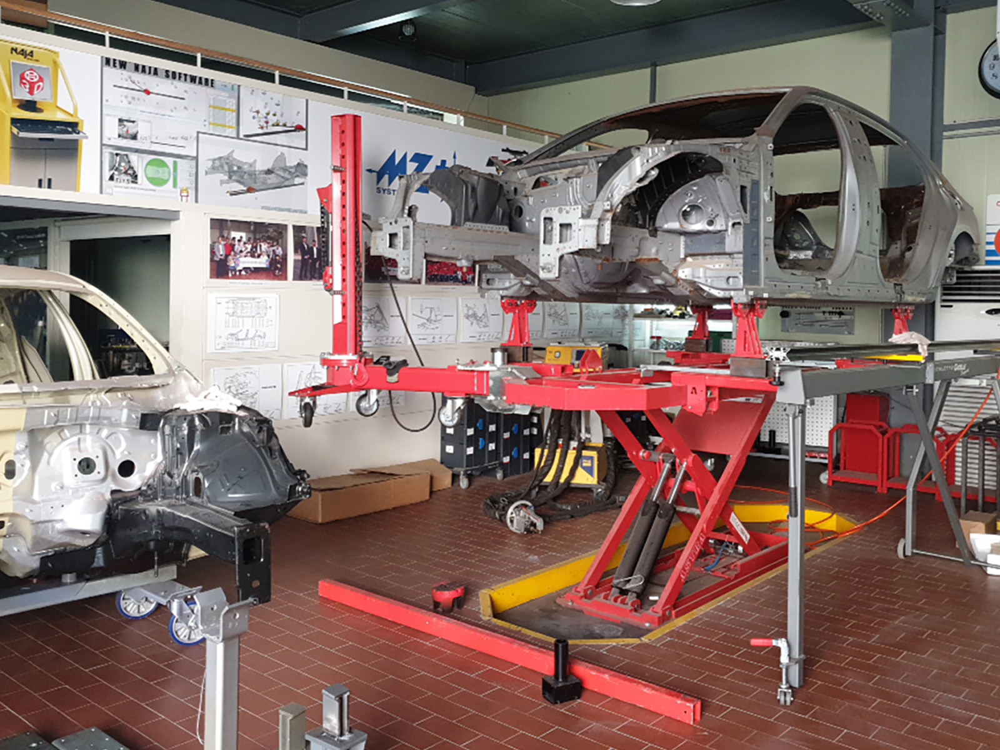
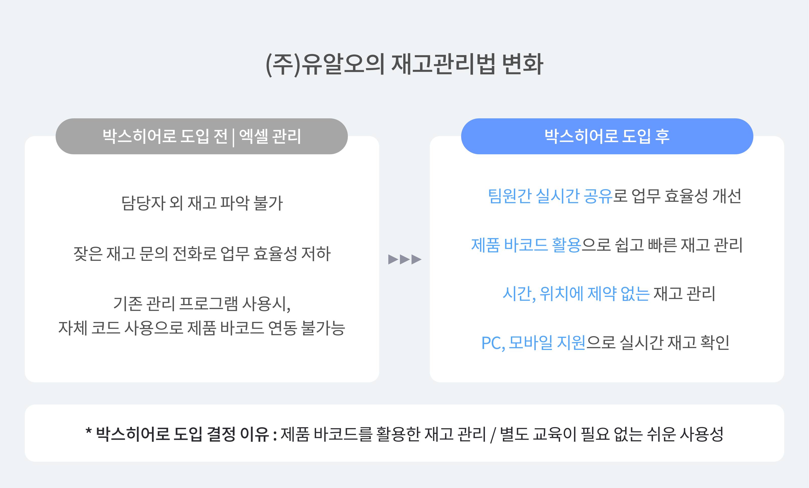
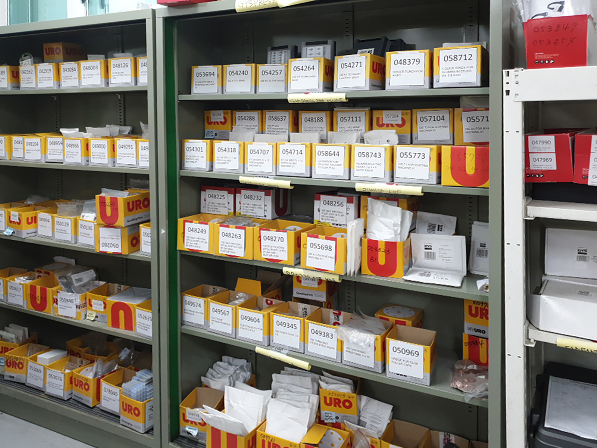
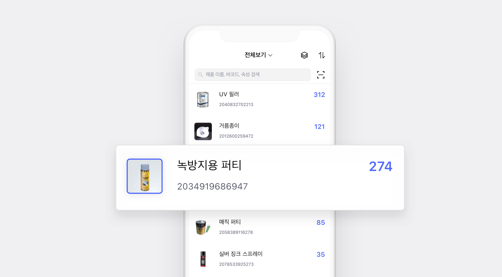
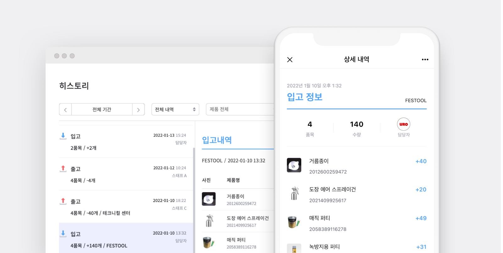
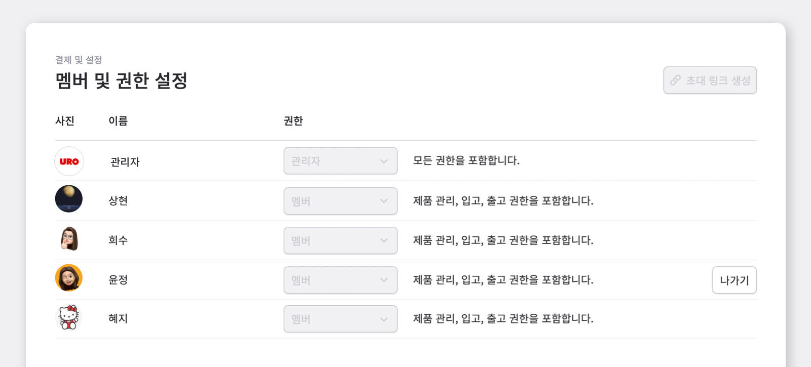
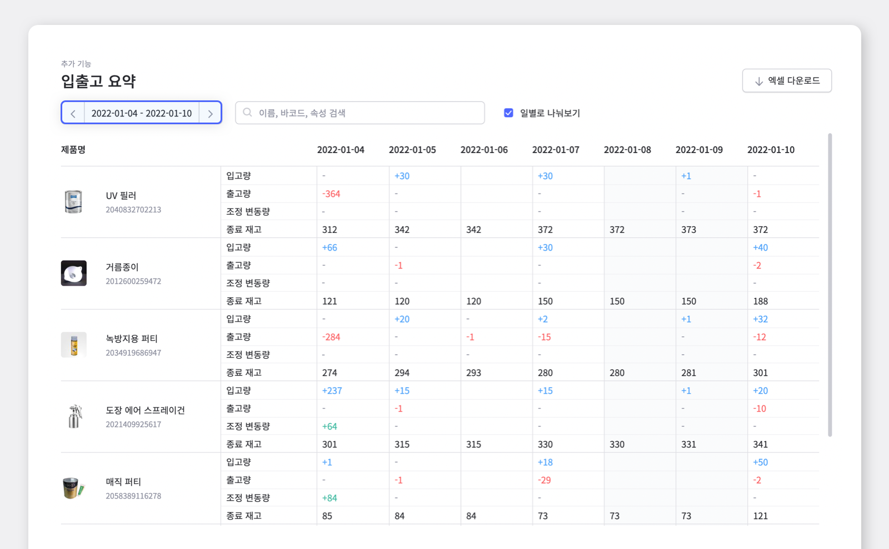

<gray-box title="[박스히어로 인터뷰 vol.03] (주)유알오">

자동차 수리에 필요한 부품과 장비를 판매함과 동시에 자체 수리 서비스 또한 제공하고 있으며 박스히어로를 사용하고 있는 ㈜유알오에서 재고관리를 담당하고 계시는 이철우 담당자님과의 인터뷰를 소개합니다!

</gray-box>

 

안녕하세요, ㈜유알오에서 자재 관리를 담당하고 있는 이철우 담당자입니다. 유알오는 자체적 수리부터 부품 판매를 제공하고 있고, 그에 필요한 자재 관리를 담당하고 있습니다.

 

## 바코드 기준으로 내역을 남길 수 있는 솔루션을 찾았고, 박스히어로가 딱 맞았습니다.

<gray-text>**Chapter 1. 박스히어로 도입 이전**</gray-text>

 

### Q. 박스히어로 사용 이전에는 어떻게 재고관리를 하셨나요?

자재 관리를 혼자 하고 있기 때문에 엑셀에 기록하며 다른 직원분들이 재고 상황 문의가 있을 때마다 저에게 통화로 물어보는 방식으로 진행해오고 있었습니다.

아무래도 매번 전화를 받는 것도, 엑셀로 관리를 하는 것도 효율적이지 않다는 판단이 들어 프로그램을 찾아보기 시작했습니다. 우선 무료로 사용할 수 있는 프로그램들을 찾아봤지만 대부분 사용하기에 불편해보이는 게 많았습니다. 예를 들어 여러 디바이스 등록이 안돼 사무실과 창고를 번갈아 사용하기엔 불편했고, 제품을 대량으로 등록할 수 없어 여러 품목을 다루는 저희는 사용하기가 사실상 불가능해 보였습니다.

그러다 우연히 박스히어로를 추천받게 되었고 이렇게 지금까지 잘 사용하고 있습니다.

### Q. 그렇다면 결정적으로 박스히어로를 선택한 이유는 어떤 게 있으셨나요?

회계 처리를 위해 더존 프로그램을 사용 중인데, 제품에 부착되어 있는 바코드를 기준으로 올릴 수가 없고 더존 고유 코드를 입력해야 해서 바코드 연동이 어려운 상황이었습니다. 그래서 <mark>바코드를 기준으로 제품 등록을 하고, 스캔하면 바로 조회 및 내역을 남길 수 있는 솔루션을 찾았고 박스히어로가 딱 맞았습니다.</mark>

 

## 더이상 재고 관련 전화를 거의 받고 있지 않아요,  업무가 효율적으로 크게 개선했죠.

<gray-text>**Chapter 2. 박스히어로 도입 이후**</gray-text>

### Q. 박스히어로 사용 후 어떤 점이 가장 크게 달라졌나요?

업무가 효율적으로 개선됐다는 게 가장 크게 느껴집니다.

예를 들어 이전에는 출고 담당자가 출고하기 전에 전화로 재고가 몇 개 남았는지 물어봐야 했는데, 이젠 따로 전화하지 않아도 박스히어로 앱을 통해 재고를 확인하고 바로 출고 신청을 하고 계십니다. 이렇게 재고 확인 관련 전화 응대가 일주일에 100건에서 이제 대략 4~5건으로 줄어들어 사실상 재고 관련 전화를 거의 받고 있지 않다고 볼 수 있어 업무가 효율적으로 크게 개선했다는 게 가장 크게 느껴집니다. (전화 스트레스가 정말 많이 줄었어요. 하하.)

사실 도입 초반엔 솔루션을 월간 구독으로 결제를 진행하는 게 생소했는데 출장 시 재고 현황을 바로 박스히어로 앱에서 확인할 수 있고, 제품 사진을 통해 정확하게 재고 확인 및 업무 미팅 시 편리하게 사용하고 있어 생각이 매우 긍정적으로 바뀌었습니다.

 

- **언제 어디서든 내 제품을 한 눈에**

### Q. 대부분의 재고관리 프로그램은 도입 장벽이 높다고 느끼시는 분들이 많던데, 박스히어로는 어떠셨나요?

다른 서비스는 도입과 동시에 별도의 교육이 필요하지만, 박스히어로는 사용하기 쉽고 편리해 금방 적응할 수 있었습니다. 저희 회사에서 박스히어로를 사용하는 연령대가 20대부터 50대까지 매우 다양한데 모두 어려움 없이 쉽게 적응해서 사용하고 있습니다. 특히 박스히어로 앱이 누구나 쉽게 사용하기 수월한 것 같아요.

### Q.  현재 박스히어로를 주로 어떻게 사용하고 계신가요?

입고와 출고 등 내역을 남기는 건 모두 제가 담당하고 있고, 내역을 통해 실시간으로 업데이트 되는 재고 상황을 모든 직원들이 박스히어로 앱을 통해 확인하고 있습니다. 박스히어로에서는 권한 관리도 조정 가능하니 걱정없이 사용하고 있습니다.

 

- **모든 내역은 실시간으로 작성 및 확인**

- **기능에 따라 권한을 세부적으로**

그리고 무엇보다 재고에 대한 신뢰도가 많이 높아졌습니다. 이전에는 재고 내역과 회계 내역을 대조하는 것도 시간이 꽤 걸렸는데 이제 박스히어로에 입력된 내역을 믿고 정산 처리를 해서 훨씬 수월해졌어요.

 

-  기간별 내역 조회도 간편하게

### 부품관리, 생각만 해도 머리가 지끈하다면?

타 재고관리 프로그램과는 다르게 별도의 교육 없이 바로 사용이 가능합니다.

모든 팀원과 재고 상황이 실시간으로 공유됩니다.

재고 확인부터 회계 대조까지 믿고 관리할 수 있는 박스히어로, 지금 시작하세요!
