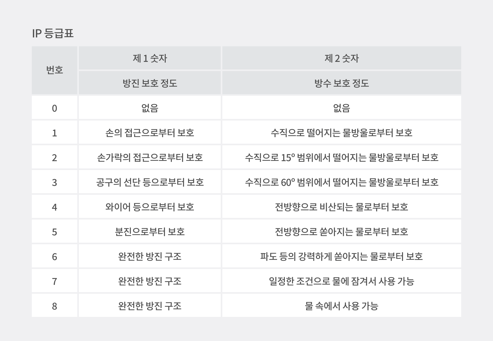
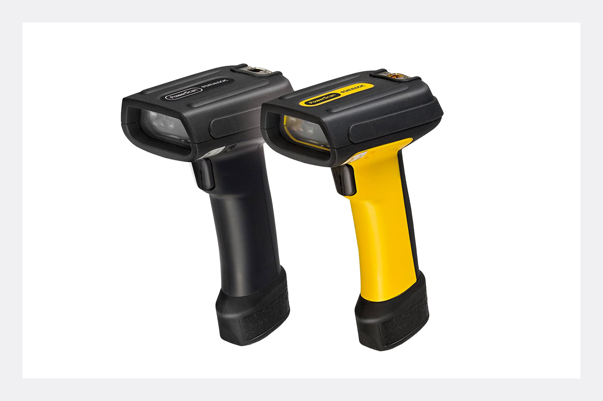
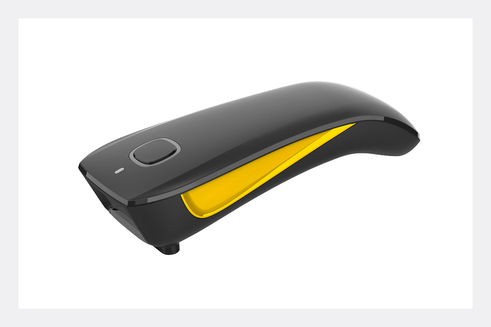
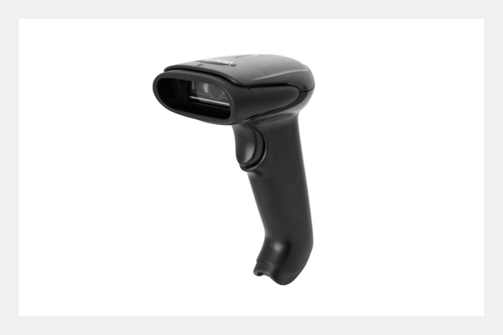
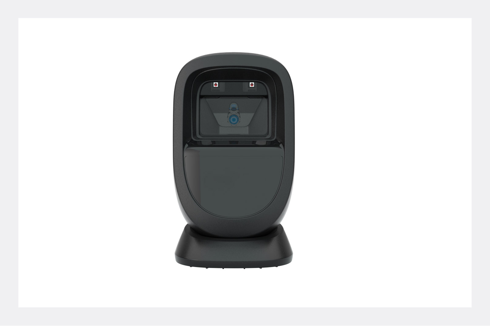
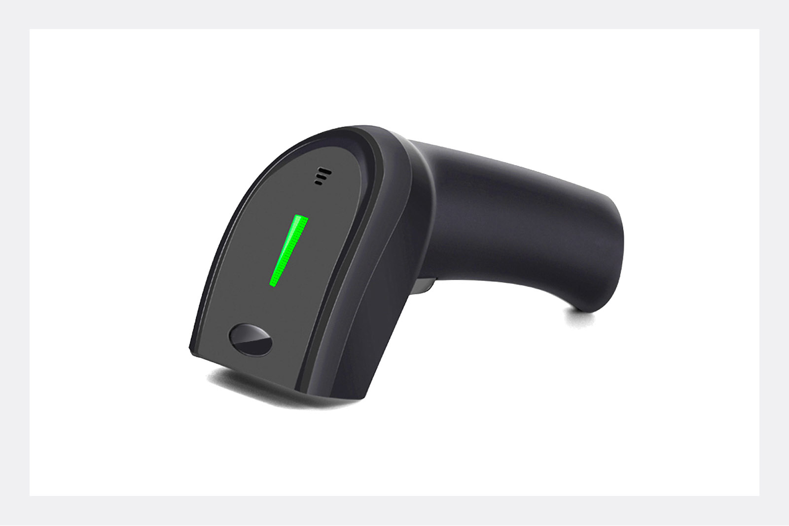

<gray-box>

**Q.** 박스히어로를 사용하기 위해서 어떤 바코드 스캐너를 사용해야하나요? 혹시 추천해주실만한 바코드 스캐너가 있을까요?

**A.** 박스히어로는 시중에 판매하고 있는 **모든 바코드 스캐너와 연동이 가능**합니다!

</gray-box>

 

위와 같이 어떤 바코드 스캐너를 사용해야 할지 막막하신 분들께서는 종종 저희에게 문의를 주시기도 합니다.

재고관리에 빠질 수 없는 바코드 시스템을 사용하면서 바코드 스캔 전용 스캐너를 준비하시는 분들이 많으실텐데요, 워낙 종류가 다양하다보니 검색 후 오히려 어려움을 느끼는 분들이 많습니다.

이번 게시글에서는 각자의 사용 환경과 편의성에 맞는 바코드 제품을 찾기 위해 바코드 스캐너의 종류에 대해 먼저 알아보겠습니다.

## Choice 1.  사용 환경에 따른 바코드 스캐너 선택

바코드 스캐너 제품들은 각각의 내구성에 맞는 IP 등급*을 가지고 있습니다. 모든 스캐너는 각각의 **IP 등급**을 갖고 있어, 활용하는 사용 환경에 맞게 선택할 수 있습니다 
<gray-text>***IP 등급이란**, 외부의 고체와 액체에 대해 얼마나 보호되는지를 판단하는 등급을 말해요.</gray-text>

 

**1) 산업용 스캐너**

거친 환경이나 액체 물질이 많은 작업 환경에서 사용할 경우 (높은 IP 등급의 스캐너 추천)

**2) 일반 보급형 스캐너**

일반 마트, 사무실, 의류 매장과 같은 일반 환경에서 사용할 경우

**3) 장거리용 스캐너 / 고밀도 바코드 스캐너**

내구성 뿐만 아니라 원거리에 있는 바코드를 인식하거나, 아주 작은 바코드를 인식해야 하는 경우

 

## Choice 2. 편의성에 따른 바코드 스캐너

**1) 고정식 스캐너**

공장에서 컨베이어 벨트를 타고 지나가는 제품의 바코드를 인식해야하는 경우

**2) 무선 스캐너**

재고 실사를 위해 현장을 직접 돌아다니면서 바코드 스캔 작업을 해야할 경우

위와 같은 방향으로 제품 폭을 좁혀 나가면 사업장에 알맞는 바코드 스캐너를 선택하실 수 있을 거예요. 바코드 스캐너와 함께 똑똑한 재고관리에 힘써보세요.

 

<gray-box title="바코드 스캐너로 활용할 수 있는 바코드 시스템에 대해 더 자세히 알아보세요.">

[박스히어로와 함께 바코드 생성하기](https://www.boxhero-app.com/ko/blog/posts/%EB%B0%94%EC%BD%94%EB%93%9C%EB%8A%94-%EC%96%B4%EB%96%BB%EA%B2%8C-%EB%A7%8C%EB%93%A4%EA%B9%8C)

[바코드 생성부터 출력까지 박스히어로와 함께 시작하세요!](https://www.boxhero-app.com/ko/blog/posts/%EB%B0%94%EC%BD%94%EB%93%9C-%EC%83%9D%EC%84%B1%EB%B6%80%ED%84%B0-%EC%B6%9C%EB%A0%A5%EA%B9%8C%EC%A7%80-%EB%B0%95%EC%8A%A4%ED%9E%88%EC%96%B4%EB%A1%9C%EC%99%80-%ED%95%A8%EA%BB%98-%EC%8B%9C%EC%9E%91%ED%95%98%EC%84%B8%EC%9A%94)

</gray-box>

### 이제 박스히어로와 함께 쉽고 정확하게 재고관리하세요.

재고관리에 어려움을 겪고 계신가요? 지금 바로 박스히어로를 시작해보세요.

박스히어로는 누구나 쉽게 사용할 수 있는 재고관리 특화 솔루션입니다.

다양한 재고관리 기능을 통해 업종 구분없이 모든 비즈니스에서 도입이 가능합니다.

 

<tip-box>

**박스히어로는 PC와 모바일, 모든 환경에서 사용할 수 있습니다.**

PC가 없는 환경에서도 재고관리는 멈추지 않고 계속됩니다.

강력한 모바일 앱을 지원해 스마트폰에서도 박스히어로를 사용할 수 있습니다.

</tip-box>
