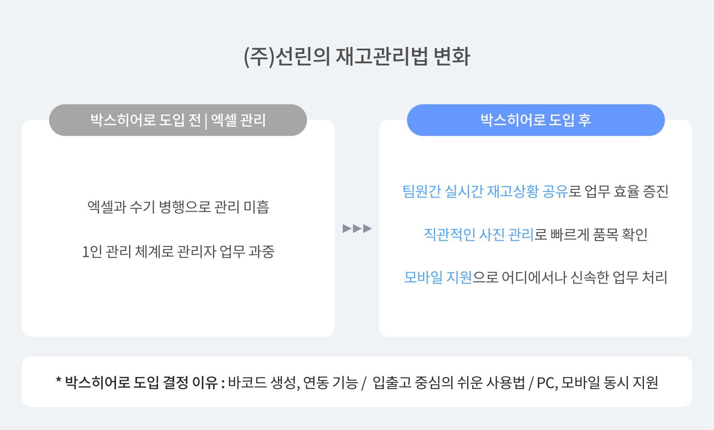
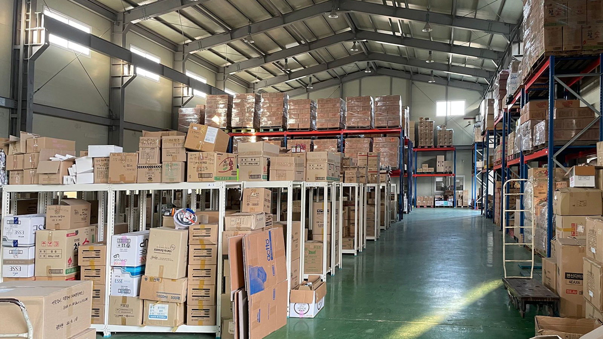
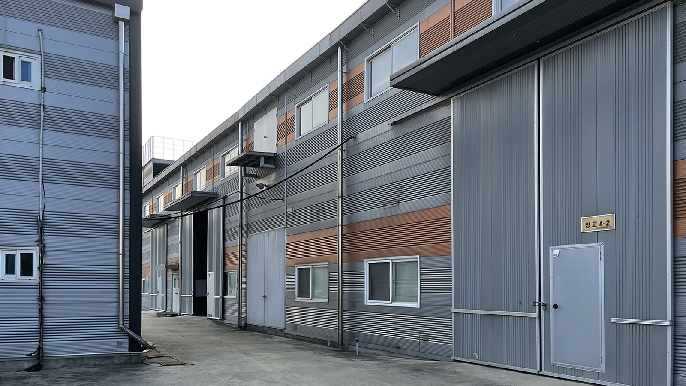
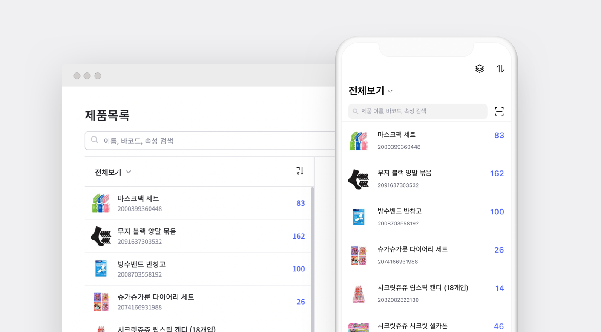
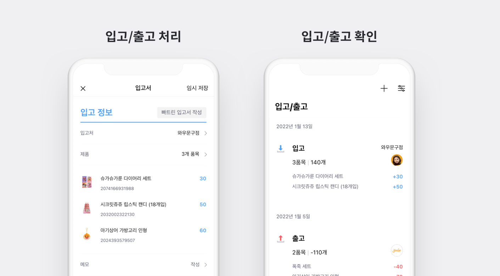
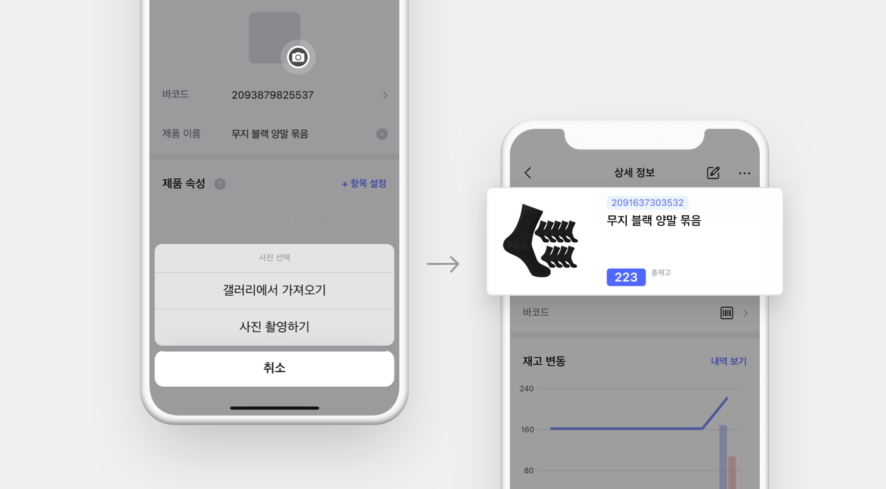
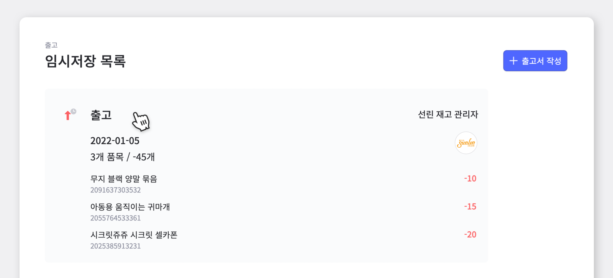

<gray-box title="[박스히어로 인터뷰 vol.04] (주)선린">

㈜선린에서 상품 컨택부터 유통까지 전반적인 프로세스를 담당하고 계시며 박스히어로를 오랜 기간 사용해오신 오수진 팀장님과의 인터뷰를 소개합니다!

</gray-box>

 

안녕하세요, 소매점 유통업 ㈜ 선린에서 상품 컨택부터 유통까지 전반적인 프로세스를 맡고 있는 오수진 팀장입니다. 상품을 다양한 소매점에 유통하고 있으며, 취급하는 상품은 식품부터 비식품까지 여러 품목을 다루고 있습니다.

 

## 타 프로그램과는 다르게 모바일 앱도 지원된다는 점에서 도입을 결정했죠.

<gray-text>**Chapter 1. 박스히어로 도입 이전**</gray-text>

 

### Q. 박스히어로 도입 이전에는 어떻게 재고관리를 하고 계셨나요?

재고관리를 담당하는 담당자가 혼자 엑셀로 품목부터 입출고까지 매일 수기로 정리해 관리하고 있었습니다.

하지만 엑셀 재고관리의 경우 쉽게 시작할 수 있다는 장점이 있지만, 사용할수록 관리가 안되고 있다는 판단이 들었어요. 특히 수많은 종류의 품목 관리부터 수시로 입고 및 출고가 이루어지는 게 재고관리이다 보니 한 사람이 엑셀로 관리하는 건 너무 버겁다는 생각이 들었습니다. 그렇게 재고관리 프로그램 도입을 고려하게 되었습니다.

### Q. 재고관리 프로그램을 찾아보실 때 어떤 점을 중점에 두고 알아보셨나요?

여러 프로그램을 찾아보았지만 대부분 기능이 너무 복잡하거나 금액이 부담스러운 경우가 많았습니다. ERP도 고려해보았지만 기능이 너무 많아 부담됐고, 이미 기존에 더존 프로그램을 통해 회계 업무를 처리하고 있어 최대한 간단한 프로그램을 찾고 있었습니다.

사실 여러 사람이 함께 사용해야 하고 바로 업무에 도입되어야 해서 복잡할수록 도입 기간이 길어지는 것도 부담됐어요. 요금 측면에서도 기능이 다양할수록 비용이 늘어나는 것도 조심스러웠고요. 엑셀보단 관리가 잘 되고 누구든 쉽게 사용할 수 있는, 조금 더 간단한 프로그램을 필요하다는 생각이 들었습니다.

 

### Q. 박스히어로를 선택한 가장 결정적인 이유가 있었나요?

저희는 바코드를 기준으로 입고 또는 출고 내역이 남아야 했어요. 다루는 제품들 대부분이 바코드가 부착되어 있어 저희가 쓰는 바코드로 등록해야 했고, 또 바코드가 없는 제품에도 따로 바코드를 부여해서 내역에 남겨야 했는데 박스히어로는 바코드 인식부터 등록까지 모두 가능하더라고요. 특히 바코드를 기준으로 제품을 등록하는 게 중요했던 이유가, 더존 프로그램의 경우 더존의 고유 코드로 제품 등록이 가능해서 실제 물류에서 다루는 제품들을 바로 바코드로 처리해 회계 내역과 맞춰볼 수 있어야 했습니다.

프로그램을 시작해서 사용하는 것도 쉬울 뿐만 아니라 입출고를 중심으로 간단하게 업무를 할 수 있다는 점, 그리고 타 재고관리 프로그램들과는 다르게 PC프로그램 뿐만 아니라 모바일 앱도 지원된다는 점에서 결정적으로 도입하게 되었습니다.

 

 

## 엑셀에서 박스히어로로 옮기고 나니  통화 업무가 단번에 줄어들었습니다.

<gray-text>**Chapter 2. 박스히어로 도입 이후**</gray-text>

### Q. 박스히어로 도입 이후 느끼는 가장 큰 변화는 어떤 건가요?

우선 한 사람이 모든 업무를 부담하고 있지 않는다는 게 가장 크게 달라졌어요.

이전에 엑셀로 관리를 했을 땐 한 사람이 관리를 하고 있었기 때문에 다른 팀원들은 재고 상황을 체크하기가 어려웠어요. 또 그래서 재고 상황에 대한 정보가 필요하면 그때마다 통화로 체크를 해야 했어요. 사실 다들 바쁜데 매번 전화로 재고를 체크하니 관리자와 물류 센터 팀원들 모두 비효율적으로 업무를 진행하고 있다는 생각이 들더라고요.

하지만 이후 엑셀에서 박스히어로로 옮기고 나니 우선 통화 업무가 단번에 줄어들었습니다. 물류센터에서 일하는 팀원들은 박스히어로 모바일 앱을 통해 전화하지 않아도 바로 재고상황을 확인할 수 있어 서로 편리합니다.

 

- **모든 재고 현황을 모바일로 한 번에 확인**

- **모바일에서 입출고 내역 처리부터 확인까지 가능**

또한 엑셀로 관리할 땐 품목 확인이 어려워 사진을 찍어 전송해 관리자가 체크해줘야 해서 골치 아팠는데, 박스히어로에선 제품에 사진을 올릴 수 있어 바로 품목 확인이 가능해졌습니다.

 

- **제품 사진으로 재고관리 정확도 상승**

### Q. 박스히어로에서 가장 유용하게 생각하는 부분은 어떤 게 있나요?

우선 모바일 앱으로도 업무를 진행할 수 있는 점이 큰 것 같아요. 현장이나 물류센터에서 재고 확인부터 입출고 처리까지 그때그때 바로 할 수 있으니 지체되는 것 없이 바로 처리할 수 있어 좋아요.

예정서로 내역을 미리 작성해둘 수 있는 것도 유용하게 사용하고 있습니다. 발주를 넣거나 주문을 받으면 입출고 메뉴에서 미리 예정서를 만들어 두고, 입고가 되면 담당자가 재고를 확인한 뒤 박스히어로 앱에서 바로 처리하면 되거든요. 출고도 마찬가지로 출고 담당자가 예정서만 확인해서 바로 출고 버튼만 누르면 되니까 따로 연락하지 않아도 바로 예정서로 확인할 수 있어 편리해요.

 

- **미리 작성한 출고서로 간편하게 내역 처리**

### 재고관리, 너무 어렵게만 생각하지 마세요.

재고관리 업무가 한 사람에게 몰려있다면 프로그램 도입이 필요하다는 신호입니다.

실시간으로 공유하고, 효율적으로 관리하세요.

재고관리 프로그램, 더이상 미루지 말고 도입하세요!
