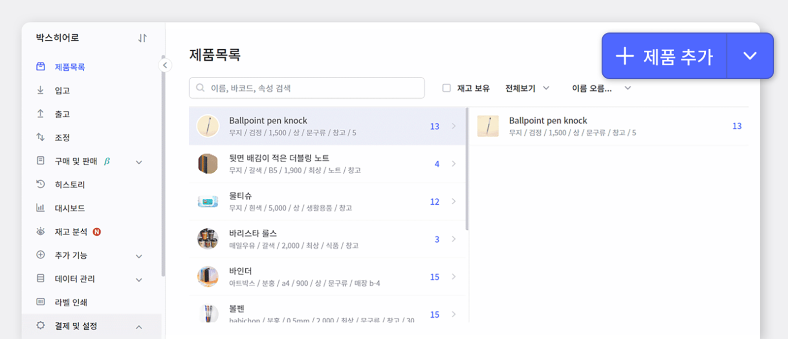
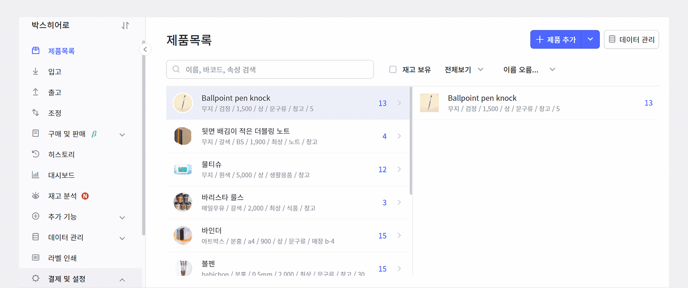
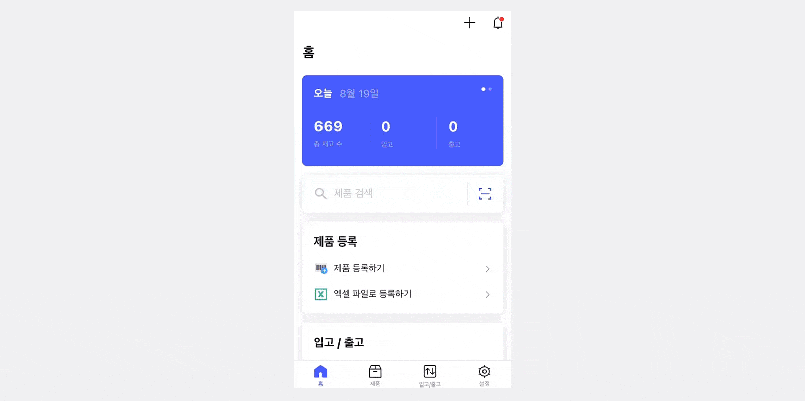
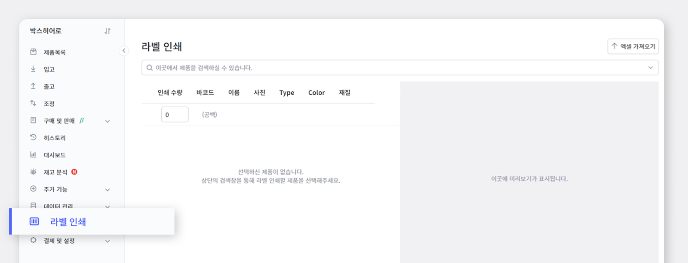
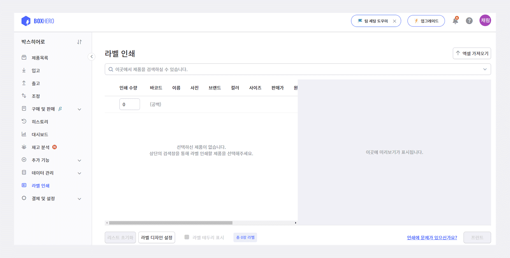
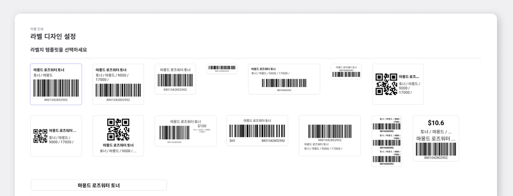
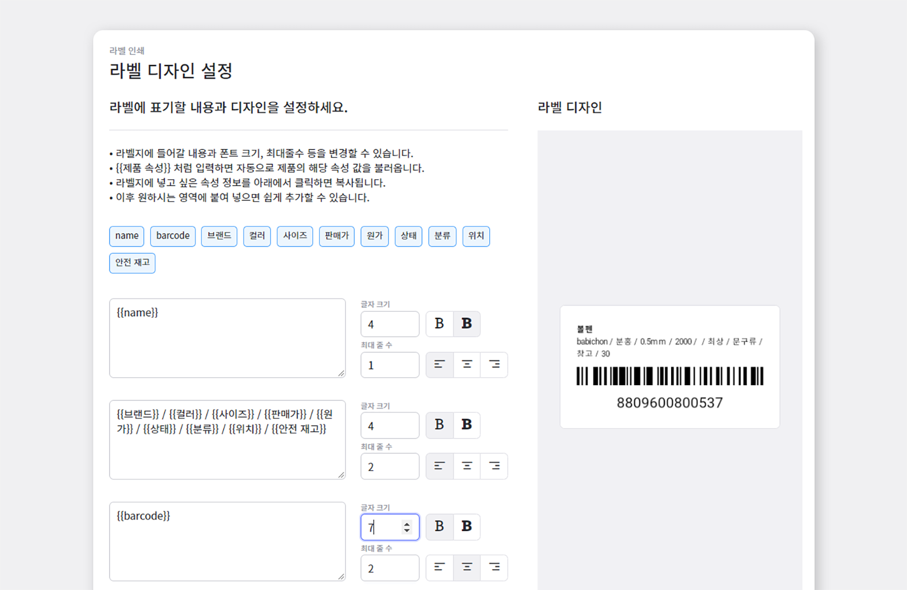
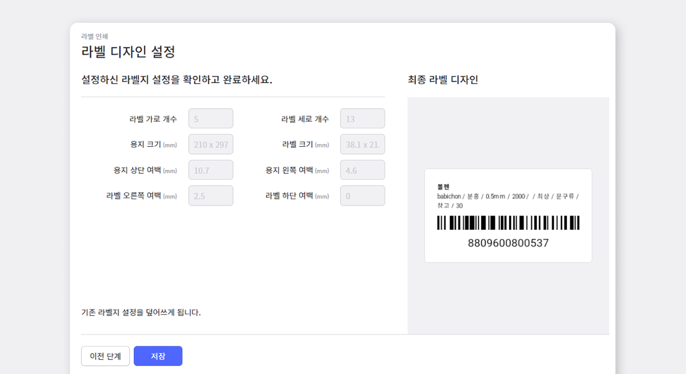

평소 물건을 구입할 때 상품 뒷면 하단을 보면 바코드에 빨간 불빛을 쏘아 자동으로 계산하는 장면을 적지 않게 보셨을 거에요. 바코드란 암호처럼 되어있는 검은 줄무늬 부분을 말합니다. 바코드를 자세히 들여다보면 굵기가 서로 다른 검은 막대와 흰 막대가 섞인 채 나란히 배열되어있는 것을 볼 수 있는데 이를 **바(Bar) 코드(Code)** 라고 부릅니다!

<gray-text>이 글은 바코드 생성/출력하여 재고를 관리하고 싶으신 분들께 유용한 박스히어로의 팁이 가득 담겨진 글입니다.</gray-text>

**바코드 어떻게 생성하는지 알아보기 전에 먼저 바코드가 왜 필요한지 알아볼까요?**

바코드를 사용하는 가장 큰 이유는 "효율성"입니다. 계산대에서는 최대한 빠르게 계산을 정확히 해야 하는데, 바코드가 없다면 어떤 제품이 몇개 있는지 눈으로 일일히 갯수를 세야합니다. 문제는 마트나 편의점에서 일하는 분들이 수천가지의 제품을 다 외우는 것이 불가능할 뿐더러, 아주 비슷하게 생긴 제품이 많아 사람의 눈으로 제품을 구분하기 어렵다는 것입니다. 바코드, 꼭 필요한 시스템이겠죠?

박스히어로와 함께 바코드 생성에서부터 출력까지 함께 해보겠습니다!

## 1. **바코드 생성**

박스히어로는 제품 추가시 바코드를 생성할 수 있습니다. 
먼저 오른쪽 상단의 ‘제품 추가’ 메뉴로 이동합니다.

바코드를 생성할 수 있는 방법에는 두 가지가 있습니다.

1. `바코드 자동으로 생성`하기 > `자동 생성 버튼`을 눌러 자동으로 생성하거나

1. `바코드 직접 입력`하기 > `원하시는 바코드 번호를 직접 입력`하실 수 있습니다.

먼저 PC 웹 버전으로 함께 보실게요.

모바일 버전으로 사용을 원하신다면, 참고해주세요!

이렇게 간단하고 쉽게 바코드 생성이 가능합니다.

박스히어로에서는 바코드 생성 뿐만 아니라 생성한 바코드에 따른 라벨 디자인과 출력까지 할 수 있습니다.  
어렵지 않으니 천천히 따라해보세요!

## 2. **바코드를 사용한 라벨지 생성/출력**

먼저 왼쪽 메뉴 하단에 있는 '라벨 인쇄' 메뉴로 이동해주세요. 
라벨 인쇄 메뉴에서는 라벨 인쇄 뿐만 아니라 디자인도 원하시는 디자인으로 설정이 가능합니다.

그럼 차근차근 시작해볼까요?

라벨 인쇄 하단 '라벨 디자인 설정' 메뉴를 클릭하면 라벨지 템플릿을 선택하실 수 있습니다.

원하시는 라벨지 템플릿 선택이 가능하며 따로 원하시는 디자인이 있으시다면 **박스히어로 고객센터**로 연락주시면 최선을 다해서 도와드리겠습니다.

현재 저희 박스히어로에서는 **일반 용지와 감열지**를 사용한 라벨지 제작이 가능합니다. 원하시는 용지로 제작이 가능하며 일반 용지에서도 원하시는 용지가 따로 있을 경우 해당 용지로 제작이 가능합니다.

화면 오른쪽 용지 설명 그림을 참고하시어 각각의 수치를 입력하면 라벨지 제작의 기초 과정이 끝납니다. 몇몇 용지들은 자동으로 수치를 계산해주기 떄문에 따로 입력하실 필요가 없습니다.

라벨지 설정이 끝났으면 다음은 라벨에 표기할 내용을 설정할 차례입니다! 해당 속성 값을 클릭하면 자동으로 복사가 되며 복사된 값을 원하시는 영역에 붙여넣기 하면 쉽게 추가할 수 있습니다.

글자 크기/최대 줄 수를 조절하여 원하시는 제품의 속성를 모두 넣을 수도 있고 필요하지 않은 속성은 제외시킬 수 있습니다.

최종적으로 완성된 디자인을 검토한 후 저장하면 라벨 디자인이 완료됩니다.

출력하기 전 미리보기 기능을 통해 인쇄될 라벨을 미리 확인하실 수 있습니다!

<caution-box>

라벨 디자인과 출력 기능은 PC웹 버전에서만 사용이 가능합니다.

</caution-box>

## 박스히어로와 바코드생성/출력까지 함께하세요!

박스히어로에는 다음과 같이 바코드 생성과 출력에 꼭 맞는 유용한 기능들이 포함되어 있습니다.

- 직접 입력/자동생성 메뉴로 바코드를 쉽게 생성할 수 있습니다.

- 생성한 바코드를 사용하여 바코드 라벨지 출력이 가능합니다.

- 바코드 라벨지를 원하는 형태에 맞춰 디자인이 가능합니다.

- 라벨지에 원하는 제품 속성을 기입할 수 있습니다.

<tip-box>

**박스히어로는 PC와 모바일, 모든 환경에서 사용할 수 있습니다.**

PC가 없는 환경에서도 재고관리는 멈추지 않고 계속됩니다.

강력한 모바일 앱을 지원해 스마트폰에서도 박스히어로를 사용할 수 있습니다.

</tip-box>

